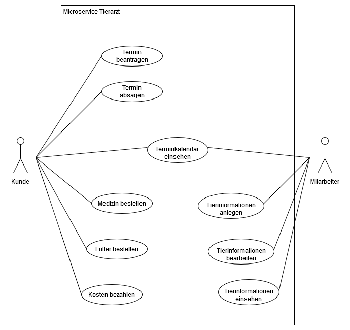

# Smart City: Microservice Tierarzt  
Autor: Mattis Küper  
[Link zum Repository](https://github.com/SGSE-2020/MS_Tierarzt) 

# 1 Einführung

## 1.1 Beschreibung

* Projektname
* Darstellung der Produktvision in Prosa (5-10 Sätze)
* Ziele
* Für wen ist das Produkt/der Service?
* Was ist das Bedürfnis? 
* Was ist das Produkt/der Service?
* Warum sollte der Kunde dieses Produkt/den Service „kaufen“ oder nutzen?
* Im Gegensatz zu welchen anderen Produkten/Services steht dies?
* Was macht dieses Produkt/der Service anders?
* Warum ist das Projekt sinnvoll?
* Welche Stakeholder sind betroffen und wie stehen Sie zu der Projektidee?
* Welche alternativen Lösungsideen existieren für den identifizierten Bedarf?
* Wie hoch sind Aufwand und erwarteter Nutzen und stehen sie in einem sinnvollen Verhältnis? (Lohnt sich das Projekt?)
* Verfügen wir über die notwendigen Kompetenzen? (Umsetzbarkeit)
* Welche Risiken und negativen Nebeneffekte sind zu erwarten?

## 1.2 Ziele

- Anwendungsbereiche, Motivation, Umfang, Alleinstellungsmerkmale, Marktanforderungen
- Informationen zu Zielbenutzergruppen und deren Merkmale (Bildung, Erfahrung, Sachkenntnis)
- Abgrenzung (Was ist das Softwaresystem _nicht_)
- ggfs. SWOT-Analyse

# 2 Anforderungen

## 2.1 Stakeholder

| Funktion / Relevanz | Name | Kontakt / Verfügbarkeit | Wissen  | Interessen / Ziele  |
|---|---|---|---|---|
|  |   |   |    |   |

### Beispiel

| Funktion / Relevanz | Name | Kontakt / Verfügbarkeit | Wissen  | Interessen / Ziele  | 
|---|---|---|---|---|
| Leiter der Bibliothek, Fachlicher Entscheider  |  Herr Bauer | Tel. 409000, Von 9-19 Uhr telefonisch erreichbar, Mitarbeit zu 30% möglich, Nürnberg  | Kennt das Altsystem aus der Anwendersicht, soll mit dem System arbeiten  | Vereinfachung der Ausleihprozesse  |  
| Administrator, Informationslieferant bzgl. Wartungsanforderungen  | Herr Heiner  | Heiner@gmx.net, Per E-Mail, immer erreichbar, Verfügbarkeit 50%, Nürnberg  | Vertraut mit vergleichbarer Verwaltungssoftware   |  Stabiles System, geringer Wartungsaufwand | 
| Product-Owner, Entscheider - als Koordinator der Stakeholderanforderungen   | Paul Ottmer  |  po@ottmer.de, Per E-Mail und tel. tagsüber, Verfügbarkeit 100%, Nürnberg  | Koordinator für die Inputs der Stakeholder  | ROI des Systems sicherstellen  | 

## 2.2 Funktionale Anforderungen

## 2.3 Nicht-funktionale Anforderungen 

### 2.3.1 Rahmenbedingungen

- Normen, Standards, Protokolle, Hardware, externe Vorgaben

### 2.3.2 Betriebsbedingungen

- Vorgaben des Kunden (z.B. Web Browser / Betriebssystem Versionen, Programmiersprache)

### 2.3.3 Qualitätsmerkmale

- Externe Qualitätsanforderungen (z.B. Performance, Sicherheit, Zuverlässigkeit, Benutzerfreundlichkeit)

Qualitätsmerkmal | sehr gut | gut | normal | nicht relevant
---|---|---|---|---
**Zuverlässigkeit** | | | | |
Fehlertoleranz |X|-|-|-|
Wiederherstellbarkeit |X|-|-|-|
Ordnungsmäßigkeit |X|-|-|-|
Richtigkeit |X|-|-|-|
Konformität |-|X|-|-|
**Benutzerfreundlichkeit** | | | | |
Installierbarkeit |-|-|X|-|
Verständlichkeit |X|-|-|-|
Erlernbarkeit |-|X|-|-|
Bedienbarkeit |-|X|-|-|
**Performance** | | | | |
Zeitverhalten |-|-|X|-|
Effizienz|-|-|-|X|
**Sicherheit** | | | | |
Analysierbarkeit |X|-|-|-|
Modifizierbarkeit |-|-|-|X|
Stabilität |X|-|-|-|
Prüfbarkeit |X|-|-|-|

## 2.4 Graphische Benutzerschnittstelle

- GUI-Mockups passend zu User Stories
- Screens mit Überschrift kennzeichnen, die im Inhaltsverzeichnis zu sehen ist
- Unter den Screens darstellen (bzw. verlinken), welche User Stories mit dem Screen abgehandelt werden
- Modellierung der Navigation zwischen den Screens der GUI-Mockups als Zustandsdiagramm

## 2.5 Anforderungen im Detail

| **Als** | **möchte ich** | **so dass** | **Akzeptanz** | **Priorität** |
| :------ | :----- | :------ | :-------- | :------- |
| Kunde | einen Termin vereinbaren | mein Tier ärztliche Versorgung erhält | Termin wird in Terminkalendar eingetragen | Must |
| Kunde | einen Termin absagen | meine Reservierung rückgängig gemacht wird | Termin wird aus Terminkalendar gelöscht | Must |
| Kunde | mir meine Termine anzeigen lassen | ich keine Termine verpasse | Termine werden angezeigt | Must |
| Kunde | meine Kosten Bezahlen |  | Geld wird überwiesen | Should |
| Kunde | Tiermedizin bestellen |  | Medizin wird bestellt und geliefert | Should |  
| Kunde | Tierfutter bestellen |  | Futter wird bestellt und geliefert | Should |  

| **Als** | **möchte ich** | **so dass** | **Akzeptanz** | **Priorität** |
| :------ | :----- | :------ | :-------- | :------- |
| Mitarbeiter | meine Termine einsehen | ich meinen Tagesablauf planen kann | Terminkalender für Mitarbeiter wird angezeigt | Must |
| Mitarbeiter | Informationen über Tiere einsehen | ich mich auf die Behandlung vorbereiten kann | Informationen über Tiere werden angezeigt | Should | 
| Mitarbeiter | Informationen über Tiere bearbeiten | die Informationen immer auf dem neusten Stand bleiben | Informationen werden aktualisiert und angezeigt | Should |
| Mitarbeiter | Benachrichtigt werden, wenn ein geplanter Termin abgesagt wurde | ich mich auf meinen neuen Tagesplan vorbereiten kann | Mitarbeiter wird Benachrichtigt | Could |

# 3 Technische Beschreibung

## 3.1 Systemübersicht

- Systemarchitekturdiagramm ("Box-And-Arrow" Diagramm)
- Kommunikationsprotokolle, Datenformate

## 3.2 Softwarearchitektur

- Darstellung von Softwarebausteinen (Module, Schichten, Komponenten)

## 3.3 Schnittstellen

- Termine von Kunden und Mitarbeitern mit
  - BürgerID
  - Ankunftszeit
  - ungefähre Aufenthaltsdauer
- Informationen über angemeldete Tiere mit 
  - BürgerID des Besitzers
  - Art und Rasse des Tieres
  - Gewicht
  - Krankheiten

## 3.3.1 Ereignisse

- In Event-gesteuerten Systemen: Definition der Ereignisse und deren Attribute

## 3.4 Datenmodell 

- Konzeptionelles Analyseklassendiagramm (logische Darstellung der Konzepte der Anwendungsdomäne)
- Modellierung des physikalischen Datenmodells 
  - RDBMS: ER-Diagramm bzw. Dokumentenorientiert: JSON-Schema

## 3.5 Abläufe

- Aktivitätsdiagramme für relevante Use Cases
- Aktivitätsdiagramm für den Ablauf sämtlicher Use Cases

## 3.6 Entwurf

- Detaillierte UML-Diagramme für relevante Softwarebausteine

## 3.7 Fehlerbehandlung 

* Mögliche Fehler / Exceptions auflisten

## 3.8 Validierung

* Relevante (Integrations)-Testfälle, die aus den Use Cases abgeleitet werden können

# 4 Projektorganisation

## 4.1 Annahmen

- Nicht durch den Kunden definierte spezifische Annahmen, Anforderungen und Abhängigkeiten
- Verwendete Technologien (Programmiersprache, Frameworks, etc.)
- Aufteilung in Repositories gemäß Software- und Systemarchitektur und Softwarebbausteinen 
- Einschränkungen, Betriebsbedingungen und Faktoren, die die Entwicklung beeinflussen (Betriebssysteme, Entwicklungsumgebung)
- Interne Qualitätsanforderungen (z.B. Softwarequalitätsmerkmale wie z.B. Erweiterbarkeit)

## 4.2 Verantwortlichkeiten

- Zuordnung von Personen zu Softwarebausteinen aus Kapitel 3.1 und 3.2
- Rollendefinition und Zuordnung

| Softwarebaustein | Person(en) |
|----------|-----------|
| Komponente A | Thomas Mustermann |

### Rollen

#### Softwarearchitekt
Entwirft den Aufbau von Softwaresystemen und trifft Entscheidungen über das Zusammenspiel der Softwarebausteine.

#### Frontend-Entwickler
Entwickelt graphische oder andere Benutzerschnittstellen, insbesondere das Layout einer Anwendung.

#### Backend-Entwickler
Implementiert die funktionale Logik der Anwendung. Hierbei werden zudem diverse Datenquellen und externe Dienste integriert und für die Anwendung bereitgestellt.

### Rollenzuordnung

| Name     | Rolle     |
|----------|-----------|
| Thomas Mustermann | Softwarearchitekt |

## 4.3 Grober Projektplan

- Meilensteine

### Meilensteine
* KW 43 (21.10)
  * Abgabe Pflichtenheft
* KW 44 (28.10) / Projekt aufsetzen
  * Repository Struktur
* KW 45 (4.11) / Implementierung
  * Implementierung #3 (Final)
* KW 48 (18.12) / Abnahmetests
  * manuelle Abnahmetestss
  * Präsentation / Software-Demo

# 5 Anhänge

## 5.1 Glossar 

- Definitionen, Abkürzungen, Begriffe

## 5.2 Referenzen

- Handbücher, Gesetze

## 5.3 Index

