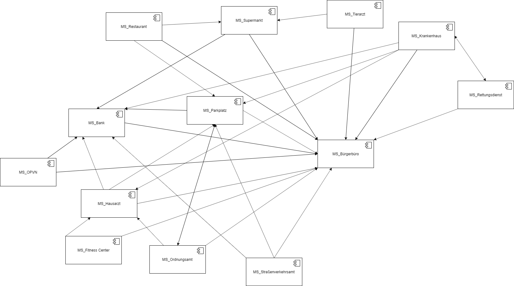

# Smart-City

Auf den folgenden Seiten werden die Spezifikationen der verschiedenen Microservices für unsere Smart-City genauer erläutert.

## Beschreibung Smart-City

Bei der Smart-City handelt es sich um eine fiktive Kleinstadt. In dieser Kleinstadt leben ca. 10.000 Einwohner. Jedem Bewohner wird mit der Geburt eine eindeutige Identifikationsnummer zugeordnet. Ziel ist es nun, verschiedene Dienste und Angebote in der Stadt zu digitalisieren um das Leben der Bürger einfacher zu gestalten. Dazu gehört neben den Abrufen von Informationen auch eine Digitalisierung im Arbeitsalltag. 

Die ausgewählten Angebote, jedes bildet einen eigenständigen Microservice, sind über ein zentrales Portal im Web erreichbar.

## Kommunikation unter den Microservices

### Techniken

__Asynchrone  Kommunikation:__ RabbitMQ

- Datenaustauschformat: json

__Synchrone Kommunikation:__ gRPC

### Schnittstellenübersicht

### Kommunikationsdiagramm

## Zentrales Portal

### Mockup

## Ansprechpartner Microservices

Bürgerbüro - Pia

Öffentlicher Nahverker (ÖPNV) - Alexander

Parkplatz - Sven

Straßenverkehrsamt - Benedikt

Hausarzt - Tim

Restaurant - Andre K.

Krankenhaus - Jendrik

Supermarkt - Andre M.

Fitness Center - Malte

Ordnungsamt - Philipp

Bank - Fabian

Tierarzt - Mattis

Rettungsdienst - Patrick

Apotheke - David

## Ansprechpartner Zentrale Themen

RabbitMQ - Philipp, Malte, Sven

Authentifizierung - Pia, Benedikt

Zentrales Portal - Andre M.

Server - Andre K., Alexander

CI - Jendrik, Tim