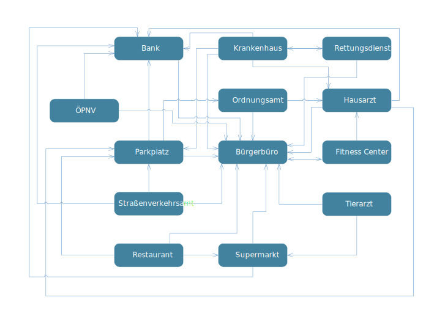
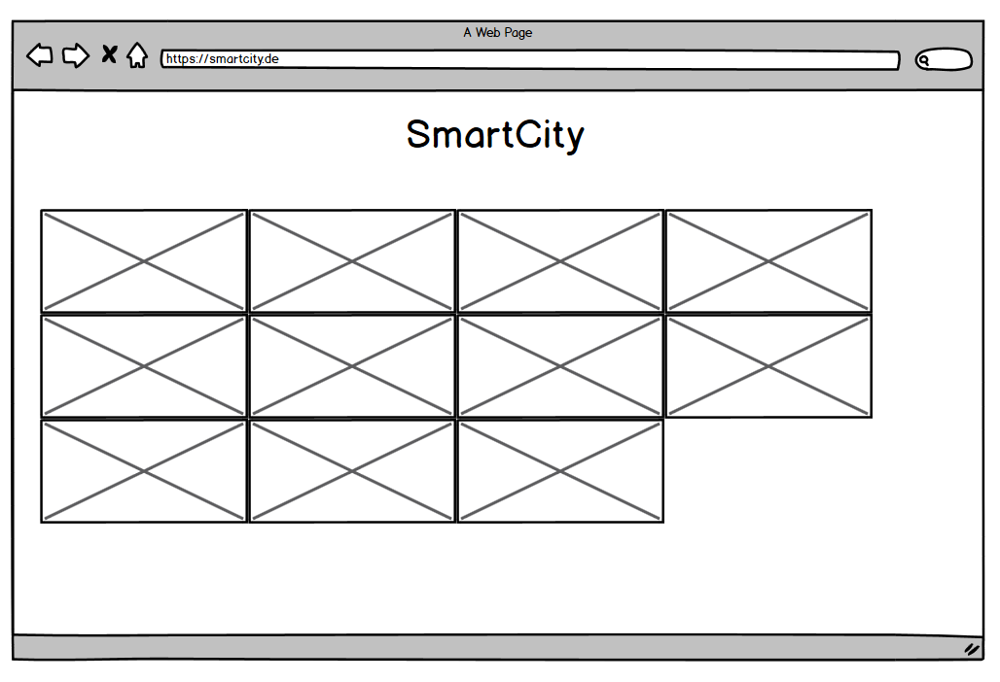

# Smart-City

Auf den folgenden Seiten werden die Spezifikationen der verschiedenen Microservices für unsere Smart-City genauer erläutert.

## Beschreibung Smart-City

Bei der Smart-City handelt es sich um eine fiktive Kleinstadt. In dieser Kleinstadt leben ca. 10.000 Einwohner. Jedem Bewohner wird mit der Geburt eine eindeutige Identifikationsnummer zugeordnet. Ziel ist es nun, verschiedene Dienste und Angebote in der Stadt zu digitalisieren um das Leben der Bürger einfacher zu gestalten. Dazu gehört neben den Abrufen von Informationen auch eine Digitalisierung im Arbeitsalltag. 

Die ausgewählten Angebote, jedes bildet einen eigenständigen Microservice, sind über ein zentrales Portal im Web erreichbar.

## Kommunikation unter den Microservices

### Techniken

__Asynchrone  Kommunikation:__ RabbitMQ

- Datenaustauschformat: JSON

__Synchrone Kommunikation:__ gRPC

### Kommunikationsdiagramm

### Schnittstellenübersicht

#### Bürgerbüro

**Message Queues**

- Bürgerdaten haben sich geändert
- Bürger ist zugezogen (Neue Registrierung)
- Nutzerkonto wurde deaktiviert (weggezogen oder für tot erklärt)

**Schnittstellen**

- Gibt Userdaten raus (Benötigt UserID)
- Nimmt Anhänge fürs schwarze Brett entgegen
- Verifiziert User Token und gibt userid zurück
- Löscht Anhänge vom schwarzen Brett

#### Parkplatz

**Schnittstellen**

- Parkplatz reservieren
- Auslastung abfragen
- Parkfläche bereitstellen
- Parkfläche bearbeiten
- Parkfläche löschen

#### Straßenverkehrsamt

**Schnittstellen**

- Führerschein abfragen
- Fahrzeuginhaber abfragen

#### Krankenhaus

**Schnittstellen**

- Überweisung von Patienten an den Hausarzt
- Entgegennahme von Überweisungen
- Vereinbaren von Terminen
- Abrufen von Patientendaten

#### Hausarzt 

**Schnittstellen**

- Überweisungen von Patienten an Krankenhaus/Fitnesscenter
- Krankenakte rausschicken

#### Restaurants

**Schnittstellen**

- Terminüberschneidung von Benutzer überprüfen

#### Supermarkt

**Schnittstellen**

- Produkt bestellen
- Bestellstatus einsehen

#### Fitness Center

**Message Queues**

- Neues Gerät

**Schnittstellen**

- Trainingsplan beantragen
- Termin beim Physiotherapeut anfragen

#### Ordnungsamt

**Message Queues**

- Genehmigungen
- Ordnungswidrigkeiten

**Schnittstellen**

- Bestehende Genehmigungen anfragen
- Bestehende Ordnungswidrigkeiten anfragen
- Ordnungswidrigkeit melden
- Meldung von psychisch Kranken

#### Bank

**Schnittstellen**

- Geld einzahlen/auszahlen
- Geld überweisen
- Geld monatlich(generell Zeitlich) überweisen
- Konto anlegen

#### Tierarzt

**Schnittstellen**

- Tierarzt Termine anzeigen
- Tierarzt Termine anfordern/löschen
- Tierfutter/Medizin bestellen
- Tierarztkosten bezahlen

#### Rettungsdienst

**Message Queues**

- Person verstorben

**Schnittstellen**

- Einsatzbericht abrufen
- Transport anmelden

#### ÖPNV

**Message Queues**

- Neue Verkehrsinformationen
- Fahrplan Änderungen

**Schnittstellen**

- Ticket kosten

- Verkehrsinformationen

  

## Zentrales Portal

### Mockup

## Ansprechpartner Microservices

| Microservice       | Ansprechpartner |
| ------------------ | --------------- |
| Bürgerbüro         | Pia             |
| Parkplatz          | Sven            |
| ÖPNV               | Alexander       |
| Straßenverkehrsamt | Benedikt        |
| Hausarzt           | Tim             |
| Restaurant         | Andre K.        |
| Supermarkt         | Andre M.        |
| Fitness Center     | Malte           |
| Ordnungsamt        | Philipp         |
| Bank               | Fabian          |
| Tierarzt           | Mattis          |
| Rettungsdienst     | Patrick         |

## Ansprechpartner Zentrale Themen

| Thema             | Ansprechpartner      |
| ----------------- | -------------------- |
| RabbitMQ          | Philipp, Malte, Sven |
| Authentifizierung | Pia, Benedikt        |
| Zentrales Portal  | Andre M.             |
| Server            | Andre K., Alexander  |
| CI                | Jendrik, Tim         |

