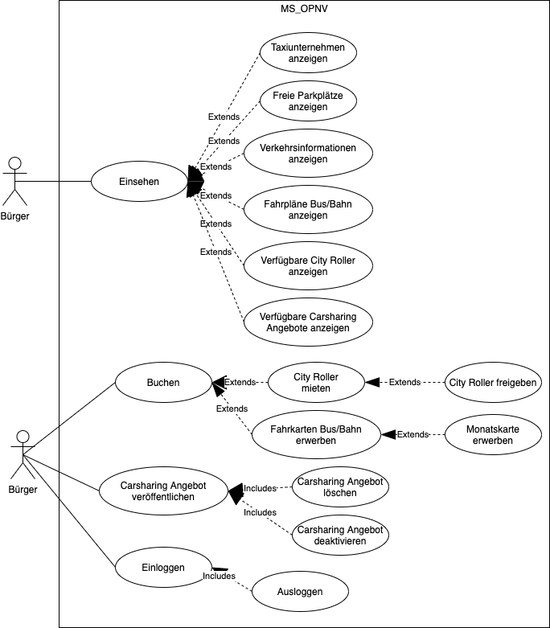

# Anforderungs- und Entwurfsspezifikation ("Pflichtenheft")

* __Titel:__ SmartCity-ÖPNV
* __Author:__ Alexander Bergmann
* __Source Code:__ [Code Repository](https://github.com/SGSE-2020/MS_OPNV.git)

# 1 Einführung

## 1.1 Beschreibung

Die Plattform für den öffentlichen Personennahverkehr der Smart City bietet nicht nur die möglichkeit zum Erwerb von Fahrkarten für Buse und Bahnen, sondern bezieht auch moderne Fortbewegungsmöglichkeiten ein. Das mieten von City Rollern oder Angebote zum Carsharing können einfach über dieses Portal verwaltet werden. Zudem ist das Informationsangebot rund um den allgemeinen Personenverkehr in der Stadt sehr Vielfältig. Es werden Informationen zu den Verfügbaren Taxiunternehmen der Stadt aufgelistet und allgemeine Verkehrsinformationen angezeigt. Außerdem können freie Parkplätze schnell und einfach eingesehen werden. Die Werbeflächen auf Bussen und Bahnen können Unternehmen der Stadt ebenfalls über dieses Portal buchen. Der Micro Service ÖPNV dient dem Bürger der Smart City als zentrale Anlaufstelle in Sachen Fortbewegung.

* Projektname
* Darstellung der Produktvision in Prosa (5-10 Sätze)
* Ziele
* Für wen ist das Produkt/der Service?
* Was ist das Bedürfnis? 
* Was ist das Produkt/der Service?
* Warum sollte der Kunde dieses Produkt/den Service „kaufen“ oder nutzen?
* Im Gegensatz zu welchen anderen Produkten/Services steht dies?
* Was macht dieses Produkt/der Service anders?
* Warum ist das Projekt sinnvoll?
* Welche Stakeholder sind betroffen und wie stehen Sie zu der Projektidee?
* Welche alternativen Lösungsideen existieren für den identifizierten Bedarf?
* Wie hoch sind Aufwand und erwarteter Nutzen und stehen sie in einem sinnvollen Verhältnis? (Lohnt sich das Projekt?)
* Verfügen wir über die notwendigen Kompetenzen? (Umsetzbarkeit)
* Welche Risiken und negativen Nebeneffekte sind zu erwarten?

## 1.2 Ziele

Die Alarmierung von Einsatzkräften spielt in vielen Gemeinden eine große Rolle. Eine lückenlose Alarmierungsmöglichkeit ohne die gesamte Bevölkerung zu unterrichten sind wichtige Eigenschaften eines modernen Systems. Das System soll die Mitarbeiter des Rettungsdienstes bei Einsätzen unterstützen. Hierzu zählt die Aufnahme eines Notfalls, die Benachrichtigung des Rettungswagen, sowie Maßnahmen vor Ort. Hierzu zählt das Abrufen der Patientenakte oder das Finden eines freien Krankenhauses. Im Abschluss kann der Einsatz mit einem Einsatzbericht abgeschlossen werden. 

# 2 Anforderungen

## 2.1 Stakeholder

| Funktion / Relevanz | Name | Kontakt / Verfügbarkeit | Wissen  | Interessen / Ziele  |
|---|---|---|---|---|
|  |      |  |  |  |

## 2.2 Funktionale Anforderungen

## 2.3 Nicht-funktionale Anforderungen 

### 2.3.1 Rahmenbedingungen

- Normen, Standards, Protokolle, Hardware, externe Vorgaben

### 2.3.2 Betriebsbedingungen

- Vorgaben des Kunden (z.B. Web Browser / Betriebssystem Versionen, Programmiersprache)

### 2.3.3 Qualitätsmerkmale

Qualitätsmerkmal | sehr gut | gut | normal | nicht relevant
---|---|---|---|---
**Zuverlässigkeit** | | | | 
Fehlertoleranz |X|-|-|-
Wiederherstellbarkeit |-|X|-|-
Ordnungsmäßigkeit |X|-|-|-
Richtigkeit |X|-|-|-
Konformität |-|X|-|-
**Benutzerfreundlichkeit** | | | | 
Installierbarkeit |-|-|-|X
Verständlichkeit |X|-|-|-
Erlernbarkeit |-|X|-|-
Bedienbarkeit |X|-|-|-
**Performance** | | | | 
Zeitverhalten |-|X|-|-
Effizienz|-|-|X|-
**Sicherheit** | | | | 
Analysierbarkeit |-|-|X|-
Modifizierbarkeit |-|-|X|-
Stabilität |-|X|-|-
Prüfbarkeit |-|X|-|-

## 2.4 Graphische Benutzerschnittstelle

- GUI-Mockups passend zu User Stories
- Screens mit Überschrift kennzeichnen, die im Inhaltsverzeichnis zu sehen ist
- Unter den Screens darstellen (bzw. verlinken), welche User Stories mit dem Screen abgehandelt werden
- Modellierung der Navigation zwischen den Screens der GUI-Mockups als Zustandsdiagramm

## 2.5 Anforderungen im Detail

| **Als** | **möchte ich** | **so dass** | **Akzeptanz** |
| :------ | :----- | :------ | :-------- |
| Bürger | die Taxiunternehmen der Stadt einsehen | ich mir ein Taxi rufen kann | Muss |
| Bürger | mir die aktuellen freien Parkplätze ansehen können | so das ich schnell einen Parkplatz finde | Muss |
| Bürger | mir die aktuellen Verkehrsinformationen anzeigen lassen | ich mich auf Verzögerungen einstellen kann | Kann |
| Bürger | mir die Fahrpläne von Bus und Bahn anzeigen lassen | ich weiß wann meine Linie abfährt und wo sie hält | Muss |
| Bürger | mir die verfügbaren City Roller der Stadt auf eine Karte anzeigen lassen | ich erkennen kann ob ein freier City Roller in meiner Nähe zu Verfügung steht | Kann |
| Bürger | mir die Carsharing Angebote anderer Bürger anschauen | ich mir eine Mitfahrgelegenheit suchen kann | Kann |
| Unternehmen | Werbeflächen (Bus/Bahn) mieten können | Werbung für mein Unternehmen in der Stadt veröffentlichen kann | Muss |
| Unternehmen | gemietete Werbeflächen (Bus/Bahn) wieder Freigeben können | ich diese nicht mehr bezahlen muss | Muss |
| Bürger | freie City Roller mieten und freigeben können | ich diese für einen bestimmten Zeitraum nutzen kann | Kann |
| Bürger | Fahrkarten für Bus und Bahn erwerben können | ich die öffentlichen Verkehrsmittel nutzen kann | Muss |
| Bürger | eine Monatskarte erwerben können | ich bei häufiger Nutzung des ÖPNV eine Vergünstigung erhalte | Muss |
| Bürger | Carsharing Angebote veröffentlichen, löschen und deaktivieren können | ich meine Carsharing angebote einfach verwalten kann | Kann |
| Bürger | mich mit meinem Account Einloggen und Ausloggen können | ich meine Daten einsehen kann und die ÖPNV Plattform nutzen kann | Muss |

# 3 Technische Beschreibung

## 3.1 Systemübersicht

- Systemarchitekturdiagramm ("Box-And-Arrow" Diagramm)
- Kommunikationsprotokolle, Datenformate

## 3.2 Softwarearchitektur

- Darstellung von Softwarebausteinen (Module, Schichten, Komponenten)

## 3.3 Schnittstellen

- Schnittstellenbeschreibung (API)
- Auflistung der nach außen sichtbaren Schnittstelle der Softwarebausteine

## 3.3.1 Ereignisse

- In Event-gesteuerten Systemen: Definition der Ereignisse und deren Attribute

## 3.4 Datenmodell 

- Konzeptionelles Analyseklassendiagramm (logische Darstellung der Konzepte der Anwendungsdomäne)
- Modellierung des physikalischen Datenmodells 
  - RDBMS: ER-Diagramm bzw. Dokumentenorientiert: JSON-Schema

## 3.5 Abläufe

- Aktivitätsdiagramme für relevante Use Cases
- Aktivitätsdiagramm für den Ablauf sämtlicher Use Cases

## 3.6 Entwurf

- Detaillierte UML-Diagramme für relevante Softwarebausteine

## 3.7 Fehlerbehandlung 

* Mögliche Fehler / Exceptions auflisten

## 3.8 Validierung

* Relevante (Integrations)-Testfälle, die aus den Use Cases abgeleitet werden können

# 4 Projektorganisation

## 4.1 Annahmen

- Nicht durch den Kunden definierte spezifische Annahmen, Anforderungen und Abhängigkeiten
- Verwendete Technologien (Programmiersprache, Frameworks, etc.)
- Aufteilung in Repositories gemäß Software- und Systemarchitektur und Softwarebbausteinen 
- Einschränkungen, Betriebsbedingungen und Faktoren, die die Entwicklung beeinflussen (Betriebssysteme, Entwicklungsumgebung)
- Interne Qualitätsanforderungen (z.B. Softwarequalitätsmerkmale wie z.B. Erweiterbarkeit)

## 4.2 Verantwortlichkeiten

- Zuordnung von Personen zu Softwarebausteinen aus Kapitel 3.1 und 3.2
- Rollendefinition und Zuordnung

| Softwarebaustein | Person(en) |
|----------|-----------|
| Komponente A | Thomas Mustermann |

### Rollen

#### Softwarearchitekt
Entwirft den Aufbau von Softwaresystemen und trifft Entscheidungen über das Zusammenspiel der Softwarebausteine.

#### Frontend-Entwickler
Entwickelt graphische oder andere Benutzerschnittstellen, insbesondere das Layout einer Anwendung.

#### Backend-Entwickler
Implementiert die funktionale Logik der Anwendung. Hierbei werden zudem diverse Datenquellen und externe Dienste integriert und für die Anwendung bereitgestellt.

### Rollenzuordnung

| Name     | Rolle     |
|----------|-----------|
| Thomas Mustermann | Softwarearchitekt |

## 4.3 Grober Projektplan

- Meilensteine

### Meilensteine
* KW 43 (21.10)
  * Abgabe Pflichtenheft
* KW 44 (28.10) / Projekt aufsetzen
  * Repository Struktur
* KW 45 (4.11) / Implementierung
  * Implementierung #3 (Final)
* KW 48 (18.12) / Abnahmetests
  * manuelle Abnahmetestss
  * Präsentation / Software-Demo

# 5 Anhänge

## 5.1 Glossar 

- Definitionen, Abkürzungen, Begriffe

## 5.2 Referenzen

- Handbücher, Gesetze

## 5.3 Index

