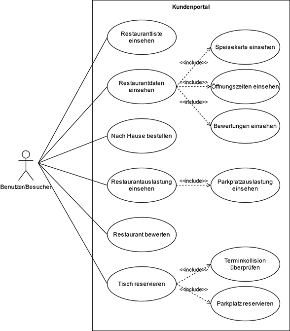

# Restaurants - Anforderungs- und Entwurfsspezifikation

* Titel: SmartCity - Restaurants
* Autor: André Kirsch
* https://github.com/SGSE-2020/MS_Restaurant

# 1 Einführung

## 1.1 Beschreibung

Restaurants sind zentrale Punkte des öffentlichen Lebens in einer Stadt. Mit dem SmartCity Service **Restaurants** können Restaurants sich online vorstellen und ihre Produkte anbieten. Besucher der Webseite können sich über einzelne Restaurants informieren und Bestellungen tätigen sowie Tische reservieren. Restaurantbesitzer können ihre Restaurants online einstellen und präsentieren. Die Webseite bietet Restaurantbesitzern einen neuen Weg der Vermarktung.

* Projektname
* Darstellung der Produktvision in Prosa (5-10 Sätze)
* Ziele
* Für wen ist das Produkt/der Service?
* Was ist das Bedürfnis? 
* Was ist das Produkt/der Service?
* Warum sollte der Kunde dieses Produkt/den Service „kaufen“ oder nutzen?
* Im Gegensatz zu welchen anderen Produkten/Services steht dies?
* Was macht dieses Produkt/der Service anders?
* Warum ist das Projekt sinnvoll?
* Welche Stakeholder sind betroffen und wie stehen Sie zu der Projektidee?
* Welche alternativen Lösungsideen existieren für den identifizierten Bedarf?
* Wie hoch sind Aufwand und erwarteter Nutzen und stehen sie in einem sinnvollen Verhältnis? (Lohnt sich das Projekt?)
* Verfügen wir über die notwendigen Kompetenzen? (Umsetzbarkeit)
* Welche Risiken und negativen Nebeneffekte sind zu erwarten?

## 1.2 Ziele

Der SmartCity Service Restaurant soll Restaurantbesitzer ermöglichen, eine Online Plattform für ihr Restaurant aufzubauen. Dabei soll es grundlegende Einstellungsmöglichkeiten für Restaurantbesitzer geben. Andere Besucher der Online Plattform sollen Informationen zu eingetragenen Restaurants finden und Bestellungen aufgeben können. Im Unterschied zu einzelnen Webseiten von Restaurants befindet sich auf dieser Webseite eine Auswahl mehrerer Restaurants einer bestimmten Smart City.

- Anwendungsbereiche, Motivation, Umfang, Alleinstellungsmerkmale, Marktanforderungen
- Informationen zu Zielbenutzergruppen und deren Merkmale (Bildung, Erfahrung, Sachkenntnis)
- Abgrenzung (Was ist das Softwaresystem _nicht_)
- ggfs. SWOT-Analyse

# 2 Anforderungen

## 2.1 Stakeholder

| Funktion / Relevanz | Name | Kontakt / Verfügbarkeit | Wissen  | Interessen / Ziele  |
|---|---|---|---|---|
|  |   |   |    |   |

## 2.2 Funktionale Anforderungen

##### Kundenportal

##### Restaurantverwaltung

## 2.3 Nicht-funktionale Anforderungen 

### 2.3.1 Rahmenbedingungen

### 2.3.2 Betriebsbedingungen

Der Benutzer soll mithilfe eines Browser auf die Anwendung als Webseite zugreifen können. Der Zugriff über den Browser soll dabei über PC, Tablet und Smartphone erfolgen können. Die Bedingung für den vollfunktionsfähigen Zugriff auf die Webseite ist die Verwendung einer aktuellen Browserversion.

### 2.3.3 Qualitätsmerkmale

Qualitätsmerkmal | sehr gut | gut | normal | nicht relevant
---|---|---|---|---
**Zuverlässigkeit** | | | | 
Fehlertoleranz | X        |-| -      |-
Wiederherstellbarkeit | X        |-| -      |-
Ordnungsmäßigkeit | X        |-|-|-
Richtigkeit | X        |-| -      |-
Konformität |-|X|-|-
**Benutzerfreundlichkeit** | | | | 
Installierbarkeit |-|-|-| X              
Verständlichkeit |X|-|-|-
Erlernbarkeit |X|-|-|-
Bedienbarkeit |X|-|-|-
**Performance** | | | | 
Zeitverhalten |-|X|-|-
Effizienz|-| X-   |        |-
**Sicherheit** | | | | 
Analysierbarkeit |-|-|X|-
Modifizierbarkeit |-|-|-|X
Stabilität |-|X|-|-
Prüfbarkeit |-|-|X|-

## 2.4 Graphische Benutzerschnittstelle

## 2.5 Anforderungen im Detail

#### Benutzer

| **Name**                                | **In meiner Rolle als**... | ...**möchte ich**...                                         | ..., **so dass**...                                          | **Erfüllt, wenn**...                                         | **Priorität** |
| :-------------------------------------- | :------------------------: | :----------------------------------------------------------- | :----------------------------------------------------------- | :----------------------------------------------------------- | :------------ |
| Restaurantliste einsehen                |          Benutzer          | eine Liste mit allen Restaurants in meiner Stadt und zusätzlichen Informationen zu diesen Restaurants einsehen | ich weiß, welche Restaurants in der Stadt existieren und welche sich aktuell lohnen zu besuchen. | die Restaurantliste einsehbar ist.                           | Muss          |
| Speisekarte einsehen                    |          Benutzer          | die Speisekarte zu einem von mir ausgewählten Restaurant angezeigt bekommen | ich sehen kann, welche Gerichte in diesem Restaurant bestellt werden können. | die Speisekarte zu jedem Restaurant einsehbar ist.           | Muss          |
| Tisch reservieren                       |          Benutzer          | bei einem ausgewählten Restaurant einen Tisch für eine von mir ausgewählte Anzahl an Personen für einen bestimmten Zeitpunkt reservieren | dieser Tisch verfügbar ist, wenn ich mit meiner Gruppen zu dem gegebenen Zeitpunkt in dem Restaurant essen möchte | Tische über die Webseite reserviert werden können.           | Muss          |
| Restaurantauslastung einsehen           |          Benutzer          | einsehen können, wie stark aktuell die Restaurantauslastung in einem Restaurant ist und wie viele Plätze in dem Restaurant noch frei sind | ich besser einschätzen kann, ob sich aktuell ein Besuch bei dem Restaurant lohnt. | die Restaurantauslastungen und die Anzahl freier Tische einsehbar ist | Kann          |
| Terminkollision überprüfen              |          Benutzer          | , dass ich bei der Reservierung eines Tisches in einem Restaurant gewarnt werde, wenn in meinem Kalender eine Kollision mit einem anderen Termin existiert | ich zu dem gegebenen Zeitpunkt zusätzlich bestätigen muss, dass ich einen Tisch reservieren möchte. | bei Terminkollision eine zusätzliche Abfrage existiert.      | Muss          |
| Nach Hause bestellen                    |          Benutzer          | eine Bestellung in einem Restaurant, welches Lieferungen unterstützt, aufgeben und online bezahlen | mir diese Bestellung nach Hause geliefert wird.              | Gerichte bestellt und bezahlt werden können.                 | Muss          |
| Parkplätze reservieren                  |          Benutzer          | angeben können, ob und wie viele Parkplätze bei einer Tischreservierung in der Nähe des Restaurants mit reserviert werden können | ich bei der Ankunft am Restaurant keinen Parkplatz suchen muss. | Parkplatzreservierung mit Anzahl angegeben werden kann.      | Muss          |
| Parkplatzauslastung einsehen            |          Benutzer          | die Parkplatzauslastung am Restaurant einsehen können        | ich weiß, ob ich in der Nähe noch einen Parkplatz finden kann. | die Parkplatzauslastung einsehbar ist.                       | Kann          |
| Restaurants bewerten                    |          Benutzer          | Restaurants bewerten können                                  | andere einsehen können, welche Restaurants gut sind.         | die Restaurantbewertungen einsehbar sind.                    | Muss          |

#### Administrator

| **Name**                                | **In meiner Rolle als**... | ...**möchte ich**...                                         | ..., **so dass**...                                          | **Erfüllt, wenn**...                                         | **Priorität** |
| :-------------------------------------- | :------------------------: | :----------------------------------------------------------- | :----------------------------------------------------------- | :----------------------------------------------------------- | :------------ |
| Restaurant eintragen                    |     Restaurantbesiter      | mein Restaurant eintragen können                             | andere Personen sehen können, dass es mein Restaurant in der Stadt gibt. | neue Restaurants eingetragen werden können.                  | Muss          |
| Speisekarte eintragen                   |     Restaurantbesitzer     | die Speisekarte meines Restaurants eintragen und ändern können | andere Personen sehen können, welche Gerichte in meinem Restaurant angeboten werden. | Gerichte eingefügt, geändert und gelöscht werden können.     | Muss          |
| Öffnungszeiten eintragen                |     Restaurantbesitzer     | die Öffnungszeiten meines Restaurants eintragen können       | andere Personen wissen, wann mein Restaurant geöffnet ist.   | Öffnungszeiten eintragbar und von anderen Personen einsehbar sind. | Muss          |
| Restaurantdaten eintragen               |     Restaurantbesitzer     | Restaurantdaten wie Tischanzahl, -größe und Parkplätze in der Nähe eintragen können | Benutzer Tische und Parkplätze reservieren kann.             | Tische und Parkplätze reserviert werden können               | Muss          |
| Bestellungen erlauben                   |     Restaurantbesitzer     | Online-Bestellungen erlauben können                          | andere Personen in meinem Restaurant online Gerichte bestellen und bezahlen können. | Gerichte online bestellt und bezahl werden können und der Restaurantbesitzer diese Funktion aktivieren/deaktivieren kann. | Muss          |
| Bestellungen einsehen                   |     Restaurantbesitzer     | Online-Bestellungen einsehen können                          | ich weiß, wann ein Besucher der Webseite eine Bestellung aufgegeben hat. | Bestellungen auf der Webseite eingesehen werden können.      | Muss          |
| Bestellungen annehmen                   |     Restaurantbesitzer     | Online-Bestellungen annehmen können                          | die Bestellung geliefert werden kann.                        | Bestellungen auf der Webseite angenommen werden können       | Muss          |
| Bestellungen abschließen                |     Restaurantbesitzer     | Online-Bestellungen abschließen können                       | die Bestellung erfüllt werden kann.                          | Bestellungen auf der Webseite abgeschlossen werden können    | Muss          |
| Restaurantangebote im Bürgerbüro teilen |     Restaurantbesitzer     | spezielle Angebote in einem Restaurant an das Bürgerbüro senden | andere Personen dort diese Angebote sehen können.            | Angebote können an das Bürgerbüro gesendet werden.           | Kann          |

# 3 Technische Beschreibung

## 3.1 Systemübersicht

## 3.2 Softwarearchitektur

## 3.3 Schnittstellen

## 3.4 Datenmodell

## 3.5 Abläufe

## 3.6 Entwurf

## 3.7 Fehlerbehandlung 

## 3.8 Validierung

# 4 Projektorganisation

## 4.1 Annahmen

## 4.2 Verantwortlichkeiten

### Rollen

#### Softwarearchitekt

#### Frontend-Entwickler

#### Backend-Entwickler

### Rollenzuordnung

## 4.3 Grober Projektplan

### Meilensteine

- Erstellung Repositories
  - Di, 21.04.2020
- Abgabe Software-Spezifikation
  - Mo, 11.05.2020
- Abgabe Softwareprodukt (Version 0)
  - Erste lauffähige Version
  - Mo, 08.06.2020
- Abgabe Softwareprodukt
  - Voll funktionsfähig
  - Mit Präsentation/Demo
  - Do, 03.07.2020

# 5 Anhänge

## 5.1 Glossar

- Definitionen, Abkürzungen, Begriffe

## 5.2 Referenzen

- Handbücher, Gesetze

## 5.3 Index
