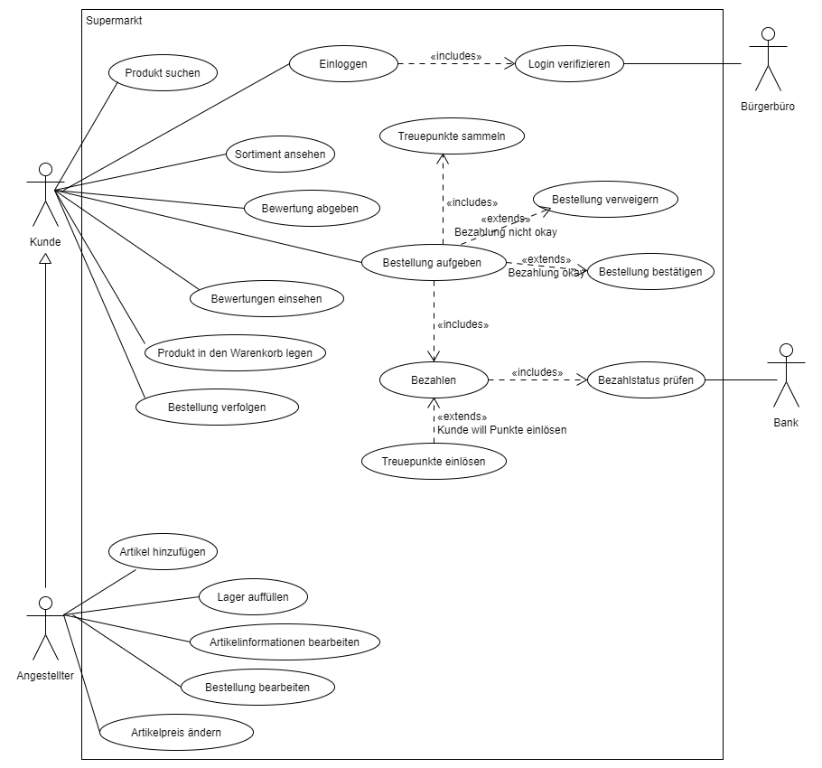
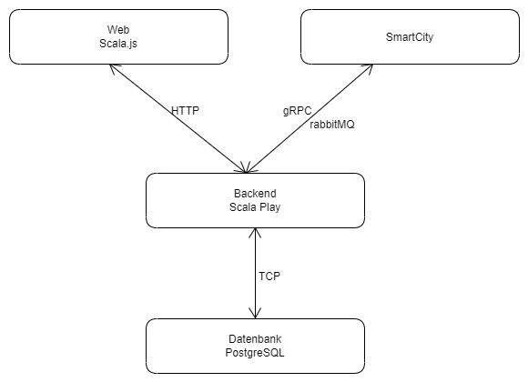

# Anforderungs- und Entwurfsspezifikation ("Pflichtenheft")

* SmartCity: Smart-Markt
* Author: André Matutat
* Source Code: [GitHub](<https://github.com/SGSE-2020/MS_Supermarkt>)

# 1 Einführung

## 1.1 Beschreibung

Der Supermarkt in der SmartCity versorgt Privatpersonen und Unternehmen mit Gütern des alltäglichen Bedarfs. Der *Smart-Markt* ist eine digitale Einkaufsplattform und ermöglicht es den Kunden seinen Einkauf bequem von Zuhause oder unterwegs mit dem Smartphone zu tätigen. Durch die Verbindung mit dem Bürgerkonto ist es nicht nötig ein extra Benutzerkonto anzulegen. Die Abbuchung des Geldes und die Ermittlung der Lieferadresse erfolgt vollautomatisch mithilfe der verschiedenen Service der Smart-City. Bürger der Smart-City sammeln vollautomatisch Treuepunkte welche sie für tolle Rabatte einläsen können und das OHNE angst um ihre Daten haben zu müssen.


## 1.2 Ziele

Ziel des Smart-Markts ist es, jeden Bürger der Smart-City, egal ob jung oder alt, ein möglichst Angenehmes und sicheres Einkaufserlebnis zu gewährleisten. Vor allem ältere Bürger können sich so den anstrengenden Gang zum Supermarkt sparen und erhalten dennoch täglich frische Lebensmittel der besten Qualität.

Aber auch die Angestellten des Smart-Markts profitieren von der Digitalisierung. Der Lagerbestand jedes Produktes kann schnell und einfach eingesehen werden, ohne seinen Schreibtisch zu verlassen. Bestellungen beim Zuliefere können mit nur wenigen Klicks aufgegeben werden. Preise der Produkte können ebenfalls angepasst werden.

Das System ist jedoch keine volle Automatisierung des Einzelhandels. Kundenbestellungen werden von Menschen bearbeitet, um die best mögliche Qualität zu gewährleisten.  


# 2 Anforderungen

## 2.1 Stakeholder

| Funktion / Relevanz | Name | Kontakt / Verfügbarkeit | Wissen  | Interessen / Ziele  |
|---|---|---|---|---|
| Fialleiter | Dieter Dinkel | Tel 03126, E-Mail ddinkel@smartmarkt.de | Kennt die Abläufe eines Supermarktes aus organisatorischer Sicht. Soll mit dem System arbeiten. | Gewinn Steigerung, Steigung der Kundenzufriedenheit |
| Angestelle | Markus Müller | Tel 072567, E-Mail mmueller@smartmakrt.de | Kennt die Abläufe eines Supermarktes. Soll mit dem System arbeiten. | Erleichterung bei der Arbeit. |
| Lieferant | Klaudia Klemens | Tel 05173, E-Mail kklemens@smartmarkt.de | Wissen über Anforderungen von Lebensmitteltransport. Soll mit dem System arbeiten. | Neues Arbeitsfeld durch Lieferservice. Ordnungsgemäße Durchführung der Transporte. |
| Kunden | Anna Althaus | Tel 012354 | Soll das System als Kundin nutzten. | Einfaches einkaufen von Zuhause. |

## 2.2 Funktionale Anforderungen



## 2.3 Nicht-funktionale Anforderungen 

### 2.3.1 Rahmenbedingungen

- Kommunikation mit anderen Microservices: 
  - Asynchron: RabbitMQ
  - Synchron: gRPC

### 2.3.2 Betriebsbedingungen

- Verfügbarkeit per Webzugriff mit den Browsern Google Chrome und Firefox

### 2.3.3 Qualitätsmerkmale

Qualitätsmerkmal | sehr gut | gut | normal | nicht relevant
---|---|---|---|---
**Zuverlässigkeit** | | | | 
Fehlertoleranz |X|-|-|-
Wiederherstellbarkeit |X|-|-|-
Ordnungsmäßigkeit |X|-|-|-
Richtigkeit |X|-|-|-
Konformität |-|X|-|-
**Benutzerfreundlichkeit** | | | | 
Installierbarkeit |-|-|-|X
Verständlichkeit |X|-|-|-
Erlernbarkeit | X        |-|-|-
Bedienbarkeit |X|-|-|-
**Performance** | | | | 
Zeitverhalten |-|-|X|-
Effizienz|-|-|X|-
**Sicherheit** | | | | 
Analysierbarkeit |-|-|X|-
Modifizierbarkeit |X|-|-|-
Stabilität |-|X|-|-
Prüfbarkeit |X|-|-|-

## 2.4 Graphische Benutzerschnittstelle

#### Hauptseite (Kunde)


#### Produktseite (Kunde)


#### Warenkorb (Kunde)


#### Lager (Angestellter)


#### Bestellungen (Angestellter)


#### Bestellung (Angestellter)


## 2.5 Anforderungen im Detail

| **Als** | **möchte ich** | **so dass** | **Akzeptanz** |
| :------ | :----- | :------ | :-------- |
| Kunde        | Produkte einsehen                        | ich mich entscheiden kann, ob ich sie kaufen möchte          | Produkt Katalog wird im Frontend angezeigt                  |
| Kunde        | ein Produkte suchen                      | ich mir gezielt ein bestimmtes Produkt ansehen kann          | Suchfunktion für Produkte vorhanden                         |
| Kunde        | ein Produkt in den Warenkorb hineinlegen | ich das Produkt später kaufen kann                           | Ware kann in den Warenkorb gelegt werden                    |
| Kunde        | ein Produkt aus den Warenkorb entfernen  | ein Produkt nicht mehr kaufen muss                           | Ware kann aus den Warenkorb entfernt werden                 |
| Kunde        | meinen Warenkorb bezahlen                | mein Kauf abgeschlossen wird und meine Bestellung entgegen genommen wird. | Warenkorb kann bestellt werden                  |
| Kunde        | meine Treuepunkte einlösen               | ich Rabatt auf meine Bestellung bekomme                      | Treuepunkte werden verrechnet und vom Kundenkonto abgezogen |
|Kunde| bestellstatus prüfen| ich weiß, wann meine Lieferung kommt | Bestellstatus einsehbar|
| Kunde| Produkt bewerten| ich Feedback geben kann | Produktbewertung möglich|
| Angestellter | Bestellungen einsehen                    | ich offene Bestellungen sehen kann                           | Bestellungen werden angezeigt                               |
| Angestellter | den Lagerbestand einsehen                | ich sehen kann, wie viele Produkte noch im Lager sind        | Lagerbestand einsehbar                                      |
| Angestellter | Lager füllen                             | der Lagerbestand gefüllt wird                                | Lagerbestand lässt sich anpassen                            |
| Angestellter | Preise ändern                            | ich Angebote erstellen oder Preisänderungen durchführen kann | Preise lassen sich ändern                                   |
| Angestellter | Bestellstatus ändern | der aktuelle Bestellstatus einsehbar ist | Bestellstatus lässt sich ändern|
| Kunde     | mich einloggen                           | damit mir die Funktionen des SmartMarkts zur Verfügung stehen | User kann sich anmelden                                     |
|Angestellter|neue Artikel hinzufügen|damit diese von nun an auch gekauft werden können|Neue Artikel können hinzugefügt werden|
|Angestellter|Artikel bearbeiten|Artikelinformationen aktuell gehalten werden können|Artikel lassen sich bearbeiten|
|Kunde|Bewertungen ansehen|ich die Meinung anderer Nutzer sehen kann|Reviews werden auf der Artikelseite angezeigt|


# 3 Technische Beschreibung

## 3.1 Systemübersicht



## 3.2 Softwarearchitektur


## 3.3 Schnittstellen

### 3.3.1 gRPC

API um Bestellungen direkt (ohne die Webseite) aufzugeben und den Bestellstatus zu prüfen. 

```
syntax = "proto3";

package grpcOrder;

service OrderService { 
    rpc makeOrder (OrderInformation) returns (OrderID){}
    rpc trackOrder (OrderID) returns (OrderState){}
}

message OrderID {
    int32 orderID=1; //-1 if order failed
}

message OrderInformation{
    string userID=1;
    int32 artickeID=2;
    int32 howMany=3;
}

message OrderState{
    string state=1;
}
```

### 3.3.2 Ereignisse (RabbitMQ)

#### Sende

```
"sgse.messages.supermarkt.updatePrice":{
    "description": "The following Articleprice was updated", 
        "fields": [
            {"name": "articleID", "type": "int", "required": true}
            {"name" "oldPrice". type: "float". "required": true}
            {"name" "newPrice". type: "float". "required": true}
        ]
}
```

## 3.4 Datenmodell 


## 3.5 Abläufe

### Angebot durchsuchen und bestellen 


## 3.6 Fehlerbehandlung 

* Keine Verbindung zur Bank --> Fehlermeldung
* Keine Verbindung zum Bürgerbüro --> Fehlermeldung
* Backend Request Failed -> Fehlermeldung
* Produkt wird bestellt obwohl es nicht auf Lager ist --> keine Fehlerbehandlung

# 4 Projektorganisation

## 4.1 Annahmen

- Verwendete Technologien: HTML, Scala.js, Scala Playframework, PostgreSQL, gRPC, rabbitMQ, Docker
- Aufteilung in Repositories gemäß Software- und Systemarchitektur und Softwarebbausteinen


## 4.2 Grober Projektplan

### Meilensteine
* 11.05.2020
  * Abgabe Pflichtenheft
* 07.06.2020
  * Fertigstellung Prototyp
* 08.06.2020
  * Präsentation Prototyp
* 01.07.2020
  * Fertigstellung Micro-Service
* 02.07.2020 
  * Finale Einbindung in die Smart-City
* 02.07.2020 
  * Softwareübergabe
  * Präsentation 
