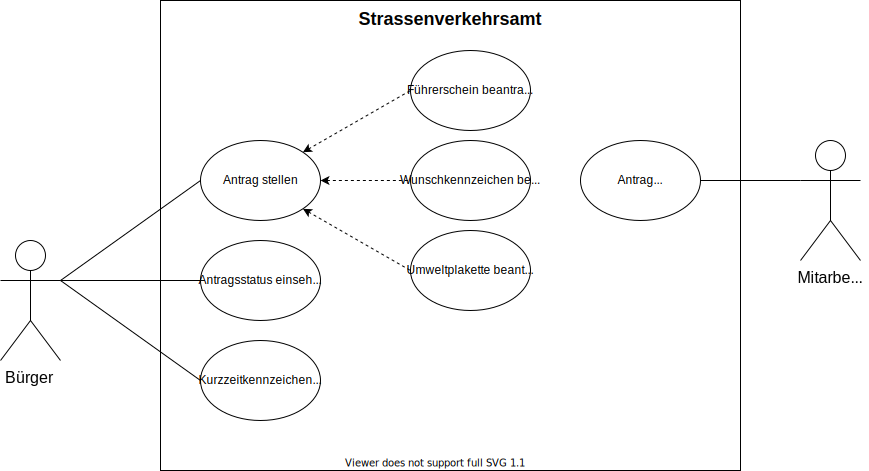

# Strassenverkehrsamt - Anforderungs- und Entwurfsspezifikation ("Pflichtenheft")

* **Titel:** SmartCity - Strassenverkehrsamt
* **Author:** Benedikt Struzek
* **Source Code:** [Link zum Code Repository](https://github.com/SGSE-2020/MS_Strassenverkehrsamt)

# 1 Einführung

## 1.1 Beschreibung

* Projektname
* Darstellung der Produktvision in Prosa (5-10 Sätze)
* Ziele
* Für wen ist das Produkt/der Service?
* Was ist das Bedürfnis? 
* Was ist das Produkt/der Service?
* Warum sollte der Kunde dieses Produkt/den Service „kaufen“ oder nutzen?
* Im Gegensatz zu welchen anderen Produkten/Services steht dies?
* Was macht dieses Produkt/der Service anders?
* Warum ist das Projekt sinnvoll?
* Welche Stakeholder sind betroffen und wie stehen Sie zu der Projektidee?
* Welche alternativen Lösungsideen existieren für den identifizierten Bedarf?
* Wie hoch sind Aufwand und erwarteter Nutzen und stehen sie in einem sinnvollen Verhältnis? (Lohnt sich das Projekt?)
* Verfügen wir über die notwendigen Kompetenzen? (Umsetzbarkeit)
* Welche Risiken und negativen Nebeneffekte sind zu erwarten?

## 1.2 Ziele

- Anwendungsbereiche, Motivation, Umfang, Alleinstellungsmerkmale, Marktanforderungen
- Informationen zu Zielbenutzergruppen und deren Merkmale (Bildung, Erfahrung, Sachkenntnis)
- Abgrenzung (Was ist das Softwaresystem _nicht_)
- ggfs. SWOT-Analyse

# 2 Anforderungen

## 2.1 Stakeholder

| Funktion / Relevanz | Name | Kontakt / Verfügbarkeit | Wissen | Interessen / Ziele |
|---------------------|------|-------------------------|--------|--------------------|
|                     |      |                         |        |                    |

## 2.2 Funktionale Anforderungen

## 2.3 Nicht-funktionale Anforderungen 

### 2.3.1 Rahmenbedingungen

### 2.3.2 Betriebsbedingungen

### 2.3.3 Qualitätsmerkmale

## 2.4 Graphische Benutzerschnittstelle

## 2.5 Anforderungen im Detail

- User Stories mit Akzeptanzkritierien 
- Optional: Name (oder ID) und Priorität ("Must", "Should", "Could", "Won't")
- Strukturierung der User Stories in funktionale Gruppen

### Bürger

| **Als** | **möchte ich**                | **so dass**                                                        | **Akzeptanz**              | **Priorität** |
|---------|-------------------------------|--------------------------------------------------------------------|----------------------------|---------------|
| Bürger  | Führerschein beantragen       | Der Antrag bearbeitet werden kann                                  | Kann abgeholt werden       | Must          |
| Bürger  | Wunschkennzeichen beantragen  | Nach einer Verfügbarkeitsprüfung der Antrag bearbeitet werden kann | Kann abgeholt werden       | Must          |
| Bürger  | Kurzzeitkennzeichen bestellen | Das Kennzeichen verschickt wird                                    | Kennzeichen ist angekommen | Should        |
| Bürger  | Umweltplakette beantragen     | Der Antrag bearbeitet werden kann                                  | Kann abgeholt werden       | Could         |
| Bürger  | Antragsstatus einsehen        | Der Status eingesehen werden kann                                  | Wird angezeigt             | Should        |

### Mitarbeiter

| **Als**     | **möchte ich**     | **so dass**                                     | **Akzeptanz**        | **Priorität** |
|-------------|--------------------|-------------------------------------------------|----------------------|---------------|
| Mitarbeiter | Anträge einsehen   | Der Antrag eingesehen werden kann               | Wird angezeigt       | Must          |
| Mitarbeiter | Anträge bearbeiten | Der Antrag angenommen oder abgeleht werden kann | Status wird geändert | Must          |

### Use Case Diagramme

# 3 Technische Beschreibung

## 3.1 Systemübersicht

## 3.2 Softwarearchitektur

## 3.3 Schnittstellen

- Schnittstellenbeschreibung (API)
- Auflistung der nach außen sichtbaren Schnittstelle der Softwarebausteine

## 3.3.1 Ereignisse
- Aktualisierung der Adresse des Bürgers

## 3.4 Datenmodell 

## 3.5 Abläufe

## 3.6 Entwurf

## 3.7 Fehlerbehandlung 

## 3.8 Validierung

# 4 Projektorganisation

## 4.1 Annahmen

## 4.2 Verantwortlichkeiten

### Rollen

#### Softwarearchitekt

#### Frontend-Entwickler

#### Backend-Entwickler

### Rollenzuordnung

## 4.3 Grober Projektplan

### Meilensteine
* KW 18 (01.05)
    * Spezifikation starten
	* Use Cases definieren

# 5 Anhänge

## 5.1 Glossar 

- Definitionen, Abkürzungen, Begriffe

## 5.2 Referenzen

- Handbücher, Gesetze

## 5.3 Index

