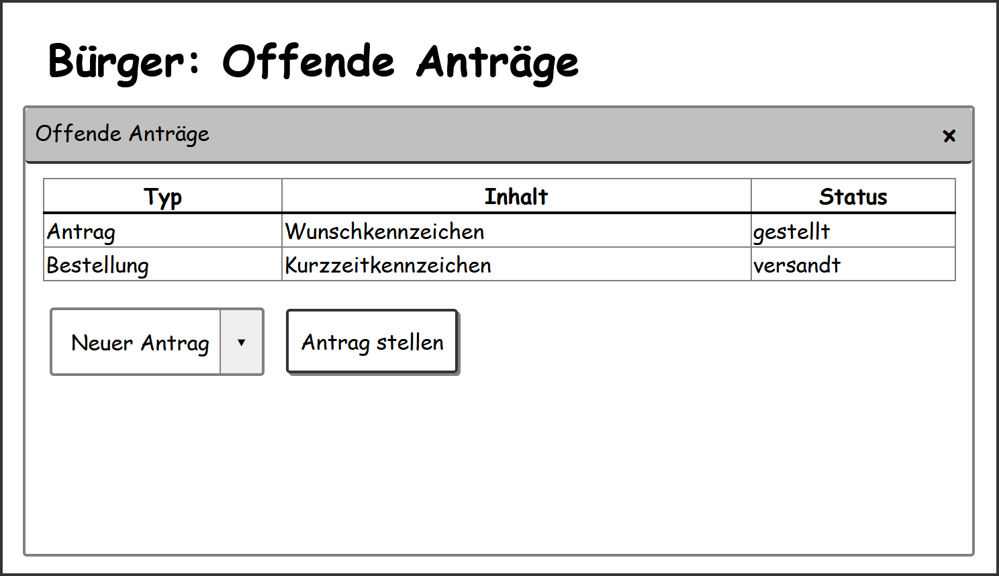
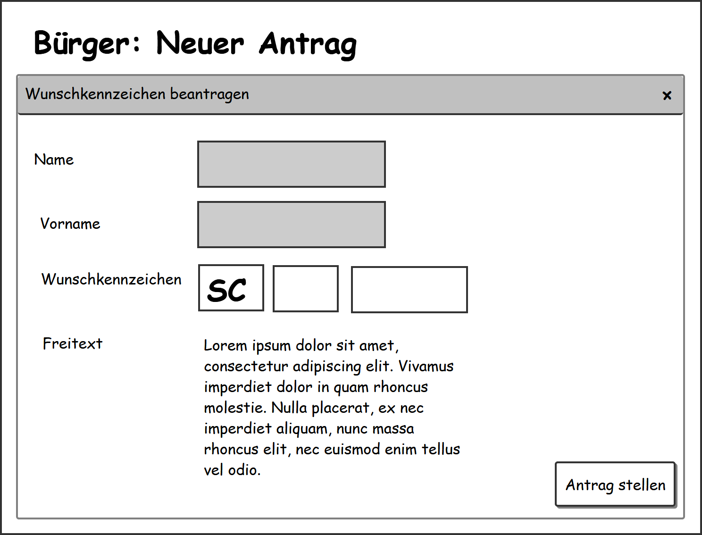
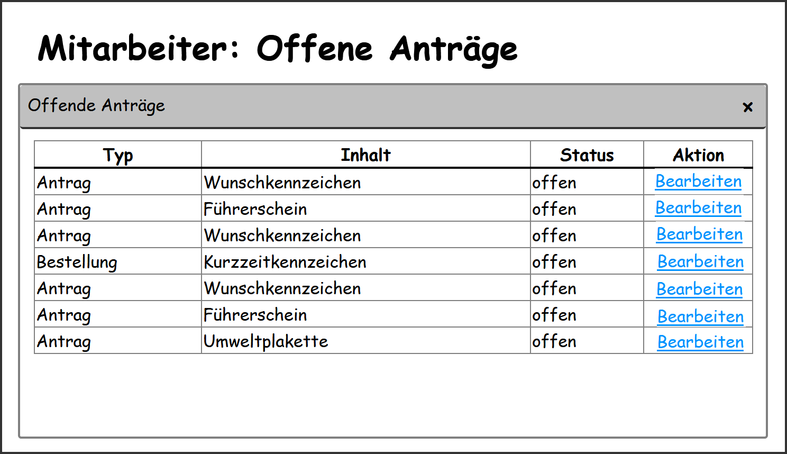
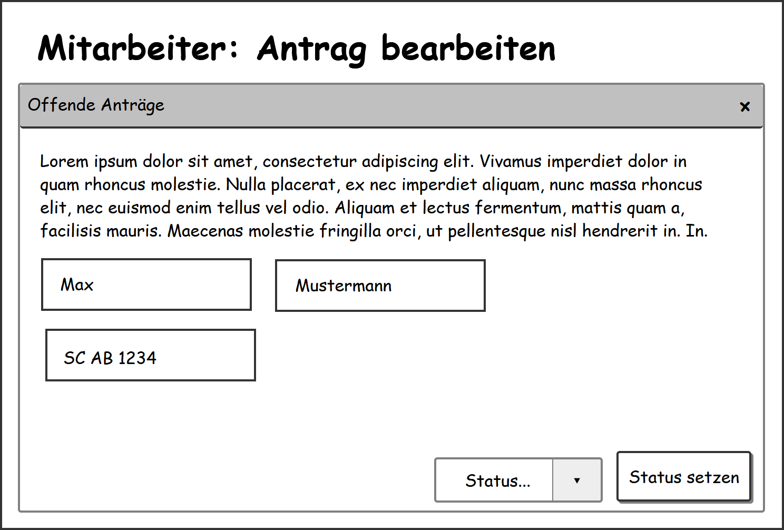
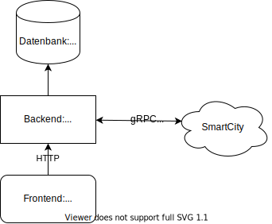
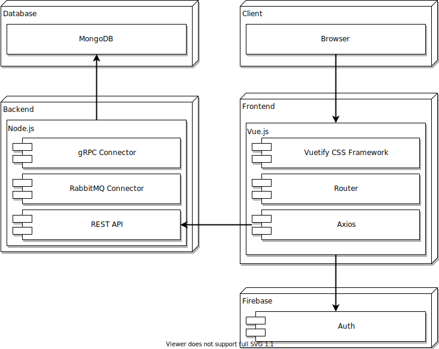

# Strassenverkehrsamt - Anforderungs- und Entwurfsspezifikation ("Pflichtenheft")

* **Titel:** SmartCity - Strassenverkehrsamt
* **Author:** Benedikt Struzek
* **Source Code:** [Link zum Code Repository](https://github.com/SGSE-2020/MS_Strassenverkehrsamt)

# 1 Einführung

## 1.1 Beschreibung
Das Strassenverkehrsamt ist eine der Behörden der Smart City. Anträge mit Bezug zum Straßenverkehr oder Fahrzeugen können hier gestellt und von Verwaltungsmitarbeitern bearbeitet werden. Um dies zu ermöglichen wird eine Webapp zur Verfügung gestellt.

* Projektname
* Darstellung der Produktvision in Prosa (5-10 Sätze)
* Ziele
* Für wen ist das Produkt/der Service?
* Was ist das Bedürfnis? 
* Was ist das Produkt/der Service?
* Warum sollte der Kunde dieses Produkt/den Service „kaufen“ oder nutzen?
* Im Gegensatz zu welchen anderen Produkten/Services steht dies?
* Was macht dieses Produkt/der Service anders?
* Warum ist das Projekt sinnvoll?
* Welche Stakeholder sind betroffen und wie stehen Sie zu der Projektidee?
* Welche alternativen Lösungsideen existieren für den identifizierten Bedarf?
* Wie hoch sind Aufwand und erwarteter Nutzen und stehen sie in einem sinnvollen Verhältnis? (Lohnt sich das Projekt?)
* Verfügen wir über die notwendigen Kompetenzen? (Umsetzbarkeit)
* Welche Risiken und negativen Nebeneffekte sind zu erwarten?

## 1.2 Ziele

Alle Fahrzeughalter und jene die es werden wollen sollen ihre amtlichen belange bezüglich von Fahrzeugen in der Webapp des Strassenverkehrsamts erledigen können.

__TODO__

- Anwendungsbereiche, Motivation, Umfang, Alleinstellungsmerkmale, Marktanforderungen
- Informationen zu Zielbenutzergruppen und deren Merkmale (Bildung, Erfahrung, Sachkenntnis)
- Abgrenzung (Was ist das Softwaresystem _nicht_)
- ggfs. SWOT-Analyse

# 2 Anforderungen

## 2.1 Stakeholder

| Funktion / Relevanz   | Name           | Kontakt / Verfügbarkeit | Wissen                               | Interessen / Ziele |
|-----------------------|----------------|-------------------------|--------------------------------------|--------------------|
| Bürger (exemplarisch) | Max Mustermann | Tel. 03265 756468548    | Kennt die Dienstleistungen eines SVA |                    |
| Mitarbeiter           |                |                         |                                      |                    |

## 2.2 Funktionale Anforderungen


## 2.3 Nicht-funktionale Anforderungen 
- Normen, Standards, Protokolle, Hardware, externe Vorgaben

### 2.3.1 Rahmenbedingungen
Um mit anderen Microservices der SmartCity zu kommunizieren werden zwei Systeme verwendet:
- __Synchron__: gRPC
- __Asynchron__: RabbitMQ

### 2.3.2 Betriebsbedingungen
Der Fahrzeughalter soll die Anwendung im Brwoser und auf dem Smartphone verwenden können. Der Funktionsumfang soll dabei der gleiche sein.
Die von der Webapp genutzten Schnittstelle soll offen gestaltet sein uim drittanbietern ebenfalls das zur Verfügung stellen eines Clients, für belibige Systeme, zu ermöglichen.

### 2.3.3 Qualitätsmerkmale
| Qualitätsmerkmal           | sehr gut | gut | normal | nicht relevant |
|----------------------------|----------|-----|--------|----------------|
| Wiederherstellbarkeit      | -        | -   | X      | -              |
| Ordnungsmäßigkeit          | X        | -   | -      | -              |
| Richtigkeit                | X        | -   | -      | -              |
| Konformität                | -        | X   | -      | -              |
| **Benutzerfreundlichkeit** |          |     |        |                |
| Installierbarkeit          | -        | -   | X      | -              |
| Verständlichkeit           | -        | X   | -      | -              |
| Erlernbarkeit              | -        | X   | -      | -              |
| Bedienbarkeit              | -        | X   | -      | -              |
| **Performance**            |          |     |        |                |
| Zeitverhalten              | -        | -   | X      | -              |
| Effizienz                  | -        | -   | X      | -              |
| **Sicherheit**             |          |     |        |                |
| Analysierbarkeit           | -        | -   | X      | -              |
| Modifizierbarkeit          | -        | -   | X      | -              |
| Stabilität                 | X        | -   | -      | -              |
| Prüfbarkeit                | X        | -   | -      | -              |

## 2.4 Graphische Benutzerschnittstelle

### Eigende Anträge einsehen


### Neuen Antrag stellen


### Mitarbeiter: Offene Anträge einsehen


## Mitarbeiter: Antrag bearbeiten


## 2.5 Anforderungen im Detail

- User Stories mit Akzeptanzkritierien 
- Optional: Name (oder ID) und Priorität ("Must", "Should", "Could", "Won't")
- Strukturierung der User Stories in funktionale Gruppen

### Bürger

| **Als** | **möchte ich**                | **so dass**                                                        | **Akzeptanz**                    | **Priorität** |
|---------|-------------------------------|--------------------------------------------------------------------|----------------------------------|---------------|
| Bürger  | Führerschein beantragen       | Der Antrag bearbeitet werden kann                                  | Kann abgeholt werden             | Must          |
| Bürger  | Wunschkennzeichen beantragen  | Nach einer Verfügbarkeitsprüfung der Antrag bearbeitet werden kann | Kann abgeholt werden             | Must          |
| Bürger  | Fahrzeug abmelden             | Das Kennzeichen wieder abgegeben werden kann                       | Kennzeichen ist wieder verfügbar | Must          |
| Bürger  | Kurzzeitkennzeichen bestellen | Das Kennzeichen verschickt wird                                    | Kennzeichen ist angekommen       | Should        |
| Bürger  | Umweltplakette beantragen     | Der Antrag bearbeitet werden kann                                  | Kann abgeholt werden             | Could         |
| Bürger  | Antragsstatus einsehen        | Der Status eingesehen werden kann                                  | Wird angezeigt                   | Should        |

### Mitarbeiter

| **Als**     | **möchte ich**     | **so dass**                                     | **Akzeptanz**        | **Priorität** |
|-------------|--------------------|-------------------------------------------------|----------------------|---------------|
| Mitarbeiter | Anträge einsehen   | Der Antrag eingesehen werden kann               | Wird angezeigt       | Must          |
| Mitarbeiter | Anträge bearbeiten | Der Antrag angenommen oder abgeleht werden kann | Status wird geändert | Must          |

### Use Case Diagramme


# 3 Technische Beschreibung

## 3.1 Systemübersicht


## 3.2 Softwarearchitektur


## 3.3 Schnittstellen

### Führerschein abfragen
```json
"sgse.models.strassenverkehrsamt.diverslicense":{
	"description": "Represents whether someone has a drivers license"
}
```

### Fahrzeuginhaber abfragen
```json
"sgse.models.strassenverkehrsamt.licenseplate":{
	"description": "Represents the owner of a license plate", 
	"fields": [
        {"name": "licenseplate", "type": "string"}
    ]
}
```

## 3.3.1 Ereignisse

### Senden
- 

### Empfangen
- Parkplatz reservieren

## 3.4 Datenmodell 
- *Exemplarische JSONs der MongoDB*

## 3.5 Abläufe
- Aktivitätsdiagramme

## 3.6 Entwurf

## 3.7 Fehlerbehandlung 

## 3.8 Validierung

# 4 Projektorganisation

## 4.1 Annahmen
### Verwendete Technologien
- Backend
  - __Node.js__
  - __Nginx__
- Datenbank
  - __MongoDB__
- Frontend
  - __Vue.js__
  - __Vuetify__

## 4.2 Verantwortlichkeiten

### Rollen

#### Softwarearchitekt
Entwirft aus den gegebenen Anforderungen die Einzelkomponenten, definiert die Kommunikation zwischen den Komponenten und entwirft das benötigte Datenmodell.

#### Frontend-Entwickler
Entwickelt anhand der Angaben des Softwarearchitekten eine Webapp die für Desktop Browser und Mobielgeräte geeignet ist.

#### Backend-Entwickler
Implementiert die Bussinesslogik des Strassenverkehrsamt und stellt diese mittels diverser Schnittstellen der Webapp und anderen Diensten der Smart City zu verfügung.

### Rollenzuordnung
| Name             | Rolle               |
|------------------|---------------------|
| Benedikt Struzek | Softwarearchitekt   |
| Benedikt Struzek | Frontend-Entwickler |
| Benedikt Struzek | Backend-Entwickler  |

## 4.3 Grober Projektplan

### Meilensteine
* KW 18 (01.05)
    * Spezifikation starten
	* Use Cases definieren+

* __KW 19__
  * API-Spezifikation
* __KW 20__
  * Software-Spezifikation
* __KW 24__
  * Abgabe Softwareprodukt
* __KW 27__
  * Abgabe Softwareprodukt

# 5 Anhänge

## 5.1 Glossar 
*Definitionen, Abkürzungen, Begriffe*
- __STV__ - Strassenverkehrsamt
- __gRPC__ - Serialisiertes Service-to-Service Kommunikationsprotokoll
- __RabbitMQ__ - Open Source Message Broker

## 5.2 Referenzen

- Handbücher, Gesetze

## 5.3 Index


