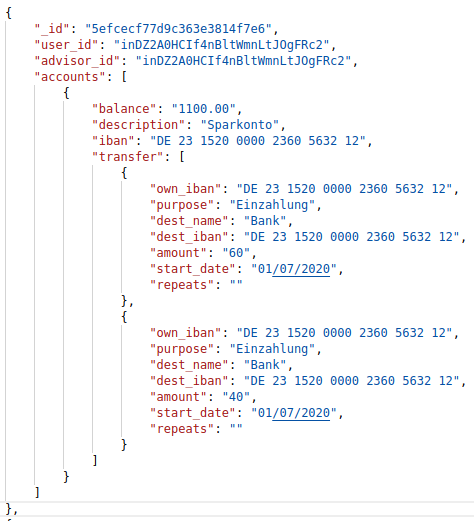
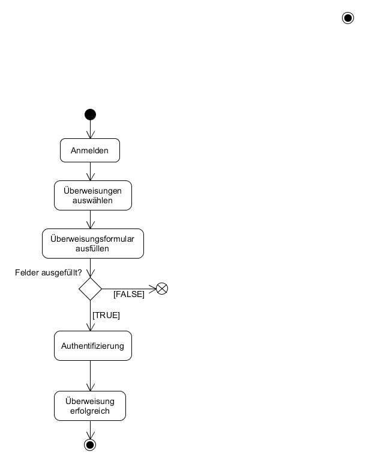

# Anforderungs- und Entwurfsspezifikation - SmartCity - Bank

* Titel: SmartCity - Bank

* Autor: Fabian Husemann

* Repository: [Repo](https://github.com/SGSE-2020/MS_Bank.git)

   

# 1 Einführung

## 1.1 Beschreibung

* Projektname
* Darstellung der Produktvision in Prosa (5-10 Sätze)
* Ziele
* Für wen ist das Produkt/der Service?
* Was ist das Bedürfnis? 
* Was ist das Produkt/der Service?
* Warum sollte der Kunde dieses Produkt/den Service „kaufen“ oder nutzen?
* Im Gegensatz zu welchen anderen Produkten/Services steht dies?
* Was macht dieses Produkt/der Service anders?
* Warum ist das Projekt sinnvoll?
* Welche Stakeholder sind betroffen und wie stehen Sie zu der Projektidee?
* Welche alternativen Lösungsideen existieren für den identifizierten Bedarf?
* Wie hoch sind Aufwand und erwarteter Nutzen und stehen sie in einem sinnvollen Verhältnis? (Lohnt sich das Projekt?)
* Verfügen wir über die notwendigen Kompetenzen? (Umsetzbarkeit)
* Welche Risiken und negativen Nebeneffekte sind zu erwarten?

## 1.2 Ziele

- Anwendungsbereiche, Motivation, Umfang, Alleinstellungsmerkmale, Marktanforderungen
- Informationen zu Zielbenutzergruppen und deren Merkmale (Bildung, Erfahrung, Sachkenntnis)
- Abgrenzung (Was ist das Softwaresystem _nicht_)
- ggfs. SWOT-Analyse

# 2 Anforderungen

## 2.1 Stakeholder

| Funktion / Relevanz | Name | Kontakt / Verfügbarkeit | Wissen  | Interessen / Ziele  |
|---|---|---|---|---|
| Kundenberatung | Fabian Husemann | Tel.: 0400805 4646 <br />Email: fabian@husemann-web.de<br />von 8 - 20 Uhr erreichbar | Kennt sich mit dem Bankportal gut aus | Gute Kundenübersicht,  Einfacher Kontakt mit Kunden |

## 2.2 Funktionale Anforderungen


## 2.3 Nicht-funktionale Anforderungen 

### 2.3.1 Rahmenbedingungen

* Kommunikation
  * Synchron: gRPC
  * Asynchron: RabbitMQ
* WebAnwendung

### 2.3.2 Betriebsbedingungen

* Um auf den MicroService: Bank zu zugreifen, muss über einen Browser die URL aufgerufen werden.

* Als Client kann dabei ein Computer oder auch eine Handy Browser benutzt werden.

  

### 2.3.3 Qualitätsmerkmale

| Qualitätsmerkmal           | sehr gut | gut  | normal | nicht relevant |
| -------------------------- | -------- | ---- | ------ | -------------- |
| **Zuverlässigkeit**        |          |      |        |                |
| Fehlertoleranz             | X        | -    | -      | -              |
| Wiederherstellbarkeit      | -        | -    | X      | -              |
| Ordnungsmäßigkeit          | X        | -    | -      | -              |
| Richtigkeit                | X        | -    | -      | -              |
| Konformität                | -        | X    | -      | -              |
| **Benutzerfreundlichkeit** |          |      |        |                |
| Installierbarkeit          | -        | X    | -      | -              |
| Verständlichkeit           | X        | -    | -      | -              |
| Erlernbarkeit              | -        | -    | X      | -              |
| Bedienbarkeit              | -        | X    | -      | -              |
| **Performance**            |          |      |        |                |
| Zeitverhalten              | -        | X    | -      | -              |
| Effizienz                  | -        | X    | -      | -              |
| **Sicherheit**             |          |      |        |                |
| Analysierbarkeit           | -        | -    | X      | -              |
| Modifizierbarkeit          | -        | -    | X      | -              |
| Stabilität                 | X        | -    | -      | -              |
| Prüfbarkeit                | -        | X    | -      | -              |

## 2.4 Graphische Benutzerschnittstelle

#### Login


#### Überschicht ( Hauptseite )


#### Kontoübersicht


#### Konteneinstellungen


#### Überweisungen


#### Ein-/Auszahlungen


#### Kontakt


## 2.5 Anforderungen im Detail

#### Benutzer

| **Als**  | **möchte ich**                        | **so dass**                                      | **Akzeptanz**                             | Priorität |
| :------- | :------------------------------------ | :----------------------------------------------- | :---------------------------------------- | --------- |
| Benutzer | mein Konto gründen                    | ich Geld sparen kann                             | Konto erstellt                            | hoch      |
| Benutzer | mein Kontostand abrufen               | ich weiß wieviel Geld auf meinem Konto ist       | Übersicht über den Kontostand             | hoch      |
| Benutzer | mein Geld einzahlen                   | ich Geld auf meinem Konto habe                   | Geld ist sicher aufm dem Konto            | hoch      |
| Benutzer | mein Geld auszahlen                   | ich Bargeld in meiner Tasche habe                | Geld wird ausgezahlt                      | hoch      |
| Benutzer | Geld zu anderen Benutzern schicken    | ich jemand anderen Geld geben kann               | Der Benutzer bekommt sein Geld            | hoch      |
| Benutzer | Berater Kontaktieren                  | mein Konto Bearbeiten kann                       | Berater kontaktiert den Benutzer zurück   | mittel    |
| Benutzer | mich sicher Einloggen                 | kein anderer auf mein Konto zugreifen kann       | Zugriff auf den Benutzer und seine Konten | hoch      |
| Benutzer | mein Konto auch Rückblickend einsehen | ich weiß wo mein Geld diesen Monat geblieben ist | Übersicht über alle Kontobewegungen       | mittel    |
| Benutzer | mir Geld leihen                       | ich an Geld komme wenn ich es brauche            | Geld wird auf das Konto überwiesen        | gering    |

#### Administrator


| **Als**       | **möchte ich**                                               | **so dass**                                                  | **Akzeptanz**                               | Priorität |
| ------------- | :----------------------------------------------------------- | :----------------------------------------------------------- | :------------------------------------------ | --------- |
| Administrator | mir eine Kundenliste anzeigen                                | alle Kunden auf einem Überblick sehe                         | Übersicht über alle Kunden                  | hoch      |
| Administrator | von Kunden kontaktiert werden                                | ich alle Kunden zufrieden stellen kann                       | Kunde sieht die Nachricht                   | mittel    |
| Administrator | mir eine Liste von Kunden anzeigen die sich Geld leihen wollen | ich ihre Konten einsehen kann und ihn ein Darlehen gewähren kann. | Übersicht über alle Kunden mit einem Kredit | mittel    |
| Administrator | Kunden Konten einsehen                                       | einen Überblick über die Kunden Konten habe                  | Übersicht über den Kunden und seine Konten  | hoch      |
| Administrator | Kunden Konten bearbeiten                                     | der Kunde sein Konto einstellen kann                         | Kunden Konto bearbeiten und gespeichert     | hoch      |

# 3 Technische Beschreibung

## 3.1 Systemübersicht


## 3.2 Softwarearchitektur


## 3.3 Schnittstellen

### Überweisung tätigen

Diese Schnittstelle wird benutzt um Überweisungen von einem Konto zu einem anderen Konto zu tätigen. Dabei <u>müssen</u> die Kontonummern der beiden Konten angegeben sein, sowie der Verwendungszweck und der Betrag der Überweisen wird.

Außerdem <u>kann</u> ein Startdatum angegeben werden der bestimmt, wann die Überweisung getätigt wird. Zusätzlich <u>kann</u> eine Wiederholung der Überweisung angegeben werden. 

Die Schnittstelle sollte im folgenden JSON Format genutzt werden:

```json
"bank.ueberweisung":{
    "iban": "DE46 4585 4585 2000 5145 20",
    "purpose": "Einkauf",  
    
    "dest_iban": "DE46 7845 2998 2554 8461 20",
    "amount": "20.00",
    
    "start_date": "07.05.2020",
    "repeat": "monthly | daily | yearly"
}
```

### Bankkonto anlegen

Diese Schnittstelle dient dazu einen neues Bankkonto anzulegen. Dabei <u>müssen</u> Informationen über eine Kundennummer und eine Kontobeschreibung mit angegeben werden. Als Rückgabewert wird die neu erstellte *IBAN* ausgegeben.

Die Schnittstelle sollte im folgenden JSON Format genutzt werden:

```json
"bank.createAccount":{
    "customerNr": "1",
    "description": "Kontobeschreibung: Firmenkonto | Sparkonto"
}
```
## 3.3.1 Ereignisse

### Überweisungsnachricht

Die Überweisungsnachricht wird für jede Überweisung verschickt. Dabei bekommen alle Kunden die mit den Konto-A oder mit dem Konto-B verknüpft sind diese Nachricht. 

````json
"bank.transferMessage": {
    "customerNr": "1",
    "lastname": "Husemann",
    
    "iban": "DE46 0202 0202 0202 0020 56",
    "message": "Ihre Überweisung von KontoA auf KontoB war erfolgreich. Für weitere 					Details rufen sie bitte die angebenen Link zu ihrere Kontoseite auf."
}
````

### Beraterverfügbarkeit

Dieses Ereignis wird aufgerufen wenn ein Kunde einen Berater kontaktiert und der Berater nicht verfügbar ist. Der Berater muss die Kontaktanfrage bestätigen und die Nachricht wird gesendet.

```json
"bank.answerMessage":{
    "message": "Ihr Berater ist für sie Verfügbarnachricht."
}
```


## 3.4 Datenmodell



## 3.5 Abläufe

### Konto löschen


### Überweisung




### Konto bearbeiten


## 3.6 Entwurf

## 3.7 Fehlerbehandlung

Passwort\PIN wird falsch eingeben → Fehlermeldung im Frontend

Backend nicht verfügbar → Fehlermeldung im Frontend

Datenbank nicht verfügbar → Fehlermeldung im Frontend

Schnittstelle nicht verfügbar → Fehlermeldung per gRPC zurück liefern

Überweisung tätigen ohne genug Kontoguthaben → Fehlermeldung im Frontend

Konto löschen obwohl Geldvorhanden ist → Fehlermeldung im Frontend

## 3.8 Validierung

# 4 Projektorganisation

## 4.1 Annahmen

## 4.2 Verantwortlichkeiten

| Softwarebaustein | Person(en)      |
| ---------------- | --------------- |
| Frontend         | Fabian Husemann |
| Backend          | Fabian Husemann |
| Datenbanken      | Fabian Husemann |

### Rollen

#### Softwarearchitekt

Entwirft den Aufbau von Softwaresystemen und trifft Entscheidungen über das Zusammenspiel der Softwarebausteine.

#### Frontend-Entwickler

Entwickelt graphische oder andere Benutzerschnittstellen, insbesondere das Layout einer Anwendung.

#### Backend-Entwickler

Implementiert die funktionale Logik der Anwendung. Hierbei werden zudem diverse Datenquellen und externe Dienste integriert und für die Anwendung bereitgestellt.

## 4.3 Grober Projektplan

### Meilensteine

* Meilenstein 1: 11.05.2020 KW 43
  * Pflichtenhelft abgeben
* Meilenstein 2: 08.06.2020 KW 45
  * Implementierung
* Meilenstein 3: 03.07.2020 KW 48
  * Abnahmetests
  * Präsentation / Software-Demo

# 5 Anhänge

## 5.1 Glossar

- Definitionen, Abkürzungen, Begriffe

## 5.2 Referenzen

- Handbücher, Gesetze

## 5.3 Index
