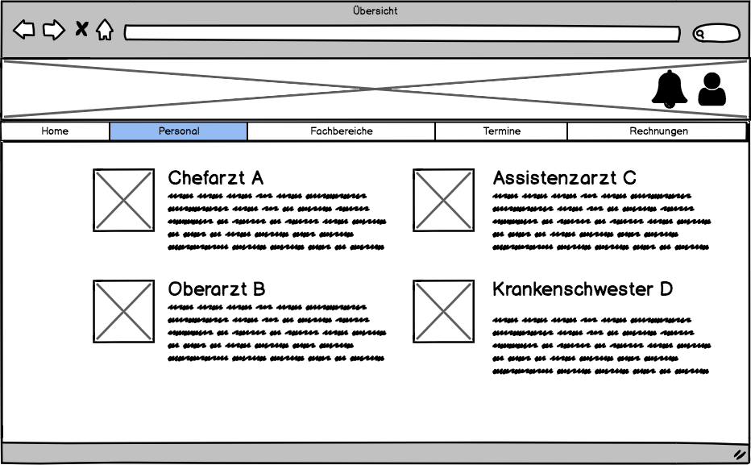

# Anforderungs- und Entwurfsspezifikation ("Pflichtenheft")

* **Titel:** SmartCity-Krankenhaus
* **Author:** Jendrik Müller
* [Code Repository](https://github.com/SGSE-2020/MS_Krankenhaus)

# 1 Einführung

## 1.1 Beschreibung

Das Krankehaus in der SmartCity stellt einen wesentlichen Faktor im Bereich der öffentlichen ärztlichen Versorgung dar. Ein zuverlässiges System kann die ärztliche Versorgung eines Patienten begleiten, um einen effizienten Informationsaustausch zu gewährleisten.  Somit kann eine Informationskette im Zusammenspiel mit Hausarzt und Rettungsdienst über die komplette Behandlungsphase des Patienten erfolgen. Gleichzeitig können sich Bürger über die Fachbereiche und Ausrüstung des Krankenhauses informieren.

Viele Krankenhäuser haben bereits digitale Verwaltungsysteme. Allerdings erfolgt das Überweisen von Patienten immer noch analog über Überweisungszettel. Das System soll eine lückenlose Übergabe zwischen dem Krankenhaus und anderen medizinischen Versorgungseinritungen ermöglichen.

## 1.2 Ziele

Das System dient als schnittstellen zwischen Bürgern der SmartCity und dem medizinischen Personal des Krankenhauses. Es richtet sich somit an Bürger und Personal gleichermaßen und soll die Kommunikation zwischen diesen fördern.

Bürger sollen sich über die Fachbereich des Krankenhauses informieren und bequem Termine vereinbaren können. 

Das medizinische Personal soll einer übersicht über die Patienten haben und Informationen mit dem Hausarzt austauschen können.

Das System soll nicht der kompletten Verwaltung eines Krankenhauses dienen. Es ist dementspechend nicht für das Erstellen eines OP-Planes, der Verwaltung des technischen Personals des Belegungsplans oder änliches zuständig.

# 2 Anforderungen

## 2.1 Stakeholder

| Funktion / Relevanz | Name | Kontakt / Verfügbarkeit | Wissen  | Interessen / Ziele  |
|---|---|---|---|---|
| Chefarzt der Dermatologie | Prof. Dr. Heinrich Heiler | Tel. 555 4312, E-Mail: heiler@krankenhaus.de, Von 6-20 Uhr telefonisch und per Mail erreichbar | Kennt das Altsystem, soll mit dem System arbeiten | Übersicht über die eigenen Patienten |
| Bürger von SmartCity | Kurt Knoche | Tel. 555 336622, E-Mail: kKnoche@city.de, Von 7-18 Uhr telefonisch und per Mail erreichbar | Kennt das Altsystem | Vereinbaren eines Termins zur Nachbehandlung |

## 2.2 Funktionale Anforderungen


## 2.3 Nicht-funktionale Anforderungen 

### 2.3.1 Rahmenbedingungen

- Kommunikation mit anderen Microservices:
  - Asynchron: RabbitMQ
  - Synchron: gRPC

### 2.3.2 Betriebsbedingungen

- Verfügbar per Webzugriff mit einem aktuellen Browser (z.B. Google Chrome 81.0.4044)

### 2.3.3 Qualitätsmerkmale

- Externe Qualitätsanforderungen (z.B. Performance, Sicherheit, Zuverlässigkeit, Benutzerfreundlichkeit)

Qualitätsmerkmal | sehr gut | gut | normal | nicht relevant
---|---|---|---|---
**Zuverlässigkeit** | | | | 
Fehlertoleranz |X|-|-|-
Wiederherstellbarkeit |X|-|-|-
Ordnungsmäßigkeit |X|-|-|-
Richtigkeit |X|-|-|-
Konformität |-|X|-|-
**Benutzerfreundlichkeit** | | | | 
Installierbarkeit |-|-|X|-
Verständlichkeit |X|-|-|-
Erlernbarkeit |-|X|-|-
Bedienbarkeit |-|X|-|-
**Performance** | | | | 
Zeitverhalten |-|-|X|-
Effizienz|-|-|-|X
**Sicherheit** | | | | 
Analysierbarkeit |-|-|X|-
Modifizierbarkeit |-|-|X|-
Stabilität |X|-|-|-
Prüfbarkeit |-|-|X|-

## 2.4 Graphische Benutzerschnittstelle

### Allgemein


Behandelte User-Storie: Anmelden


Behandelte User-Storie: Öffnungszeiten einsehen



Behandelte User-Storie: Personalübersicht bekommen


Behandelte User-Storie: Übersicht über Fachbereiche

### Patienten


Behandelte User-Storie: Termin vereinbaren


Behandelte User-Storie: Behandlungen bezahlen

### Personal


Behandelte User-Storie: Überblick über Patienten


Behandelte User-Stories: Krankenakte des Patienten einsehen, Patient an Hausarzt überweisen, Krankenakte bearbeiten


Behandelte User-Storie: Termine Einsehen


## 2.5 Anforderungen im Detail

### Nutzer

| Als | möchte ich | so dass | Akzeptanz | Priorität |
|----------|-----------|----------|----------|----------|
| Nutzer | mich Anmelden können | ich auf die die Funktionen zugreifen kann | Anmelden möglich | muss |
| Nutzer | mich Abmelden können | andere die mienen PC Nutzen nicht auf meine Daten zugreifen können | Abmelden möglich | muss |
| Nutzer | das Impressum einsehen können | ich Informiert werde, wer für die Webseite zuständig ist | Impressum einsehen | soll |
| Nutzer | eine Personalübersicht haben | ich weiß wer in dem Krankenhaus Arbeitet | Personalübersicht | soll |
| Nutzer | Übersicht über Fachbereiche | mich über die Fachbereiche des Krankenhauses informieren kann | Fachbereiche übersicht | soll |

### Patient
| Als | möchte ich | so dass | Akzeptanz | Priorität |
|----------|-----------|----------|----------|----------|
| Patient | einen Termin vereinbaren | ich behandelt werden kann | Termin vereinbar | muss |
| Patient | die Behandlung bezahlen | meine Rechnungen beglichen werden | Bezahlungsmöglichkeit auf der Webseite | soll |
| Patient | einen Parkplatz bekommen | ich mein Auto direkt am Krankenhaus parken kann | automatische Reservierung durch Termin machen | soll |
| Patient | Öffnungszeiten einsehen | ich besser Planen kann | Ansicht der Öffnungszeiten | soll |

### Personal

| Als | möchte ich | so dass | Akzeptanz | Priorität |
|----------|-----------|----------|----------|----------|
| Personal | das nur Personal zugriff  auf bestimmte Funktionen hat | kein unbefugter Änderungen machen kann | Personalkonto | muss |
| Personal | einen Überblick über die Patienten haben | einen Überblick über die aktuelle Patientenlage bekomme | Personal zugriff auf Patientenübersicht | muss |
| Personal | die Krankenakte des Patienten einsehen | der Patient die entsprechende Behandlung bekommt | Krankenakte von Personal einsehbar | soll |
| Personal | die Krankenakte bearbeiten | die Informationen des Patienten aktuell blieben | Krankenakte editieren | soll |
| Personal | Patienten an den Hausarzt überweisen | die Nachbehandlung des Patienten gesichert ist | Weiterleitungsfunktion | soll |
| Personal | meine Termine einsehen können | ich besser Planen kann | Termine einsehen | soll |


# 3 Technische Beschreibung

## 3.1 Systemübersicht


## 3.2 Softwarearchitektur


## 3.3 Schnittstellen

### Termin erstellen

Diese Schnittstelle dient zum Erstellen eines neuen Termins für einen Patienten.

```json
"sgse.models.krankenhaus.termin":{
	"description": "Creates a new appointment", 
	"fields": [
		{"name": "patientID", "type": "string", "required": true},
		{"name": "date", "type": "string", "required": true}
	]
}
```

### Patient übergeben

Über diese Schnittstelle können dem Krankenhaus neue Patienten übergeben werden. Sie soll vor allem dem Hausarzt und Rettungsdienst zum Überweisen von Patienten an das Krankenhaus dienen. Dabei soll die UserID des Bürgers und bisher aufgenommene Krankendaten übergeben werden.

```json
"sgse.models.krankenhaus.add_patient":{
	"description": "Adds a new patient to the hospital", 
	"fields": [
		{"name": "userID", "type": "string", "required": true},
		{"name": "symtomps", "type": "string", "required": false},
    {"name": "diagnosis", "type": "string", "required": false},
    {"name": "medication", "type": "string", "required": false}
	]
}
```

### Patient abrufen

Gibt die Daten eines Patienten, einschließlich der Krankendaten zurück. Die Krankendaten selbst werden vom Hausarzt des Patienten gespeichert und bei diesem abgerufen.

```json
"sgse.models.krankenhaus.get_patient":{
	"description": "Returns a single patient", 
	"fields": [
		{"name": "patientID", "type": "string", "required": true}
	]
}
```

### Patientendaten bearbeiten

Diese Schnittstelle dient dazu dem Personal die möglichkeit zu geben Pateintendaten zu ändern. Dabei soll die ID des Patienten und die neuen Daten übergeben werden. Werte die nicht geändert wurden, müssen nicht mit übertragen werden. Die neuen Daten werden anschließend an den Hausarzt weitergeleitet.

```json
"sgse.models.krankenhaus.edit_patient":{
	"description": "Eddits a single patient", 
	"fields": [
		{"name": "userID", "type": "string", "required": true},
    {"name": "station", "type": "string", "required": false},
    {"name": "faculty", "type": "string", "required": false},
		{"name": "symtomps", "type": "string", "required": false},
    {"name": "diagnosis", "type": "string", "required": false},
    {"name": "medication", "type": "string", "required": false}
	]
}
```

## 3.3.1 Ereignisse

**Senden**

##### Patient verstorben

Name Event: Patient verstorben

Payload: PatientenID (BürgerID)

#### Empfangen

##### Bürger verstorben

Details siehe Bürgerbüro

## 3.4 Datenmodell 

### Patient

```json
"sgse.models.krankenhaus.patient":{
	"description": "A Patient", 
	"fields": [
		{"name": "userID", "type": "string", "required": true},
    {"name": "station", "type": "string", "required": false},
    {"name": "faculty", "type": "string", "required": false},
		{"name": "symtomps", "type": "string", "required": false},
    {"name": "diagnosis", "type": "string", "required": false},
    {"name": "medication", "type": "string", "required": false}
	]
}
```

### Personal

```json
"sgse.models.krankenhaus.patient":{
	"description": "A medical worker", 
	"fields": [
		{"name": "userID", "type": "string", "required": true},
    {"name": "station", "type": "string", "required": false},
		{"name": "faculty", "type": "string", "required": true},
    {"name": "titel", "type": "string", "required": false}
	]
}
```

### Termin

```json
"sgse.models.krankenhaus.termin":{
	"description": "A Termin", 
	"fields": [
		{"name": "patientID", "type": "string", "required": true},
    {"name": "time", "type": "string", "required": true},
		{"name": "faculty", "type": "string", "required": false},
    {"name": "station", "type": "string", "required": false},
    {"name": "doctor", "type": "string", "required": false},
	]
}
```

# 4 Projektorganisation

## 4.1 Annahmen

- Verwendete Technologien: HTML, JavaScript, Angular, PostgreSQL, gRPC, RabbitMQ, GraphQL, Python
- Aufteilung in Repositories gemäß Software- und Systemarchitektur und Softwarebbausteinen


## 4.2 Grober Projektplan

### Meilensteine
- 11.05.2020
  - Abgabe Pflichtenheft
- 08.06.2020
  - Abgabe Prototyp
- 03.07.2020
  - Softwareübergabe

# 5 Anhänge

## 5.1 Glossar 

| Begriff     | Beschreibung     |
|----------|-----------|
| Patient | Bürger der im Krankenhaus behandelt wird |
| Fachbereich | Bezeichnet einen organisatorisch zusammengefassten medizinischen Bereich |
| Station | Bezeichnet eine Abteilung des Krankenhauses. |
| Personal | Bezeichnet das medizinische Personal des Krankenhauses |


