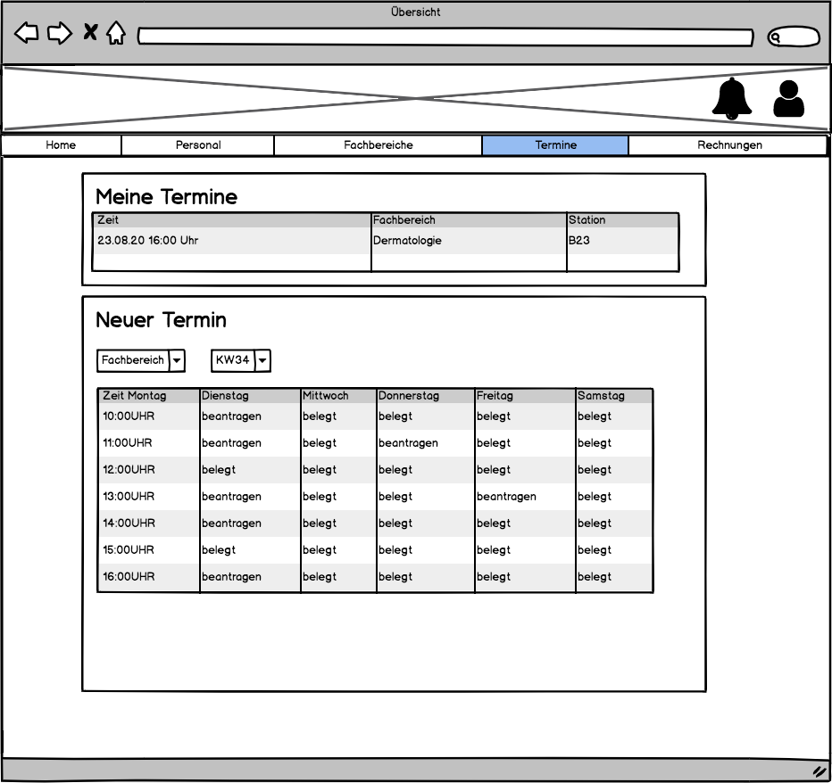

# Anforderungs- und Entwurfsspezifikation ("Pflichtenheft")

* **Titel:** SmartCity-Krankenhaus
* **Author:** Jendrik Müller
* [Code Repository](https://github.com/SGSE-2020/MS_Krankenhaus)

# 1 Einführung

## 1.1 Beschreibung

Das Krankehaus in der SmartCity stellt einen wesentlichen Faktor im Bereich der öffentlichen ärztlichen Versorgung dar. Ein zuverlässiges System kann die ärztliche Versorgung eines Patienten begleiten, um einen effizienten Informationsaustausch zu gewährleisten.  Somit kann eine Informationskette im Zusammenspiel mit Hausarzt und Rettungsdienst über die komplette Behandlungsphase des Patienten erfolgen. Das System dient zusätzlich als Anlaufstelle für Bürger, die sich über Veranstelltungen im Krankehaus und dessen Abteilungen informieren wollen.

## 1.2 Ziele

Das System dient als schnittstellen zwischen Bürgern der SmartCity und dem medizinischen Personal des Krankenhauses. Es richtet sich somit an Bürger und Personal gleichermaßen und soll die Kommunikation zwischen diesen vördern.

Bürger sollen über im Krankenhaus stattfindene Veranstalltungen informiert werden und an diesen Teilnehmen können. Die Bürger sollen sich ebenfalls über das Personal, Fachbereiche und medizinische Ausrüstung informieren und Termine vereinbareren können.

Das System soll nicht der kompletten Verwaltung eines Krankenhauses dienen. Es ist dementspechend nicht für das Erstellen eines OP-Planes, der Verwaltung des technischen Personals und ähnlichem zuständig.

# 2 Anforderungen

## 2.1 Stakeholder

| Funktion / Relevanz | Name | Kontakt / Verfügbarkeit | Wissen  | Interessen / Ziele  |
|---|---|---|---|---|
| Chefarzt der Dermatologie | Prof. Dr. Heinrich Heiler | Tel. 555 4312, E-Mail: heiler@krankenhaus.de, Von 6-20 Uhr telefonisch und per Mail erreichbar | Kennt das Altsystem, soll mit dem System arbeiten | Übersicht über die eigenen Patienten |
| Bürger von SmartCity | Kurt Knoche | Tel. 555 336622, E-Mail: kKnoche@city.de, Von 7-18 Uhr telefonisch und per Mail erreichbar | Kennt das Altsystem | Vereinvaren eines Termins zur Nachbehandlung |

## 2.2 Funktionale Anforderungen

## 2.3 Nicht-funktionale Anforderungen 

### 2.3.1 Rahmenbedingungen

- Kommunikation mit anderen Microservices:
  - Asynchron: RabbitMQ
  - Synchron: gRPC

### 2.3.2 Betriebsbedingungen

- Verfügbar per Webzugriff mit einem aktuellen Browser (z.B. Google Chrome 81.0.4044)

### 2.3.3 Qualitätsmerkmale

- Externe Qualitätsanforderungen (z.B. Performance, Sicherheit, Zuverlässigkeit, Benutzerfreundlichkeit)

Qualitätsmerkmal | sehr gut | gut | normal | nicht relevant
---|---|---|---|---
**Zuverlässigkeit** | | | | 
Fehlertoleranz |X|-|-|-
Wiederherstellbarkeit |X|-|-|-
Ordnungsmäßigkeit |X|-|-|-
Richtigkeit |X|-|-|-
Konformität |-|X|-|-
**Benutzerfreundlichkeit** | | | | 
Installierbarkeit |-|-|X|-
Verständlichkeit |X|-|-|-
Erlernbarkeit |-|X|-|-
Bedienbarkeit |-|X|-|-
**Performance** | | | | 
Zeitverhalten |-|-|X|-
Effizienz|-|-|-|X
**Sicherheit** | | | | 
Analysierbarkeit |-|-|X|-
Modifizierbarkeit |-|-|X|-
Stabilität |X|-|-|-
Prüfbarkeit |-|-|X|-

## 2.4 Graphische Benutzerschnittstelle

## 2.5 Anforderungen im Detail

#### Grundfunktionen

##### Einloggen

Es ist möglich sich als registrierter Benutzer einzuloggen. Zusätzlich kann ein Einloggen als Gastuser möglich sein.

| Name      | Rolle  | In meiner Rolle möchte ich | so dass                               | Akzeptanz        | Priorität |
| --------- | ------ | -------------------------- | ------------------------------------- | ---------------- | --------- |
| Einloggen | Nutzer | mich einloggen             | ich auf meinen Account zugreifen kann | anmelden möglich | muss      |

##### Ausloggen

Es ist zu jeder Zeit möglich sich aus der Anwendung auszuloggen.

| Name      | Rolle  | In meiner Rolle möchte ich | so dass                            | Akzeptanz        | Priorität |
| --------- | ------ | -------------------------- | ---------------------------------- | ---------------- | --------- |
| Ausloggen | Nutzer | mich ausloggen             | ich nicht dauerhaft angemeldet bin | abmelden möglich | muss      |

##### Impressum

Das Impressum muss jeder Zeit erreichbar sein. Es enthält den Namen des Betreibers, Adresse und Kontaktmöglichkeiten.

| Name               | Rolle  | In meiner Rolle möchte ich        | so dass                                                      | Akzeptanz           | Priorität |
| ------------------ | ------ | --------------------------------- | ------------------------------------------------------------ | ------------------- | --------- |
| Impressum anzeigen | Nutzer | mir das Impressum anzeigen lassen | ich weitere Informationen zum Betreiber des Dienstes erhalte | Impressum einsehbar | muss      |

##### Hilfe

Die Hilfe zur Anwendung muss jederzeit erreichbar sein.

| Name           | Rolle  | In meiner Rolle möchte ich    | so dass                                   | Akzeptanz       | Priorität |
| -------------- | ------ | ----------------------------- | ----------------------------------------- | --------------- | --------- |
| Hilfe anzeigen | Nutzer | mir die Hilfe anzeigen lassen | ich Probleme möglichst alleine lösen kann | Hilfe einsehbar | muss      |

#### Termine

| Name               | Rolle    | In meiner Rolle möchte ich                  | so dass                                                      | Akzeptanz           | Priorität |
| ------------------ | -------- | ------------------------------------------- | ------------------------------------------------------------ | :------------------ | --------- |
| Termin anvordern   | Patient  | mir einen Termin anfordern können           | ein Termin gegeben werden kann                               | Termin anfordern    | muss      |
| Termin verschieben | Patient  | einen bestehenden Termin verschieben können | einen bestehenden Termin ein neuer Zeitpunkt zugewiesen wird | Termin verschiebbar | soll      |
| Termin absagen     | Patient  | einen Termin absagen können                 | sodass ein vorhandener Termin wieder entfernt wird           | Termin löschen      | muss      |
| Termin bestätigen  | Personal | Einen Termin bestätigen können              | um Patienten Termine zuweisen zu können                      | Termin zuweisen     | muss      |
| Termin eintragen   | Personal | Einen Termin erstellen können               | perönlich mit dem Patienten vereinbarte Termine berücksichtigt werden | Termin erstellen    | muss      |

#### Veranstalltungen

| Name                       | Rolle    | In meiner Rolle möchte ich          | so dass                                                      | Akzeptanz                          | Priorität |
| -------------------------- | -------- | ----------------------------------- | ------------------------------------------------------------ | :--------------------------------- | --------- |
| Veranstalltung erstellen   | Personal | eine Veranstallung erstellen können | User sich über bevorstehende Veanstallungen informieren können | Veranstallung erstellen            | kann      |
| Veranstalltung teilnehemen | Nutzer   | an Veranstalltungen teilnehmen      | der Veranstallter weiß wie viel Personen an der Veranstalltung teilnehmen | Teilnehmer kann hinzugefügt werden | kann      |

#### Überweisung

| Name                       | Rolle    | In meiner Rolle möchte ich                       | so dass                                              | Akzeptanz                  | Priorität |
| -------------------------- | -------- | ------------------------------------------------ | ---------------------------------------------------- | :------------------------- | --------- |
| Überweisung entgegennehmen | Personal | die Überwisung von einem Hausarzt entgegennehmen | die nötige Behandlung zugeteilt wird                 | Überweisung entgegennehmen | muss      |
| Überweisung an Hausarzt    | Personal | einen Patienten an seinen Hausarzt überweisen    | die Nachversorgung des Pateinten sichergestellt wird | Patient übertragbar        | soll      |

#### Patientendaten

| Name        | Rolle    | In meiner Rolle möchte ich                      | so dass                                     | Akzeptanz                | Prioritöt |
| ----------- | -------- | ----------------------------------------------- | ------------------------------------------- | :----------------------- | --------- |
| Krankenakte | Personal | die Krankenakte eines Patienten einsehen können | der Patient die richtige Behandlung bekommt | Pateintendaten einsehbar | soll      |

#### Essen

| Name            | Rolle   | In meiner Rolle möchte ich | so dass                            | Akzeptanz               | Prioritöt |
| --------------- | ------- | -------------------------- | ---------------------------------- | :---------------------- | --------- |
| Essen bestellen | Patient | Essen bestellen können     | mir mein Wunschessen gebracht wird | Essen aus Liste wählbar | kann      |

# 3 Technische Beschreibung

## 3.1 Systemübersicht

## 3.2 Softwarearchitektur

- Darstellung von Softwarebausteinen (Module, Schichten, Komponenten)

## 3.3 Schnittstellen

- **Bank**: bezahlen von Rechnungen
- **Apotheke**: übermitteln von Rezepten
- **Hausarzt**: überweisung von Patienten
- **Parkplätze**: reservieren von Parkplätzen

## 3.3.1 Ereignisse

- In Event-gesteuerten Systemen: Definition der Ereignisse und deren Attribute

## 3.4 Datenmodell 

- Konzeptionelles Analyseklassendiagramm (logische Darstellung der Konzepte der Anwendungsdomäne)
- Modellierung des physikalischen Datenmodells 
  - RDBMS: ER-Diagramm bzw. Dokumentenorientiert: JSON-Schema

## 3.5 Abläufe

- Aktivitätsdiagramme für relevante Use Cases
- Aktivitätsdiagramm für den Ablauf sämtlicher Use Cases

## 3.6 Entwurf

- Detaillierte UML-Diagramme für relevante Softwarebausteine

## 3.7 Fehlerbehandlung 

* Mögliche Fehler / Exceptions auflisten

## 3.8 Validierung

* Relevante (Integrations)-Testfälle, die aus den Use Cases abgeleitet werden können

# 4 Projektorganisation

## 4.1 Annahmen

- Verwendete Technologien: HTML, JavaScript, Angular, PostgreSQL, gRPC, RabbitMQ, GraphQL, Python
- Aufteilung in Repositories gemäß Software- und Systemarchitektur und Softwarebbausteinen

## 4.2 Verantwortlichkeiten

| Softwarebaustein | Person(en)Frontend |
|----------|-----------|
| Frontend | Jendrik Müller |
| Backend | Jendrik Müller |
| Dantenbank | Jendrik Müller |

### Rollen

#### Softwarearchitekt
Entwirft den Aufbau von Softwaresystemen und trifft Entscheidungen über das Zusammenspiel der Softwarebausteine.

#### Frontend-Entwickler
Entwickelt graphische oder andere Benutzerschnittstellen, insbesondere das Layout einer Anwendung.

#### Backend-Entwickler
Implementiert die funktionale Logik der Anwendung. Hierbei werden zudem diverse Datenquellen und externe Dienste integriert und für die Anwendung bereitgestellt.

### Rollenzuordnung

| Name     | Rolle     |
|----------|-----------|
| Jendrik Müller | Softwarearchitekt |
| Jendrik Müller | Frontend-Entwickler |
| Jendrik Müller | Backend-Entwickler |
| Jendrik Müller | Datenbank-Entwickler |

## 4.3 Grober Projektplan

### Meilensteine
- 11.05.2020
  - Abgabe Pflichtenheft
- 08.06.2020
  - Abgabe Prototyp
- 03.07.2020
  - Softwareübergabe

# 5 Anhänge

## 5.1 Glossar 

- Definitionen, Abkürzungen, Begriffe

## 5.2 Referenzen

- Handbücher, Gesetze

## 5.3 Index

