# Anforderungs- und Entwurfsspezifikation ("Pflichtenheft")

* Titel: SmartCity - Fitnesscenter
* Autor: Malte Riechmann
* Repository: https://github.com/SGSE-2020/MS_Fitnesscenter

# 1 Einführung

## 1.1 Beschreibung

Der Microservice des Fitnesscenters erfüllt die verschiedensten Aufgaben. Grundsätzlich ist es ein Informationsportal für Kunden. Über die Website können diese sich über die Möglichkeiten, die sie in dem Fitnessstudio haben informieren. Dies umfasst die verschiedenen Geräte, die in dem Fitnessstudio vorhanden sind und die verschiedenen Kurse, die die Kunden besuchen können. Außerdem können die verschiedenen Abonnement Möglichkeiten aufgezeigt werden. Für angemeldete Nutzer erfüllt der Service weitere Möglichkeit. So können Trainer einem Mitglied einen Trainingsplan auf dessen Profil zur Verfügung stellen. Außerdem kann ein Physiotherapeut auf wichtige Behandlungsdaten über den Service Zugreifen. Gerade diese Accounts für Kunden sind neu und bei anderen Fitness Centern nicht anzufinden. Sie erleichtern den Umgang mit den Kunden und ermöglichen eine optimierte, personalisierte Betreuung und effizienteres Training.


* Welche alternativen Lösungsideen existieren für den identifizierten Bedarf?
* Wie hoch sind Aufwand und erwarteter Nutzen und stehen sie in einem sinnvollen Verhältnis? (Lohnt sich das Projekt?)
* Verfügen wir über die notwendigen Kompetenzen? (Umsetzbarkeit)
* Welche Risiken und negativen Nebeneffekte sind zu erwarten?

## 1.2 Ziele

Das Ziel soll Trainer, Physiotherapeuten und die Kunden an einer Stelle vereinen, um die Trainings- und Behandlungsprozesse für den Kunden so angenehm wie möglich Zu gestallten. Das umfasst Trainingspläne, Informationen über die Behandlung und allgemeine Informationen zu dem Fitnesscenter. In der Form, hat das bis jetzt kein Fitnesscenter implementiert. Die Trainer und Therapeuten sind besitzen große Fachkenntnisse, allerdings wenig Erfahrung im Umgang mit Computersystemen. Der Erfahrungsgrad der Kunden ist unbekannt und kann von keine Erfahrung bis sehr Erfahren gehen. 

Das System soll die persönliche Kommunikation zwischen Kunde und Trainer/Physiotherapeut nicht ersetzen. Diese ist unerlässlich für Trainer/Physiotherapeuten für ein gutes Trainingsprogramm. Das Programm soll Trainer/Physiotherapeuten lediglich unterstützen durch zur Verfügungstellung relevanter persönlicher Daten des Kundens. Desweitern bekommen Kunden die Möglichkeit sich über die Website ihren Trainingsplan, der in Zusammenarbeit mit dem Trainer ausgearbeitet wurde einzusehen.

# 2 Anforderungen

## 2.1 Stakeholder

| Funktion / Relevanz | Name | Kontakt / Verfügbarkeit | Wissen  | Interessen / Ziele  |
|---|---|---|---|---|
| Trainer im Fitnesscenter und dessen Besitzer | Herr Marshall Oconnell | Tel. 3738472520 von 8 - 20 Uhr, per E-Mail m.oconnell@web.de | Kennt die organisatorischen Abläufe im Fitnesscenter | Bessere Verwaltung der Trainer |
| Trainer im Fitnesscenter | Herr Johan Forbes | Tel. 3251259494 von 10 - 18 Uhr, per E-Mail johan.forbes@gmail.com | Erfahren im Umgang und Betreuung der Kunden und weiß, was alles dazugehört | Einfacherer Umgang mit Kunden |
| Leitende Physiotherapeutin im Fitnesscenter | Frau Katy Fletcher | Tel. 3469381411 von 8 - 18 Uhr, per E-Mail k.fletcher@gmail.com | Vertraut mit Verfahren zur Speicherung und Veraltung von Behandlungsakten | Einfacherer Umgang mit Kunden |
| Mitglied des Fitnesscenter | Herr Tommy-Lee Crosby | Tel. 3359273642 tagsüber, per E-Mail tl.crosby@hotmail.com | Kennt die Abläufe als trainierendes Mitglied und die Umständliche Trainingsplan Gestaltung | Personalisiertes Training |

## 2.2 Funktionale Anforderungen

#### Kundenportal


#### Allgemeine Verwaltung

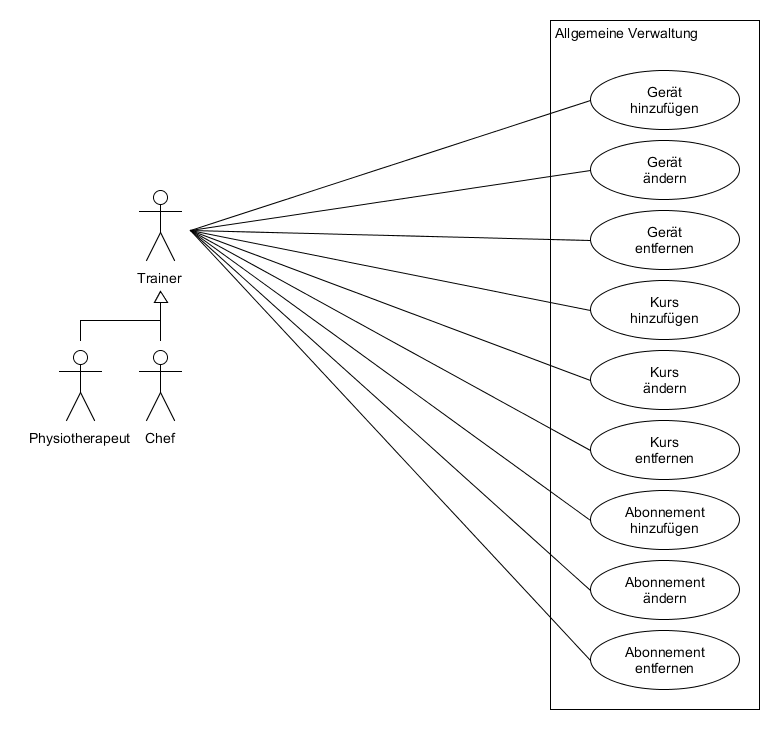

#### Mitgliederverwaltung


#### Trainer und Therapeuten Funktionen

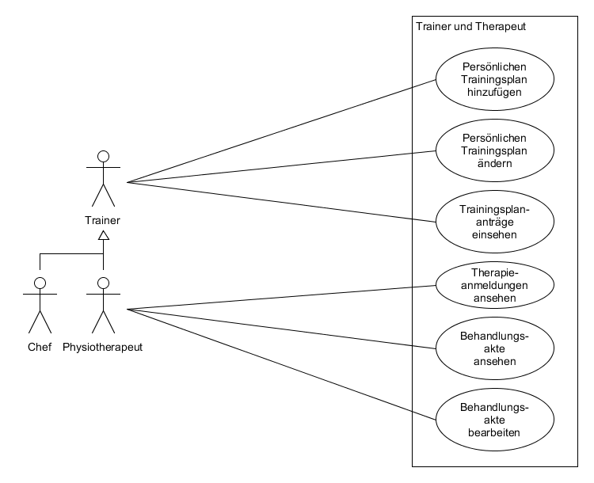


## 2.3 Nicht-funktionale Anforderungen 

### 2.3.1 Rahmenbedingungen

- Normen, Standards, Protokolle, Hardware, externe Vorgaben

### 2.3.2 Betriebsbedingungen

- Website für Desktop und Mobile Nutzer
- Schnittstelle zu Hausärzten um Kunden überwiesen zu bekommen
- Datenbank um wichtige Daten zu speichern

### 2.3.3 Qualitätsmerkmale

- Externe Qualitätsanforderungen (z.B. Performance, Sicherheit, Zuverlässigkeit, Benutzerfreundlichkeit)

Qualitätsmerkmal | sehr gut | gut | normal | nicht relevant
---|---|---|---|---
**Zuverlässigkeit** | | | | 
Fehlertoleranz |-|-|X|-
Wiederherstellbarkeit |-|-|X|-
Ordnungsmäßigkeit |-|-|X|-
Richtigkeit |-|-|X|-
Konformität |-|X|-|-
**Benutzerfreundlichkeit** | | | | 
Installierbarkeit |-|-|-| X              
Verständlichkeit |X|-|-|-
Erlernbarkeit |X|-|-|-
Bedienbarkeit |X|-|-|-
**Performance** | | | | 
Zeitverhalten |-|X|-|-
Effizienz|-|-|X|-
**Sicherheit** | | | | 
Analysierbarkeit |-|-|X|-
Modifizierbarkeit |-|-|-|X
Stabilität |-|X|-|-
Prüfbarkeit |-|-|X|-

## 2.4 Graphische Benutzerschnittstelle

### Mockups

PDF-Version mit Verlinkung im Projekt Repository

#### Home

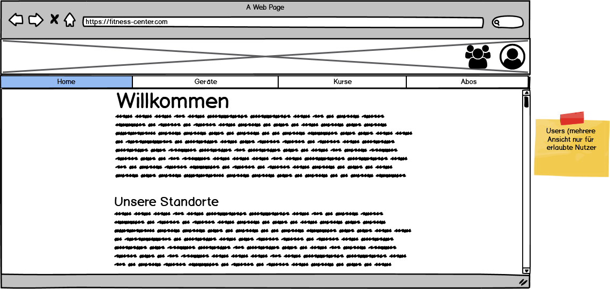

#### Geräte

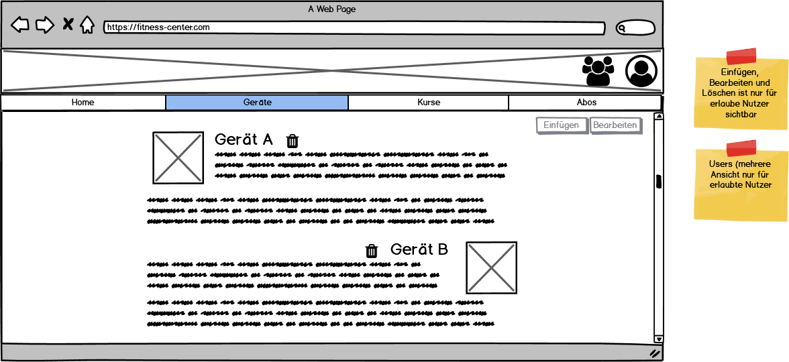

#### Kurse

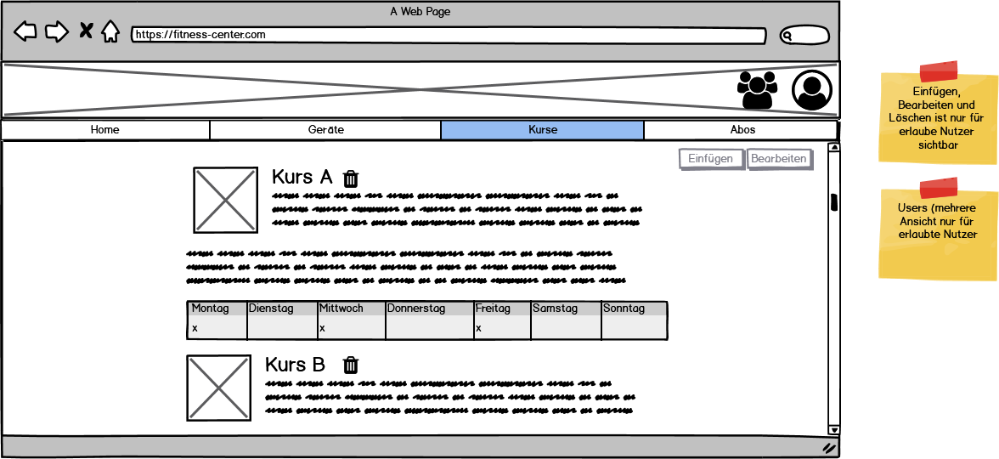

#### Abos

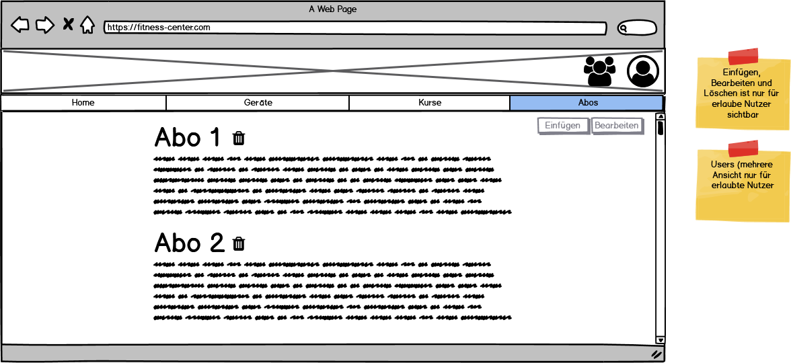

#### Profil

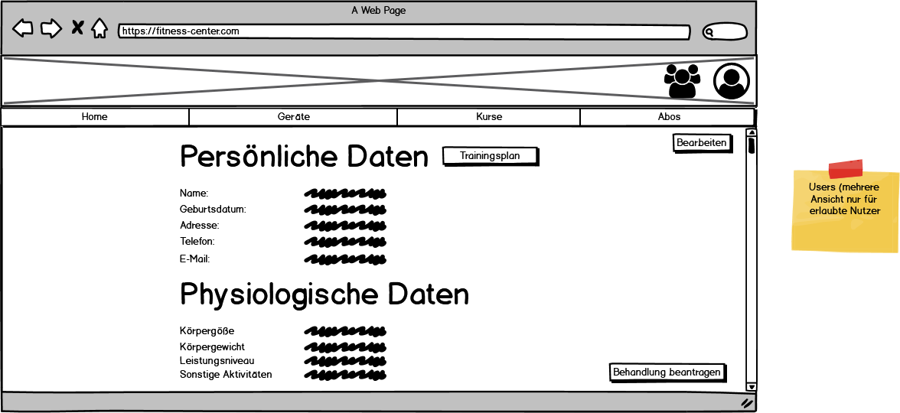

#### Mitglieder

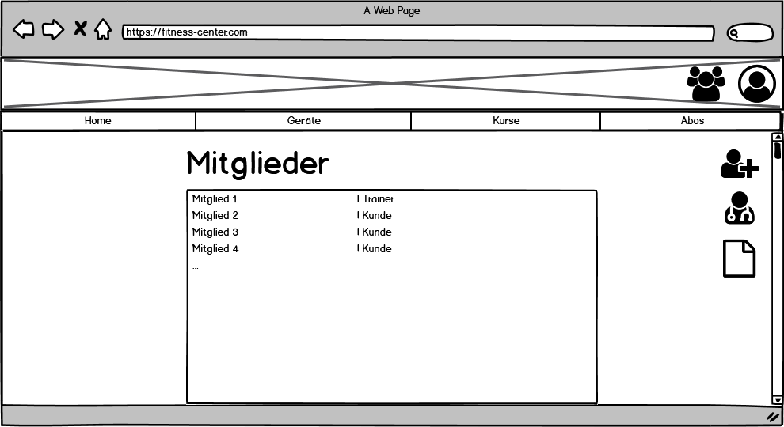

#### Mitglied Details

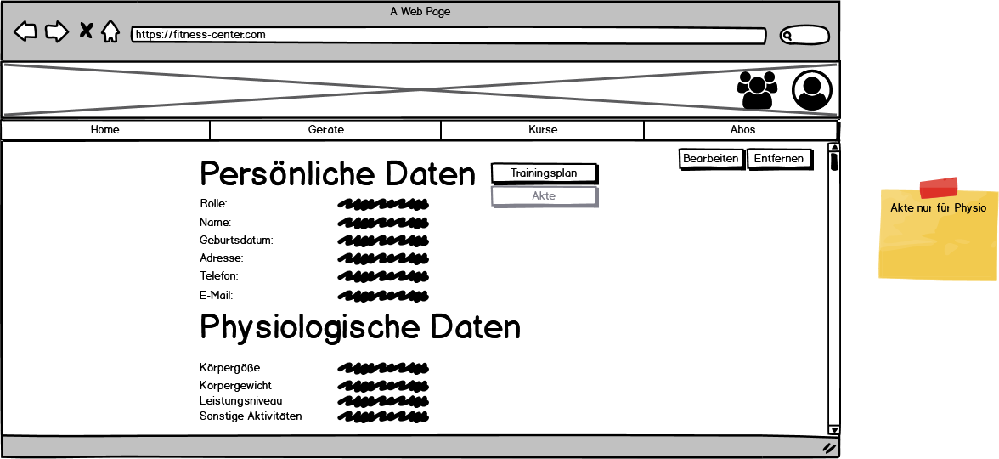


## 2.5 Anforderungen im Detail

**Kundenportal**

| **In meiner Rolle als** | **möchte ich** | , **so dass** | **Erfüllt, wenn** | **Priorität** |
| :------ | :----- | :------ | :-------- | ------- |
| Kunde | die verschiedenen Geräte ansehen können | mein Trainingsmöglichkeiten besser einschätzen kann. | Geräte mit kurz Beschreibung angezeigt werden | hoch |
| Kunde | eine Liste der verschiedenen Kurse angezeigt bekommen | mehr Informationen über den jeweiligen Kurs erhalte. | Liste der Kurse mit Beschreibung angezeigt wird | hoch |
| Kunde | die Standorte anschauen können | die mehr über die verschiedenen Möglichkeiten erfahre. | Die verschiedenen Standorte angezeigt (und ausgewählt werden können) | mittel |
| Kunde | die verschiedenen Abonnement-Möglichkeiten ansehen können | für mich am besten passende Angebot auswählen kann. | Abonnements angezeigt werden | hoch |
| Kunde | einen Termin beim Physiotherapeuten beantragen können | behandelte werden kann. | Anmeldungsformular für Physiotherapeuten vorhanden | optional |
| Kunde | einen neuen Trainingsplan beantragen können | ich mein Training an meine aktuelle Verfassung anpassen kann. | Antragsformular für Trainingsplan vorhanden | optional |
| Kunde | meine Trainingspläne  einsehen können | ich meine Fortschritte sehen kann. | Persönlicher Trainingsplan angezeigt wird | optional |

**Allgemeine Verwaltung**

| **In meiner Rolle als** | **möchte ich** | , **so dass** | **Erfüllt, wenn** | **Priorität** |
| :------ | :----- | :------ | :-------- | ------- |
| Trainer/ Chef/ Physiotherapeut | neue Geräte hinzufügen können | Kunden diese ansehen und sich informieren können | Gerät hinzugefügt | mittel |
| Trainer/ Chef/ Physiotherapeut | bestehende Geräte ändern können | Fehler oder neue Erkenntnisse eingefügt werden | Gerät geändert | mittel |
| Trainer/ Chef/ Physiotherapeut | alte Geräte entfernen können | Kunden keine Geräte angezeigt bekommen, die nicht vorhanden sind | Gerät entfernt | mittel |
| Trainer/ Chef/ Physiotherapeut | neue Kurse hinzufügen können | Kunde neue Angebote angezeigt bekommen | Kurs hinzugefügt | mittel |
| Trainer/ Chef/ Physiotherapeut | bestehende Kurse ändern können | Neuerungen im Programm für Kunden einsehbar sind | Kurs geändert | mittel |
| Trainer/ Chef/ Physiotherapeut | alte Kurse entfernen können | Kunden keine Kurse angezeigt bekommen, die nicht vorhanden sind | Kurs entfernt | mittel |
| Trainer/ Chef/ Physiotherapeut | neue Abonnement hinzufügen können | Kunden unser Angebote einsehen können. | Abonnement hinzugefügt | mittel |
| Trainer/ Chef/ Physiotherapeut | bestehende Abonnement ändern können | Änderungen bezüglich der Abonnements eingestellt werden können | Abonnement geändert | mittel |
| Trainer/ Chef/ Physiotherapeut | alte Abonnement entfernen können | Kunden keine Abonnements angezeigt bekommen, die nicht vorhanden sind | Abonnement entfernt | mittel |

**Mitgliederverwaltung**

| **In meiner Rolle als** | **möchte ich** | , **so dass** | **Erfüllt, wenn** | **Priorität** |
| :------ | :----- | :------ | :-------- | ------- |
| Trainer/ Chef/ Physiotherapeut | neue Mitglieder einfügen können | neue Kunden verzeichnet werden und sie die verschiedenen Angebote annehmen können | Mitglied eingefügt werden | hoch |
| Trainer/ Chef/ Physiotherapeut | Mitglieder ansehen können | ich die jeweiligen Mitglieder optimal beraten kann | Mitglieder angezeigt werden | hoch |
| Trainer/ Chef/ Physiotherapeut | Mitglieder bearbeiten können | ich neue Information einfügen und veraltete entfernen kann | Mitglieder werden bearbeitet | mittel |
| Trainer/ Chef/ Physiotherapeut | Mitglieder entfernen können | Persönlich Daten nicht gespeichert werden müssen, wenn es nicht nötig ist | Mitglieder werden gelöscht | hoch |
| Chef | Trainerrollen vergeben können | neue Trainer alle wichtige Funktionen nutzen können | Trainerrolle hinzufügen | niedrig |
| Chef | Trainerrollen entfernen können | ehemalige Trainer keinen Zugriff auf persönliche Daten haben | Trainerrolle entfernen | niedrig |
| Chef | Physiotherapeuten-rolle vergeben können | neue Physiotherapeuten alle wichtige Funktionen nutzen können | Physiotherapeuten hinzufügen | niedrig |
| Chef | Physiotherapeuten-rolle entfernen können | ehemalige Physiotherapeuten keinen Zugriff auf persönliche Daten haben | Physiotherapeuten entfernen | optional |
| Chef | neue Chefs hinzufügen können | neue Führungspersonen auf alle Funktionen zugreifen können | Chef hinzufügen | optional |
| Chef | Chefs entfernen können | ehemalige Führungspersonen keinen Zugriff auf persönliche Daten haben | Chef entfernen | optional |

**Trainer und Therapeuten Funktionen**

| **In meiner Rolle als** | **möchte ich** | , **so dass** | **Erfüllt, wenn** | **Priorität** |
| :------ | :----- | :------ | :-------- | ------- |
| Trainer/ Physiotherapeut | Mitgliedern neue Trainingspläne hinzufügen können | diese und ihr neues Trainingsprogramm einsehen können | Trainings-plan eingefügt        | mittel |
| Trainer/ Physiotherapeut | Trainingsplänen von Mitgliedern ändern können | auf Rück- und Fortschritte eingegangen werden kann | Trainings-plan geändert | mittel |
| Trainer/ Physiotherapeut | die Anträge für neue Trainingspläne ansehen können | erste Ideen auf Grundlage der Anamnese vorbereitet werden können | Training-plan-anträge angezeigt | niedrig |
| Physiotherapeut | die Kunden-Behandlungsakte einsehen können | ich die Behandlung basierten auf diesen Daten anpassen kann | Akte angezeigt | optional |
| Physiotherapeut | die Kunden-Behandlungsakte bearbeiten können | ich neue Erkenntnisse für Folgebehandlungen speichern kann | Akte geändert | optional |
| Physiotherapeut | die Anmeldungen zur Therapie ansehen können | ein Termin vereinbaren zu können und eine erste Behandlung auf Grundlage der Anamnese erstellen kann | Termin-anfrage angezeigt | optional |

# 3 Technische Beschreibung

## 3.1 Systemübersicht

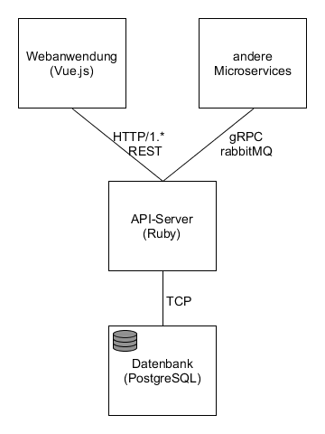

- Kommunikationsprotokolle, Datenformate

## 3.2 Softwarearchitektur

- Darstellung von Softwarebausteinen (Module, Schichten, Komponenten)

## 3.3 Schnittstellen

### Trainingsplan anfordern

````json
"sgse.model.fitness_center.trainingsplan_antrag": {
    "description": "Object to request a new training plan",
    "fields": [
      {"name": "member_id", "type": "string", "required": true},
      {"name": "date", "type": "date", "required": true}  
    ]
}
````

### Physiotherapeuten Termin anfordern
````json
"sgse.model.fitness_center.physiotherapeut_antrag": {
    "description": "Object to request an appointment with the physiotherapist",
    "fields": [
      {"name": "member_id", "type": "string", "required": true},
      {"name": "date", "type": "date", "required": true},
      {"name": "note", "type": "string", "required": false}
    ]
}
````


- Schnittstellenbeschreibung (API)
- Auflistung der nach außen sichtbaren Schnittstelle der Softwarebausteine

## 3.3.1 Ereignisse

- In Event-gesteuerten Systemen: Definition der Ereignisse und deren Attribute

## 3.4 Datenmodell 

- Konzeptionelles Analyseklassendiagramm (logische Darstellung der Konzepte der Anwendungsdomäne)


## 3.5 Abläufe

An dieser Stellen werden drei wichtige Abläufe in Form von Aktivitätsdiagrammen dargestellt. Es gibt je ein Aktivitätsdiagramm aus der *Mitgliederverwaltung*, dem *Benutzerportal* und dem *Trainer und Physiotherapeuten Portal*. Die ausgewählten sind repräsentativ für die jeweiligen Funktionen und enthalten die wichtigsten Schritte. Die anderen Abläufe können durch kleiner Anpassungen ebenfalls durch das Aktivitätsdiagramm dargestellt werden. Triviale Abläufe wie einfache Datenbankoperationen sind nicht aufgeführt. Aus diesem Grund gibt es auch keine Diagramme zu der *allgemeinen Verwaltung*.

#### Mitglied einfügen

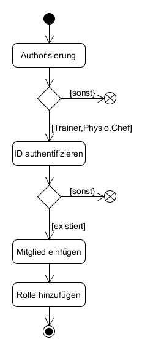

#### Trainingsplan anfordern

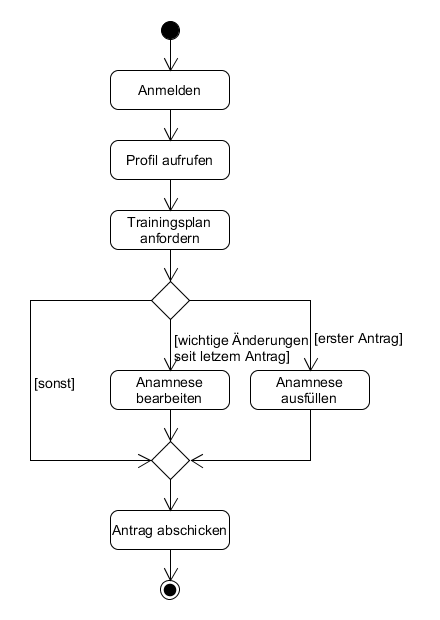

#### Behandlungsakte erweitern


## 3.6 Entwurf

- Detaillierte UML-Diagramme für relevante Softwarebausteine

## 3.7 Fehlerbehandlung 

* Mögliche Fehler / Exceptions auflisten

## 3.8 Validierung

* Relevante (Integrations)-Testfälle, die aus den Use Cases abgeleitet werden können

# 4 Projektorganisation

## 4.1 Annahmen

- Das Frontend wird mit JavaScript entwickelt
- Für den API-Server wird das Ruby on the Rails Framework verwendet
- Die Software sollte einfach zu erweitern sein, da Funktionen zur Steigerung der Personalisierung wahrscheinlich sind
- Die Bausteine müssen als Docker Container vorliegen
- Für die Kommunikation mit andere Prozessen wir gRPC verwendet

## 4.2 Verantwortlichkeiten

- Zuordnung von Personen zu Softwarebausteinen aus Kapitel 3.1 und 3.2
- Rollendefinition und Zuordnung

| Softwarebaustein | Person(en) |
|----------|-----------|
| Komponente A-Z | Malte Riechmann |

### Rollen

#### Softwarearchitekt
Entwirft den Aufbau von Softwaresystemen und trifft Entscheidungen über das Zusammenspiel der Softwarebausteine.

#### Frontend-Entwickler
Entwickelt graphische oder andere Benutzerschnittstellen, insbesondere das Layout einer Anwendung.

#### Backend-Entwickler
Implementiert die funktionale Logik der Anwendung. Hierbei werden zudem diverse Datenquellen und externe Dienste integriert und für die Anwendung bereitgestellt.

### Rollenzuordnung

| Name     | Rolle     |
|----------|-----------|
| Malte Riechmann | Softwarearchitekt, Frontend-Entwickler, Backend-Entwickler |


## 4.3 Grober Projektplan

### Meilensteine
* KW 43 (11.05)
  * Abgabe Pflichtenheft
* KW 45 (08.06) / Implementierung
  * Implementierung #3 
* KW 48 (03.07) / Abnahmetests
  * manuelle Abnahmetestss
  * Präsentation / Software-Demo

# 5 Anhänge

## 5.1 Glossar 

- Definitionen, Abkürzungen, Begriffe

## 5.2 Referenzen

- Handbücher, Gesetze

## 5.3 Index


