# Anforderungs- und Entwurfsspezifikation ("Pflichtenheft")
**Titel**: SmartCity - Tierarzt  
**Autor**: Mattis Küper  
**Repositories**: [Quellcode](https://github.com/SGSE-2020/MS_Tierarzt), [Spezifikation](!https://sgse-2020.github.io/Spezifikation/#/./mattis_kueper/Spezifikation_Tierarzt), [Projekttagebuch](!https://github.com/SGSE-2020/Praktikumstagebuch/blob/master/Mattis_Kueper/ProjektTagebuch.md) 

# 1 Einführung

## 1.1 Beschreibung

Das Projekt **Tierarzt** soll Kunden ermöglichen Termine anzufragen, abzusagen und einzusehen. Es soll außerdem ermöglicht 
werden Tierarzt Kosten direkt zu bezahlen und Haustierdaten zu erstellen. Anstehende Termine sollen in einem Kalendar angezeigt werden. 
Für Mitarbeiter des Tierarztes soll es möglich sein Haustierdaten zu bearbeiten und Terminanfragen anzunehmen oder abzulehnen. 

## 1.2 Ziele

Das Ziel des Tierarzt Microservices ist es, das Verwalten von Terminen sowohl für Tier Besitzer als auch 
Tierarzt Mitarbeiter so einfach wie möglich zu gestalten. Viele Besitzer verlieren schnell den Überblick, 
wann beispielsweise eine Impfung ansteht. 
Der Terminkalender des Microservices soll es erleichtern, all diese Termine im Blick zu behalten.  

Tierarzt Mitarbeiter können sich durch die genauen Pläne besser auf Behandlungen vorbereiten und ihre Tage besser planen.

Es werden außerdem Benachrichtigungen versendet, wenn Termine angenommen, abgelehnt, abgesagt oder angenommen worden sind.
Dadurch sind sowohl Kunden als auch Mitarbeiter stehts über Termine informiert.

# 2 Anforderungen

| Funktion / Relevanz | Name | Kontakt / Verfügbarkeit | Wissen  | Interessen / Ziele  | 
|---|---|---|---|---|
| Tierbesitzer  |  Herr Goldlinde | Tel. 0174 0815420, Jederrzeit telefonisch erreichbar  | Kennt sich mit der Bedienung von Webseiten aus | Möchte für seinen Hund Impftermine und eine generelle Untersuchung anmelden  |  
| Tierärztin  | Frau Dr. Sperling  | anette.sperling@gmail.com, Per E-Mail, immer erreichbar, Verfügbarkeit Wochentags 8-15 Uhr  | Behandelnde Tierärztin, führt Operationen durch | Möchte sich auf anstehende Behandlungen vorbereiten können | 
| Besitzer der Tierarzt Praxis   | Herr Budde  |  hans.budde@gmail.com, Per E-Mail auch an Wochenenden erreichbar, von 8-20 Uhr  | Verwaltet die Tierarzt Praxis, macht Arbeitspläne, bestellt Produkte | Möchte Arbeitspläne so schnell wie möglich erstellen | 

## 2.2 Funktionale Anforderungen

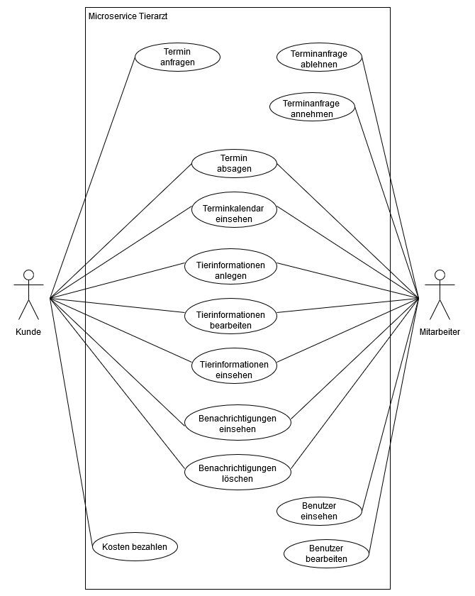

## 2.3 Nicht-funktionale Anforderungen 

### 2.3.1 Rahmenbedingungen

Kommunikation mit anderen Microservices und Geräten findet sowohl Asynchron als auch Synchron statt.

Für die Synchrone Kommunikation mit anderen Dienstleistern wird gRPC verwendet. Die Kommunikation zwischen
Frontend und Backend findet über REST statt.

Asynchrone Kommunikation wird über RabbitMQ ermöglicht.

### 2.3.2 Betriebsbedingungen

Tierarzt Microservice ist über moderne Webbrowser erreichbar und bedienbar.

### 2.3.3 Qualitätsmerkmale

Qualitätsmerkmal | sehr gut | gut | normal | nicht relevant
---|---|---|---|---
**Zuverlässigkeit** | | | | |
Fehlertoleranz |X|-|-|-|
Wiederherstellbarkeit |X|-|-|-|
Ordnungsmäßigkeit |X|-|-|-|
Richtigkeit |X|-|-|-|
Konformität |-|X|-|-|
**Benutzerfreundlichkeit** | | | | |
Installierbarkeit |-|-|-|X|
Verständlichkeit |X|-|-|-|
Erlernbarkeit |X|-|-|-|
Bedienbarkeit |X|-|-|-|
**Performance** | | | | |
Zeitverhalten |-|X|-|-|
Effizienz|-|-|-|X|
**Sicherheit** | | | | |
Analysierbarkeit |-|-|X|-|
Modifizierbarkeit |-|-|X|-|
Stabilität |-|-|X|-|
Prüfbarkeit |-|-|X|-|

## 2.4 Graphische Benutzerschnittstelle

### Tierarzt Hauptseite
Die Hauptseite erlaubt dem Kunden oder Mitarbeiter sich einzuloggen oder aktuelle Information des Tierarztes zu lesen.

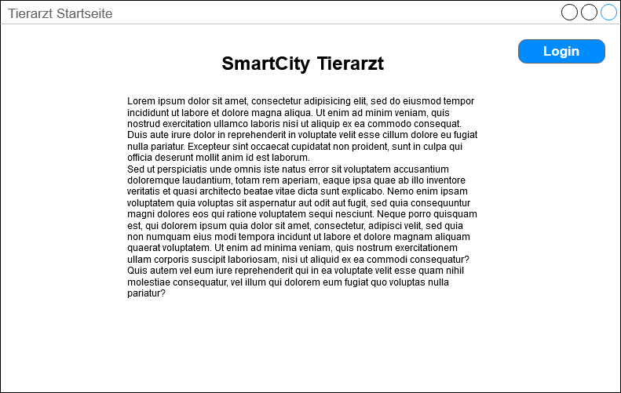

### Tierarzt Hauptseite eingeloggt
Sobald ein Kunde oder Mitarbeiter eingeloggt ist, kann er über die Navigationselemente zu der Terminübersicht, Verwaltungsübersicht
oder Nachrichtenübersicht wechseln.

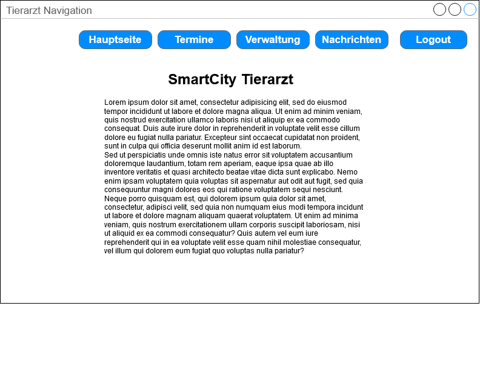

### Terminkalendar Übersicht
In dieser Übersicht werden Kunden und Mitarbeitern alle Tage angezeigt, an denen ein Termin ansteht. Wenn auf einen Tag mit Termin geklickt wird,
werden alle Termine ausgeklappt. Wird nun auf einen dieser Termine geklickt, werden Informationen zu diesem Termin angezeigt 
und der Termin kann abgesagt werden. Kunden können von hier aus neue Termine anfordern, während Mitarbeiter Anfragen annehmen oder ablehnen können.
 
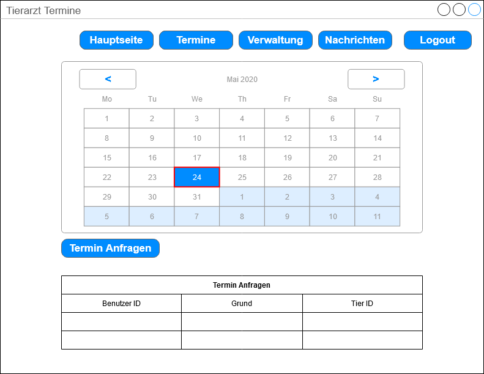

### Terminkalendar Termin Info
Diese Ansicht wird über einen Linksklick auf den Termin Anfordern Button geöffnet. Hier kann ein Kunde einen Tierarzt
Besuch anfordern, wofür der Zeitraum, in welchem der Termin liegen soll, das zu behandelnde Tier, und der Grund angegeben 
werden müssen.

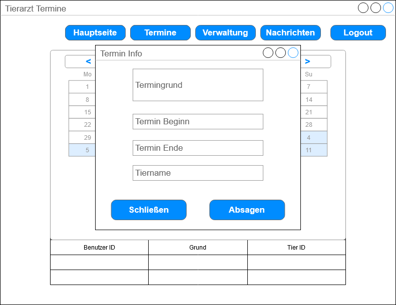

### Terminkalendar Termin Anfordern
Diese Ansicht wird über einen Linksklick auf den Termin Anfordern Button geöffnet. Hier kann ein Kunde einen Tierarzt
Besuch anfordern, wofür der Zeitraum, in welchem der Termin liegen soll, das zu behandelnde Tier, und der Grund angegeben 
werden müssen.

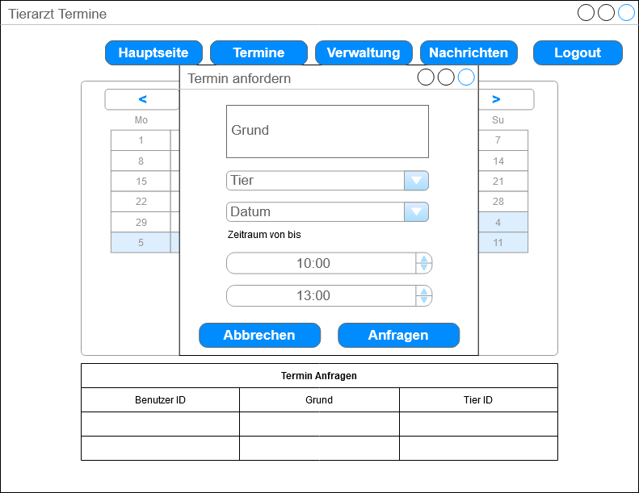

### Terminkalendar Termin Antwort
Diese Übersicht wird über einen Linksklick auf eine Terminanfrage geöffnet. Mitarbeiter können hier Anfragen ablehnen oder Annehmen.
Auf der linken Seite werden dazu alle relevanten Daten des Termins angezeigt, wenn auf die Benutzer oder Tier ID geklickt wird,
öffnet sich ein weiteres Fenster mit genaueren Informationen zu diesen. Der Mitarbeiter muss nun den Termin Beginn und das Termin Ende eintragen,
welche in den vom Kunden angegeben Zeitraum liegt, die aufkommenden Kosten und den behandelnden Mitarbeiter.
Wurde ein Termin angelegt, werden Kunde und behandelnder Mitarbeiter mit einer Nachricht Informiert, der Termin in beide
Kalendar eingetragen und die Kosten als Schulden bei dem Kunden vermerkt. 

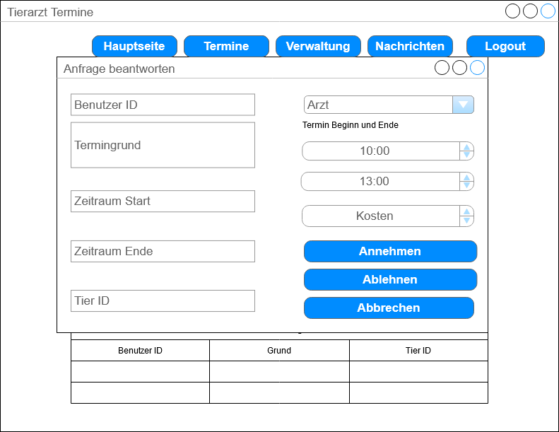

### Tierarzt Verwaltung Übersicht
Hier kann ein Kunde auswählen, ob er neue Tiere hinzufügen will, oder, falls es noch Kosten zu bezahlen gibt, er diese 
bezahlen möchte. Mitarbeiter können hier außerdem die Benutzerverwaltung auswählen.

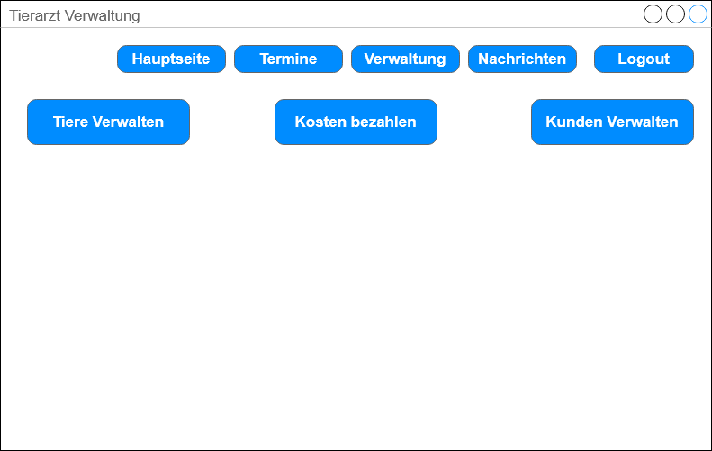

### Tierarzt Verwaltung Tier 
Hier werden Kunden alle eingetragenen Tiere angezeigt. Es können außerdem neue Tiere hinzugefügt werden oder Daten von existierenden
Tieren angepasst werden. Mitarbeitern werden alle registrierten Tiere angezeigt, welche dann bearbeitet oder gelöscht werden
können. 

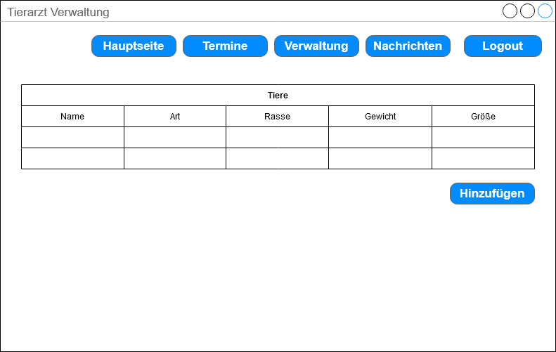

### Tierarzt Verwaltung Tier Bearbeiten
Dieses Fenster wird verwendet, wenn ein neues Tier angelegt werden soll, oder ein existierendes Bearbeitet werden soll.
Tiere können von diesem Fenster aus auch gelöscht werden.

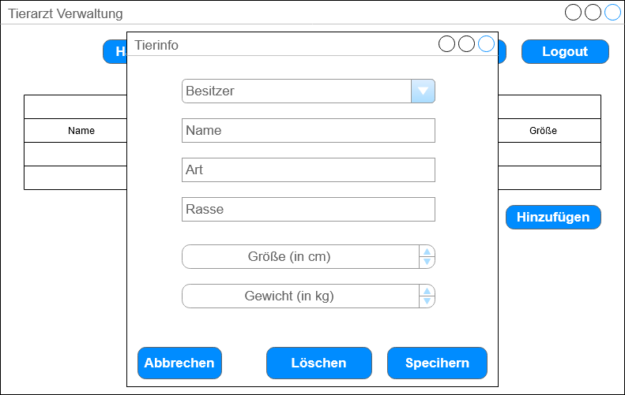

### Tierarzt Verwaltung Benutzer 
Hier können Mitarbeiter Benutzerinformationen verwalten, und zum Beispiel Benutzern Mitarbeiter Rechte geben. Das Bearbeitungsfenster ähnelt hierbei dem
der Tierbearbeitung.

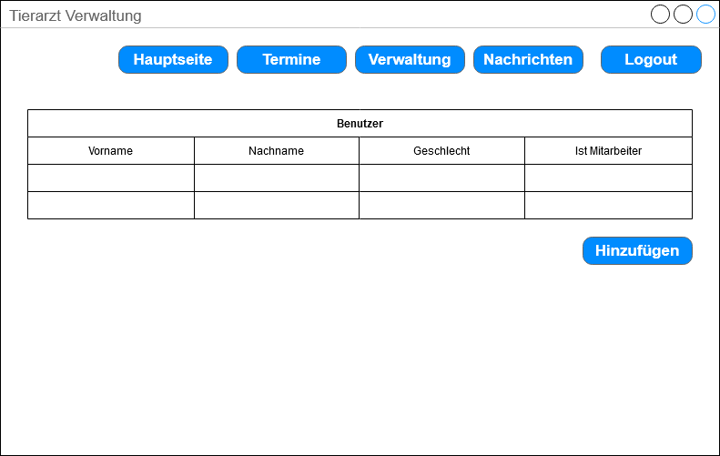

### Tierarzt Verwaltung Nachrichten 
Dieses Fenster enthält Benachrichtigungen für Kunden und Mitarbeiter. Kunden werden hier informiert, wenn angefragte Termine
angenommen oder abgelehnt wurden, wie viel angenommene Termine Kosten werden oder Termine abgesagt wurden.
Mitarbeiter werden hier über bevorstehende Termine informiert und benachrichtigt, wenn Kunden Termine absagen.

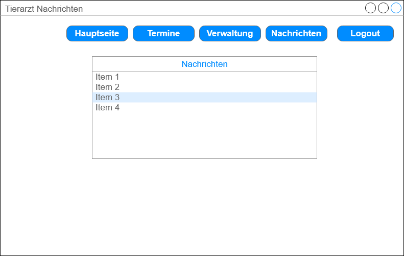

## 2.5 Anforderungen im Detail

| **Als** | **möchte ich** | **so dass** | **Akzeptanz** | **Priorität** |
| :------ | :----- | :------ | :-------- | :------- |
| Kunde | einen Termin anfragen | mein Tier ärztliche Versorgung erhält | Terminanfrage wird versendet | Must |
| Kunde | einen Termin absagen | meine Reservierung rückgängig gemacht wird | Termin wird aus Terminkalendar gelöscht, Mitarbeiter wird benachrichtigt | Must |
| Kunde | mir meine Termine anzeigen lassen | ich keine Termine verpasse | Termine werden angezeigt | Must |
| Kunde | meine Kosten Bezahlen |  | Geld wird überwiesen | Should |

| **Als** | **möchte ich** | **so dass** | **Akzeptanz** | **Priorität** |
| :------ | :----- | :------ | :-------- | :------- |
| Mitarbeiter | Terminanfragen annehmen | Kunden einen Termin erhalten | Termin wird erstellt, bei Kunde und Mitarbeiter angezeigt, Kunde wird benachrichtigt | Must |
| Mitarbeiter | Terminanfragen ablehnen | Kunden eine neue Anfrage erstellen müssen | Terminanfrage wird gelöscht, Kunde wird benachrichtigt | Must |
| Mitarbeiter | meine Termine einsehen | ich meinen Tagesablauf planen kann | Terminkalender für Mitarbeiter wird angezeigt | Must |
| Mitarbeiter | Informationen über Tiere einsehen | ich mich auf die Behandlung vorbereiten kann | Informationen über Tiere werden angezeigt | Should | 
| Mitarbeiter | Informationen über Tiere bearbeiten | die Informationen immer auf dem neusten Stand bleiben | Informationen werden aktualisiert und angezeigt | Should |
| Mitarbeiter | Benachrichtigt werden, wenn ein geplanter Termin abgesagt wurde | ich mich auf meinen neuen Tagesplan vorbereiten kann | Mitarbeiter wird Benachrichtigt | Could |

# 3 Technische Beschreibung

## 3.1 Systemübersicht

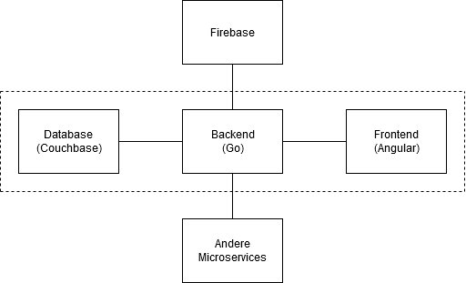

## 3.2 Softwarearchitektur

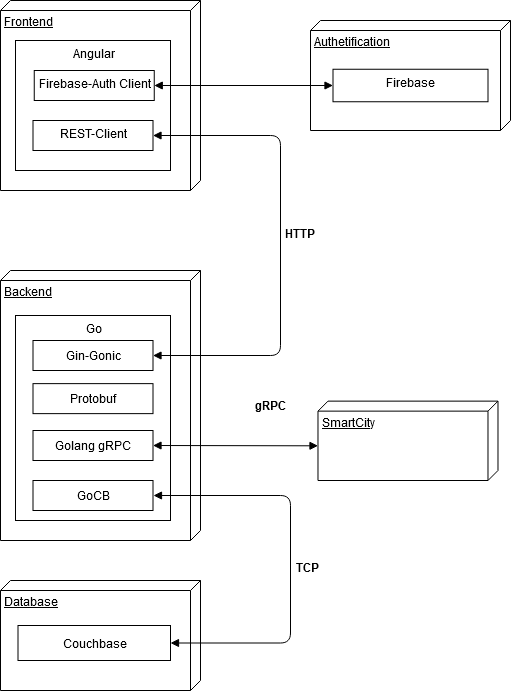

## 3.3 Schnittstellen

### Termine abfragen
Mit Hilfe dieser Schnittstelle können alle vereinbarten Termine bestimmter User angefragt werden. Dies kann verwendet werden,
um eventuelle Termin Uberschneidungen zu prüfen, und so den Benutzer vor einer Termin Erstellung zu warnen, dass er in diesem
Zeitraum bereits einen Termin mit Service X hat.
Das Payload dieser Schnittstelle wäre dazu wie folgt:
````json
"sgse.models.tierarzt.appointments":{
    "description": "Holds all appointments of a specific user with the Tierarzt",
    "fields": [
        {"name": "uid", "type": "string"},
        {"appointments": [
            {
                {"name": "appointmentid", "type": "string"},
                {"name": "start", "type": "string"},
                {"name": "end", "type": "string"}
            },
        ]}
    ]
}
````
## 3.3.1 Ereignisse
### Termin vereinbaren
Durch dieses Ereignis kann ein Benutzer einen Termin vereinbaren. Dazu muss der Benutzer seinen Wunschzeitraum mit Anfang und
Endzeitpunkt angeben. Außerdem muss das zu behandelnde Tier angegeben werden und der Termingrund.
Hierbei sähe der Payload wie folgt aus:
````json
"sgse.models.tierarzt.appointmentrequest":{
    "description": "Holds a wish date and the reason",
    "fields": [
        {"name": "requestid", "type": "string"},
        {"name": "uid", "type": "string"},
        {"name": "animalid", "type": "string"},
        {"name": "start", "type": "string"},
        {"name": "end", "type": "string"},
        {"name": "reason", "type": "string"},
    ]
}
````
Der Benutzer bekommt nun vom Tierarzt eine Antwort. Dazu gehört der genaue Beginn, der behandelnde Arzt und die anfallenden
Kosten
Dies wurde in folgender Form versendet werden:
````json
"sgse.models.tierarzt.appointmentresponse":{
    "description": "Gives the user dates to choose from, and a rough estimation on the duration of the treatment",
    "fields": [
        {"name": "appointmentid", "type": "string"},
        {"name": "uid", "type": "string"},
        {"name": "doctorid", "type": "string"},
        {"name": "animalid", "type": "string"},
        {"name": "start", "type": "string"},
        {"name": "end", "type": "string"},
        {"name": "reason", "type": "string"},
        {"name": "cost", "type": "double"},
    ]
}
````
### Termin stornieren
Der Benutzer kann Termine stornieren. Dafür wird die appointmentid des zu stornierenden Termins übertragen und aus der
Datenbank entfernt.
````json
"sgse.models.tierarzt.appointmentcancel":{
    "description": "The user sends the ID of the appointment he wants to cancel",
    "fields": [
        {"name": "uid", "type": "string"},
        {"name": "appointmentid", "type": "string"}
    ]
}
````
### Tierdaten erstellen
Diese Funktion wird von Benutzern und Mitabeitern verwendet, um neue Tiere in die Datenbank aufzunehmen. Hierbei werden zunächst allgemeine Daten
wie die Tierart, Rasse, Gewicht und Größe erfasst, aber auch die UID des Besitzers.
````json
"sgse.models.tierarzt.animalinfocreate":{
    "description": "Creates new information about a new animal.",
    "fields": [
        {"name": "uid", "type": "string"},
        {"name": "name", "type": "string"},
        {"name": "type", "type": "string"},
        {"name": "race", "type": "string"},
        {"name": "weight", "type": "double"},
        {"name": "height", "type": "double"}
    ]
}
````
### Tierdaten bearbeiten
Durch diese Funktion kann der Kunde oder Mitarbeiter Daten über Tiere ändern. 
````json
    "sgse.models.tierarzt.animalinfocreate":{
        "description": "Manipulates the information about an existing animal.",
        "fields": [
            {"name": "animalid", "type": "string"},
            {"name": "uid", "type": "string"},
            {"name": "name", "type": "string"},
            {"name": "type", "type": "string"},
            {"name": "race", "type": "string"},
            {"name": "weight", "type": "double"},
            {"name": "height", "type": "double"}
        ]
    }
````

## 3.4 Datenmodell 

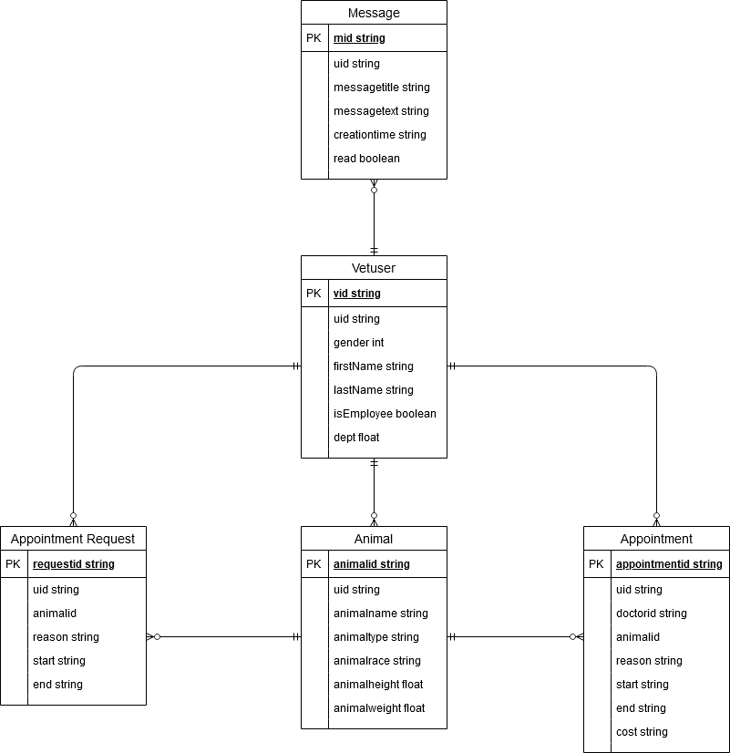

# 4 Projektorganisation

## 4.1 Annahmen

### Verwendete Technologien

#### Frontend
- Angular - Front-End-Webapplikationsframework 
- Angular Material - UI Komponenten Library
- Angular Calendar - Kalender Komponente
- NGINX - Webserver

#### Backend
- Go - Kompilierte Programmiersprache für skalierbare Dienste
- Gin-Gonic - Library für HTTP-Kommunikation
- GoCB - Library für Couchbase-Kommunikation
- Protobuf - Generierung von Go-Dateien aus Proto-Dateien

#### Datenbank
- Couchbase - NoSQL Datenbank

## 4.2 Grober Projektplan

### Meilensteine
* KW 19 (08.05.2020)
  * Fertigstellung Api-Schnittstellen-Spezifikation
* KW 20 (11.05.2020) 
  * Abgabe Software-Spezifikation
* KW 24 (08.06.2020) 
  * Abgabe Softwareprodukt (Version 0)
* KW 27 (03.07.2020) 
  * Abgabe Softwareprodukt

# 5 Anhänge

## 5.1 Glossar 

- **MS** - Microservice
- **Entität** - Microservice in der Architektur
- **gRPC** - Remote Procedure Call Framework
- **VetUser** - Benutzer des Tierarztservices

## 5.2 Referenzen
- [Angular](https://angular.io/docs)
- [Angular-Material](https://material.angular.io/)
- [Angular-Calendar](https://github.com/mattlewis92/angular-calendar)
- [NGINX](https://nginx.org/en/docs/)
- [Firebase](https://firebase.google.com/docs/auth)
- [gRPC](https://grpc.io/docs/)
- [Go](https://golang.org/doc/)
- [Gin-Gonic](https://github.com/gin-gonic/gin)
- [GoCB](https://godoc.org/github.com/couchbase/gocb)
- [Protobuf](https://developers.google.com/protocol-buffers)
- [Couchbase](https://docs.couchbase.com/home/index.html)

## 5.3 Index
 
### Bilderverzeichnis
1. [Use-Case Diagramm](#usecase)
2. [Tierarzt Hauptseite](#mainsite)
3. [Tierarzt Hauptseite Eingeloggt](#mainloggedin)
4. [Tierarzt Kalendar Info](#calendarinfo)
5. [Tierarzt Kalendar Anfordern](#calendarrequest)
6. [Tierarzt Kalendar Antwort](#calendarresponse)
7. [Tierarzt Verwaltung](#administration)
8. [Tierarzt Tier](#animal)
9. [Tierarzt Tier Info](#animalinfo)
10. [Tierarzt Benutzer](#vetusers)
11. [Tierarzt Nachrichten](#messages)
12. [System Overview](#systemoverview)
13. [Software_Architektur](#systemarchitecture)
14. [ERModel](#datamodel)

### Tabellenverzeichnis
1. [Stakeholder](#stakeholder)
2. [Qualitätsmerkmale](#qualitätsmerkmale)
3. [Kunde User Stories](#kundeuserstory)
4. [Mitarbeiter User Stories](#mitarbeiteruserstory)
