# Anforderungs- und Entwurfsspezifikation ("Pflichtenheft")
**Titel**: SmartCity - Tierarzt  
**Autor**: Mattis Küper  
**Repositories**: [Quellcode](https://github.com/SGSE-2020/MS_Tierarzt), [Spezifikation](!https://sgse-2020.github.io/Spezifikation/#/./mattis_kueper/Spezifikation_Tierarzt), [Projekttagebuch](!https://github.com/SGSE-2020/Praktikumstagebuch/blob/master/Mattis_Kueper/ProjektTagebuch.md) 

# 1 Einführung

## 1.1 Beschreibung

Das Projekt **Tierarzt** soll Kunden ermöglichen Termine zu vereinbaren, abzusagen und einzusehen. Es soll außerdem ermöglicht 
werden Futter und Medizin über den Tierarzt zu bestellen, und aufkommende Kosten direkt zu bezahlen. Somit stellt der Tierarzt
den Hauptschnittstelle für alles zum Thema Haustiere dar. Das Abrufen der Termine soll es außerdem anderen Microservices erlauben zu prüfen,
ob zwei Termine sich eventuell kreuzen und können den Benutzer an Termine erinnern.

## 1.2 Ziele

Das Ziel des Tierarzt Microservices ist es, das Verwalten von Terminen sowohl für Tier Besitzer als auch 
Tierarzt Mitarbeiter so einfach wie möglich zu gestalten. Viele Besitzer verlieren schnell den Überblick, 
wann beispielsweise an Impfung ansteht, der Terminkalender des Microservices soll es erleichtern, all diese
Termine im Bick zu behalten.  

Tierarzt Mitarbeiter können sich durch die genauen Pläne besser auf Behandlungen vorbereiten, und ihre Tage besser planen.
Allerdings müssen für Notfälle immer genug Tierärzte anwesend sein. 

# 2 Anforderungen

| Funktion / Relevanz | Name | Kontakt / Verfügbarkeit | Wissen  | Interessen / Ziele  | 
|---|---|---|---|---|
| Tierbesitzer  |  Herr Budde | Tel. 0174 0815420, Jederrzeit telefonisch erreichbar  | Kennt sich mit der Bedienung von Webseiten aus | Möchte für seinen Hund Impftermine und eine generelle Untersuchung anmelden  |  
| Tierärztin  | Frau Dr. Sperling  | anette.sperling@gmail.com, Per E-Mail, immer erreichbar, Verfügbarkeit Wochentags 8-15 Uhr  | Behandelnde Tierärztin, führt Operationen durch | Möchte sich auf anstehende Behandlungen vorbereiten können | 
| Besitzer der Tierarzt Praxis   | Herr Goldlinde  |  smartcity.tierarzt_goldlinde@web.de, Per E-Mail auch an Wochenenden erreichbar, von 8-20 Uhr  | Verwaltet die Tierarzt Praxis, macht Arbeitspläne, bestellt Produkte | Möchte Arbeitspläne so schnell wie möglich erstellen | 

## 2.2 Funktionale Anforderungen

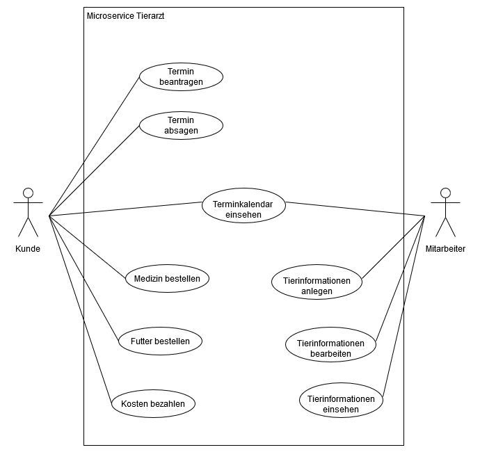

## 2.3 Nicht-funktionale Anforderungen 

### 2.3.1 Rahmenbedingungen

Kommunikation mit anderen Microservices und Geräten findet sowohl Asynchron als auch Synchron statt.

Für die Synchrone Kommunikation mit anderen Diensteistern wird gRPC verwendet. Die Kommunikation zwischen
Frontend und Backend findet über REST statt.

Asynchrone Kommunikation wird über RabbitMQ ermöglicht.

### 2.3.2 Betriebsbedingungen

Tierarzt Microservice ist über moderne Webbrowser erreichbar und bedienbar.

### 2.3.3 Qualitätsmerkmale

Qualitätsmerkmal | sehr gut | gut | normal | nicht relevant
---|---|---|---|---
**Zuverlässigkeit** | | | | |
Fehlertoleranz |X|-|-|-|
Wiederherstellbarkeit |X|-|-|-|
Ordnungsmäßigkeit |X|-|-|-|
Richtigkeit |X|-|-|-|
Konformität |-|X|-|-|
**Benutzerfreundlichkeit** | | | | |
Installierbarkeit |-|-|-|X|
Verständlichkeit |X|-|-|-|
Erlernbarkeit |X|-|-|-|
Bedienbarkeit |X|-|-|-|
**Performance** | | | | |
Zeitverhalten |-|X|-|-|
Effizienz|-|-|-|X|
**Sicherheit** | | | | |
Analysierbarkeit |-|-|X|-|
Modifizierbarkeit |-|-|X|-|
Stabilität |-|-|X|-|
Prüfbarkeit |-|-|X|-|

## 2.4 Graphische Benutzerschnittstelle

### Tierarzt Hauptseite
Die Hauptseite erlaubt dem Kunden oder Mitarbeiter sich einzuloggen oder aktuelle Information des Tierarztes zu lesen.
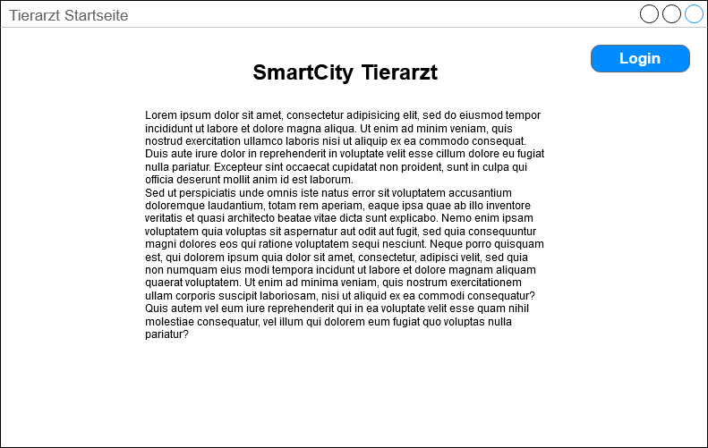

### Tierarzt Hauptseite eingeloggt
Sobald ein Kunde eingeloggt ist, kann er über den Reiter "Termine" in die Termin Ansicht wechseln.
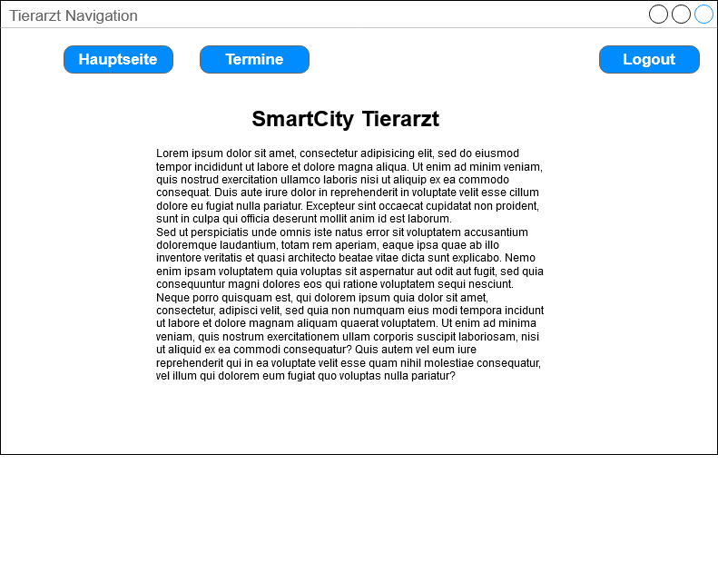

### Terminkalendar Übersicht
In dieser Übersicht werden Kunden und Mitarbeitern alle Tage angezeigt, an denen ein Termin ansteht.
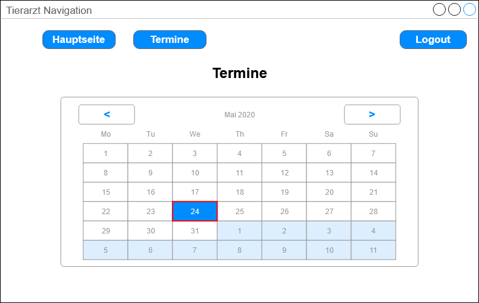

### Terminkalendar Termin Anfordern
Diese Ansicht wird über einen Rechtsklick auf einen Tag im Terminkalendar geöffnet. Hier kann ein Kunde einen Tierarzt
Besuch anfordern, wofür die gewünschte Zeit, das zu behandelnde Tier, und der Grund angegeben werden müssen.
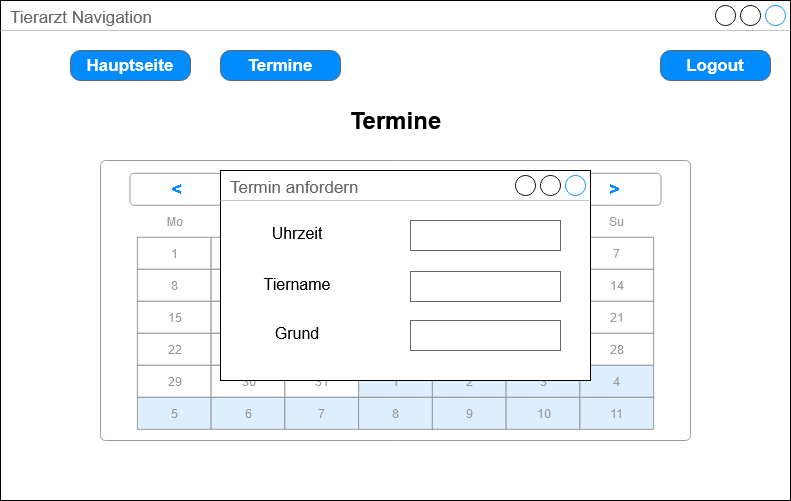

### Terminkalendar Übersicht Pro Tag
Diese Ansicht wird über einen Linksklick geöffnet. Hier werden alle Termine an einem Tag aufgelistet. Dies ist notwendig,
falls Kunden Termine mit mehreren Tieren haben, oder für Mitarbeiter, welche oftmals mehr als eine Behandlung haben.
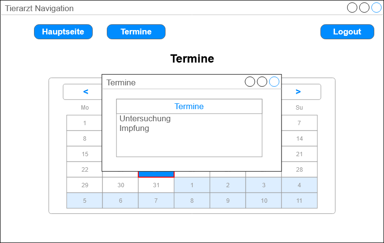

### Terminkalendar Termin Absagen
Diese Ansicht kann durch einen Rechtsklick auf einen Termin geöffnet werden. Mit ihr kann der Kunde einen Termin absagen.

### Terminkalendar Termin Info
Diese Übersicht wird über einen Linksklick auf einen Termin geöffnet. Hier werden alle relevanten Informationen über einen
Termin angezeigt.
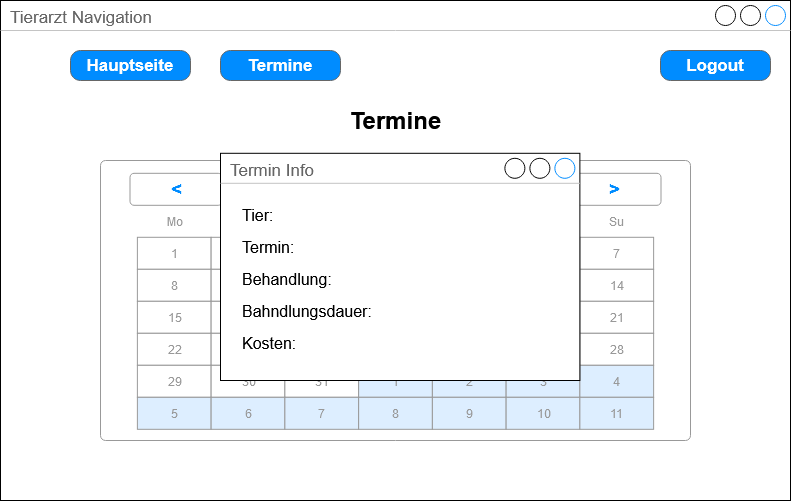

### Tierarzt Hauptseite eingeloggt Mitarbeiter
Wenn ein Mitarbeiter eingeloggt ist, kann er außer den Reiter "Termine" auch noch die "Verwaltung" auswählen.
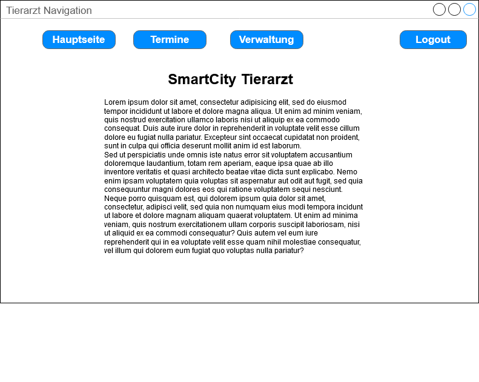

### Tierarzt Verwaltung Übersicht
Hier kann ein Mitarbeiter auswählen, ob er Kunden oder Tiere verwalten möchte.

### Tierarzt Verwaltung Tier Bearbeiten
Hier kann ein Mitarbeiter Tiere nach Namen suchen, und auswählen, ob er ein neues Tier hinzufügen, bearbeiten oder 
löschen möchte.
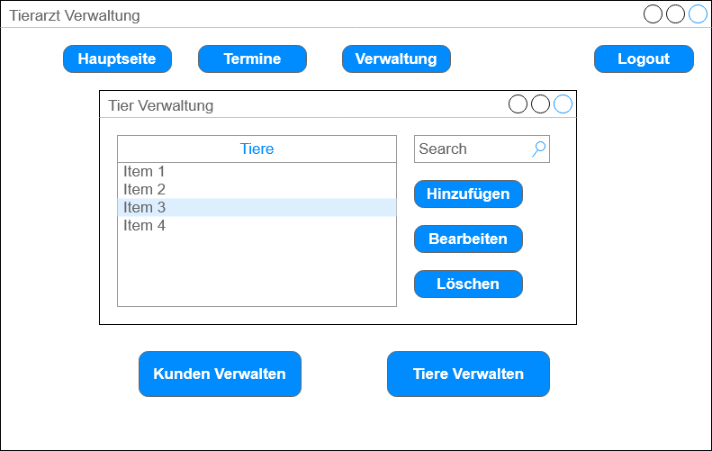

### Tierarzt Verwaltung Tier Info
Dieses Fenster wird verwendet, wenn ein neues Tier angelegt werden soll, oder ein existierendes Beabeitet werden soll.
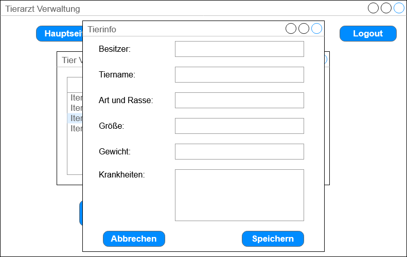

## 2.5 Anforderungen im Detail

| **Als** | **möchte ich** | **so dass** | **Akzeptanz** | **Priorität** |
| :------ | :----- | :------ | :-------- | :------- |
| Kunde | einen Termin vereinbaren | mein Tier ärztliche Versorgung erhält | Termin wird in Terminkalendar eingetragen | Must |
| Kunde | einen Termin absagen | meine Reservierung rückgängig gemacht wird | Termin wird aus Terminkalendar gelöscht | Must |
| Kunde | mir meine Termine anzeigen lassen | ich keine Termine verpasse | Termine werden angezeigt | Must |
| Kunde | meine Kosten Bezahlen |  | Geld wird überwiesen | Should |
| Kunde | Tiermedizin bestellen |  | Medizin wird bestellt und geliefert | Should |  
| Kunde | Tierfutter bestellen |  | Futter wird bestellt und geliefert | Should |  

| **Als** | **möchte ich** | **so dass** | **Akzeptanz** | **Priorität** |
| :------ | :----- | :------ | :-------- | :------- |
| Mitarbeiter | meine Termine einsehen | ich meinen Tagesablauf planen kann | Terminkalender für Mitarbeiter wird angezeigt | Must |
| Mitarbeiter | Informationen über Tiere einsehen | ich mich auf die Behandlung vorbereiten kann | Informationen über Tiere werden angezeigt | Should | 
| Mitarbeiter | Informationen über Tiere bearbeiten | die Informationen immer auf dem neusten Stand bleiben | Informationen werden aktualisiert und angezeigt | Should |
| Mitarbeiter | Benachrichtigt werden, wenn ein geplanter Termin abgesagt wurde | ich mich auf meinen neuen Tagesplan vorbereiten kann | Mitarbeiter wird Benachrichtigt | Could |

# 3 Technische Beschreibung

## 3.1 Systemübersicht

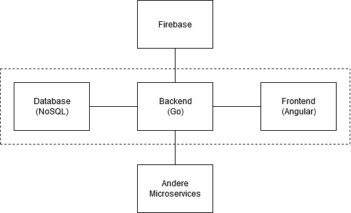

## 3.2 Softwarearchitektur

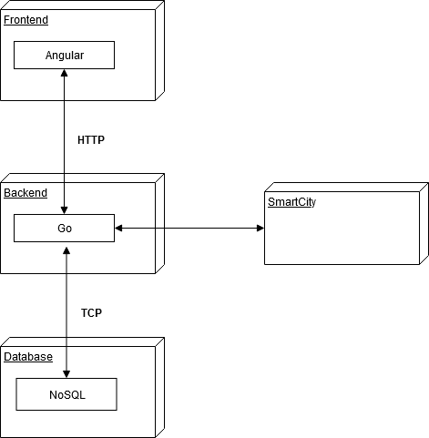

## 3.3 Schnittstellen

### Termine abfragen
Mit Hilfe dieser Schnittstelle können alle vereinbarten Termine bestimmter User angefragt werden. Dies kann verwendet werden,
um eventuelle Termin Uberschneidungen zu prüfen, und so den Benutzer vor einer Termin Erstellung zu warnen, dass er in diesem
Zeitraum bereits einen Termin mit Service X hat.

Das Payload dieser Schnittstelle wäre dazu wie folgt:
    
    "sgse.models.tierarzt.appointments":{
        "description": "Holds all appointments of a specific user with the Tierarzt",
        "fields": [
            {"name": "uid", "type": "string"},
            {"appointments": [
                {
                    {"name": "appointmentid", "type": "string"},
                    {"name": "arrivaltime", "type": "string"},
                    {"name": "duration", "type": "double"}
                },
            ]}
        ]
    }

## 3.3.1 Ereignisse

### Termin vereinbaren
Durch dieses Ereignis kann ein Benutzer einen Termin vereinbaren. Dazu muss der Benutzer zunächst seine UserID und einen
Wunschtermin mit Beschreibung für die durchzuführende Tätigkeit zum Tierarzt schicken.

Hierbei sähe der Payload wie folgt aus:

    "sgse.models.tierarzt.appointmentrequest":{
        "description": "Holds a wish date and the necessary treatment",
        "fields": [
            {"name": "uid", "type": "string"},
            {"name": "arrivaltime", "type": "string"},
            {"name": "treatment", "type": "string"},
        ]
    }

Der Benutzer bekommt nun vom Tierarzt eine Liste mit möglichen Terminen zurück, und eine Einschätzung der Dauer für die
Behandlung.

Dies wurde in folgender Form versendet werden:

    "sgse.models.tierarzt.appointmentresponse":{
        "description": "Gives the user dates to choose from, and a rough estimation on the duration of the treatment",
        "fields": [
            {"name": "uid", "type": "string"},
            {"name": "duration", "type": "double"},
            {"name": "cost", "type": "double"},
            "possibleappointments":[
                {
                    {"name": "appointmentid", "type": "string"},
                    {"name": "arrivaltime", "type": "string"}
                }
            ]
        ]
    }
    
Nun kann der User sich für einen der Termine Entscheiden oder den Vorgang abbrechen. Dazu wird die jeweilige appoointmentid
versendet, oder **null**, falls der Vorgang abgebrochen werden soll.

    "sgse.models.tierarzt.appointmentchoice":{
        "description": "The user sends the ID of the appointment he wants to attend",
        "fields": [
            {"name": "uid", "type": "string"},
            {"name": "appointmentid", "type": "string"},
            {"name": "arrivaltime", "type": "string"},
            {"name": "duration", "type": "double"},
            {"name": "cost", "type": "double"}
        ]
    }
    
Anhand dieser Daten kann nun ein Termin vermerkt werden, welcher abgerufen, storniert oder bezahlt werden kann.
 
### Termin stornieren

Der Benutzer kann Termine stornieren. Dafür wird die appointmentid des zu stornierenden Termins übertragen und aus der
Datenbank entfernt.

    "sgse.models.tierarzt.appointmentcancel":{
        "description": "The user sends the ID of the appointment he wants to cancel",
        "fields": [
            {"name": "uid", "type": "string"},
            {"name": "appointmentid", "type": "string"}
        ]
    }

### Tierdaten erstellen

Diese Funktion wird von Mitabeitern verwendet, um neue Tiere in die Datenbank aufzunehmen. Hierbei werden zunächst allgemeine Daten
wie die Tierart, Rasse, Gewicht und Größe erfasst, aber auch alle bekannten Krankheiten.

    "sgse.models.tierarzt.animalinfocreate":{
        "description": "Creates new information about a new animal.",
        "fields": [
            {"name": "uid", "type": "string"},
            {"name": "name", "type": "string"},
            {"name": "type", "type": "string"},
            {"name": "race", "type": "string"},
            {"name": "weight", "type": "double"},
            {"name": "height", "type": "double"},
            {"diseases": [
                {"name": "diseasename", "type": "string"},
                {"name": "diseasedescription", "type": "string"}
            ]}
        ]
    }

### Tierdaten bearbeiten

Durch diese Funktion kann der Mitarbeiter Daten über Tiere ändern. So können zum Beispiel Größe und Gewicht sich geändert
haben, aber auch neue Krankheiten hinzugekommen sein.

    "sgse.models.tierarzt.animalinfocreate":{
        "description": "Manipulates the information about an existing animal.",
        "fields": [
            {"name": "animalid", "type": "string"},
            {"name": "weight", "type": "double"},
            {"name": "height", "type": "double"},
            {"diseases": [
                {"name": "diseasename", "type": "string"},
                {"name": "diseasedescription", "type": "string"}
            ]}
        ]
    }

## 3.4 Datenmodell 

- Konzeptionelles Analyseklassendiagramm (logische Darstellung der Konzepte der Anwendungsdomäne)
- Modellierung des physikalischen Datenmodells 
  - RDBMS: ER-Diagramm bzw. Dokumentenorientiert: JSON-Schema

## 3.5 Abläufe

- Aktivitätsdiagramme für relevante Use Cases
- Aktivitätsdiagramm für den Ablauf sämtlicher Use Cases

## 3.6 Entwurf

- Detaillierte UML-Diagramme für relevante Softwarebausteine

## 3.7 Fehlerbehandlung 

* Mögliche Fehler / Exceptions auflisten

## 3.8 Validierung

* Relevante (Integrations)-Testfälle, die aus den Use Cases abgeleitet werden können

# 4 Projektorganisation

## 4.1 Annahmen

- Nicht durch den Kunden definierte spezifische Annahmen, Anforderungen und Abhängigkeiten
- Verwendete Technologien (Programmiersprache, Frameworks, etc.)
- Aufteilung in Repositories gemäß Software- und Systemarchitektur und Softwarebbausteinen 
- Einschränkungen, Betriebsbedingungen und Faktoren, die die Entwicklung beeinflussen (Betriebssysteme, Entwicklungsumgebung)
- Interne Qualitätsanforderungen (z.B. Softwarequalitätsmerkmale wie z.B. Erweiterbarkeit)

## 4.2 Verantwortlichkeiten

- Zuordnung von Personen zu Softwarebausteinen aus Kapitel 3.1 und 3.2
- Rollendefinition und Zuordnung

| Softwarebaustein | Person(en) |
|----------|-----------|
| Komponente A | Thomas Mustermann |

### Rollen

#### Softwarearchitekt
Entwirft den Aufbau von Softwaresystemen und trifft Entscheidungen über das Zusammenspiel der Softwarebausteine.

#### Frontend-Entwickler
Entwickelt graphische oder andere Benutzerschnittstellen, insbesondere das Layout einer Anwendung.

#### Backend-Entwickler
Implementiert die funktionale Logik der Anwendung. Hierbei werden zudem diverse Datenquellen und externe Dienste integriert und für die Anwendung bereitgestellt.

### Rollenzuordnung

| Name     | Rolle     |
|----------|-----------|
| Mattis Küper | Softwarearchitekt |
| Mattis Küper | Frontend-Entwickler |
| Mattis Küper | Backend-Entwickler |

## 4.3 Grober Projektplan

### Meilensteine
* KW 19 (08.05.2020)
  * Fertigstellung Api-Schnittstellen-Spezifikation
* KW 20 (11.05.2020) 
  * Abgabe Software-Spezifikation
* KW 24 (08.06.2020) 
  * Abgabe Softwareprodukt (Version 0)
* KW 27 (03.07.2020) 
  * Abgabe Softwareprodukt

# 5 Anhänge

## 5.1 Glossar 

- **MS** - Microservice
- **Entität** - Microservice in der Architektur

## 5.2 Referenzen

## 5.3 Index

