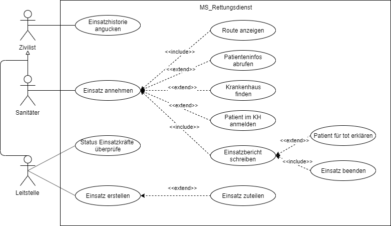

# Anforderungs- und Entwurfsspezifikation ("Pflichtenheft")

* __Titel:__ SmartCity-Rettungsdienst
* __Author:__ Patrick Poppe
* __Source Code:__ [Code Repository](https://github.com/SGSE-2020/MS_Rettungsdienst.git)

# 1 Einführung

## 1.1 Beschreibung

Der Rettungsdienst in der SmartCity stellt einen wesentlichen Faktor im Bereich der öffentlichen Dienste da. Ein zuverlässiges System kann die anstehenden Einsätze begleiten und Fehler verhindern. Somit kann eine Informationskette im Zusammenspiel mit Hausarzt und Krankenhaus über die komplette Behandlungsphase des Patienten erfolgen. Das System ist somit für die Bedürfnisse der Leitstelle wie auch der Sanitäter angepasst. Gleichzeitig dient es den Bürgern als Anlaufstelle für offizielle Informationen zu vergangenen Einsätzen. 

* Projektname
* Darstellung der Produktvision in Prosa (5-10 Sätze)
* Ziele
* Für wen ist das Produkt/der Service?
* Was ist das Bedürfnis? 
* Was ist das Produkt/der Service?
* Warum sollte der Kunde dieses Produkt/den Service „kaufen“ oder nutzen?
* Im Gegensatz zu welchen anderen Produkten/Services steht dies?
* Was macht dieses Produkt/der Service anders?
* Warum ist das Projekt sinnvoll?
* Welche Stakeholder sind betroffen und wie stehen Sie zu der Projektidee?
* Welche alternativen Lösungsideen existieren für den identifizierten Bedarf?
* Wie hoch sind Aufwand und erwarteter Nutzen und stehen sie in einem sinnvollen Verhältnis? (Lohnt sich das Projekt?)
* Verfügen wir über die notwendigen Kompetenzen? (Umsetzbarkeit)
* Welche Risiken und negativen Nebeneffekte sind zu erwarten?

## 1.2 Ziele

Die Alarmierung von Einsatzkräften spielt in vielen Gemeinden eine große Rolle. Eine lückenlose Alarmierungsmöglichkeit ohne die gesamte Bevölkerung zu unterrichten sind wichtige Eigenschaften eines modernen Systems. Das System soll die Mitarbeiter des Rettungsdienstes bei Einsätzen unterstützen. Hierzu zählt die Aufnahme eines Notfalls, die Benachrichtigung des Rettungswagen, sowie Maßnahmen vor Ort. Hierzu zählt das Abrufen der Patientenakte oder das Finden eines freien Krankenhauses. Im Abschluss kann der Einsatz mit einem Einsatzbericht abgeschlossen werden. 

# 2 Anforderungen

## 2.1 Stakeholder

| Funktion / Relevanz | Name | Kontakt / Verfügbarkeit | Wissen  | Interessen / Ziele  |
|---|---|---|---|---|
| Leiterin Leitstelle | Frau Emeg | Tel. 036356, E-Mail: emeg@leitstelle.de , Von 6-18 Uhr telefonisch  und per Mail erreichbar | Kennt das Altsystem, soll mit dem System arbeiten | Vereinfachung der Alarmierung und Einsatzplanung |
| Sanitäter | Rudolf Retter | Tel. 73683, Von 5-13 Uhr telefonisch erreichbar | Kennt das Altsystem | Unterstützung bei Einsätzen, Vereinfachung der Einsatzpflege |
|  |  |  |  |  |

## 2.2 Funktionale Anforderungen

## 2.3 Nicht-funktionale Anforderungen 

### 2.3.1 Rahmenbedingungen

- Normen, Standards, Protokolle, Hardware, externe Vorgaben

### 2.3.2 Betriebsbedingungen

- Vorgaben des Kunden (z.B. Web Browser / Betriebssystem Versionen, Programmiersprache)

### 2.3.3 Qualitätsmerkmale

Qualitätsmerkmal | sehr gut | gut | normal | nicht relevant
---|---|---|---|---
**Zuverlässigkeit** | | | | 
Fehlertoleranz |X|-|-|-
Wiederherstellbarkeit |-|X|-|-
Ordnungsmäßigkeit |X|-|-|-
Richtigkeit |X|-|-|-
Konformität |-|X|-|-
**Benutzerfreundlichkeit** | | | | 
Installierbarkeit |-|-|X|-
Verständlichkeit |X|-|-|-
Erlernbarkeit |-|X|-|-
Bedienbarkeit |X|-|-|-
**Performance** | | | | 
Zeitverhalten |-|X|-|-
Effizienz|-|X|-|-
**Sicherheit** | | | | 
Analysierbarkeit |-|-|X|-
Modifizierbarkeit |-|-|X|-
Stabilität |X|-|-|-
Prüfbarkeit |X|-|-|-

## 2.4 Graphische Benutzerschnittstelle

- GUI-Mockups passend zu User Stories
- Screens mit Überschrift kennzeichnen, die im Inhaltsverzeichnis zu sehen ist
- Unter den Screens darstellen (bzw. verlinken), welche User Stories mit dem Screen abgehandelt werden
- Modellierung der Navigation zwischen den Screens der GUI-Mockups als Zustandsdiagramm

## 2.5 Anforderungen im Detail

| **Als** | **möchte ich** | **so dass** | Akzeptanz | **P**riorität |
| :------ | :----- | :------ | :-------- | --------- |
| Zivilist | die Einsatzhistorie einsehen | ich mich über Einsätze informieren kann | Übersicht einsehbar | Must |
| Sanitäter | Einsätze annehmen können | ich Notfällen helfen kann | Einsätze annehmbar | Must |
| Sanitäter | die Route zum Einsatz angezeigt bekommen | ich mich nicht unnötig verfahre | Route anzeigbar | Must |
| Sanitäter | Patienteninfos abrufen können | ich den Patient bestmöglichst behandeln kann | Infos abrufbar | Must |
| Sanitäter | freie Plätze in den Krankenhäuser finden | ich meinen Patienten in ohne Wartezeit einliefern kann | Frei Plätze anfragbar | Must |
| Sanitäter | meinen Patienten im Krankenhaus anmelden | diese die Behandlung frühzeitig vorbereiten können | Patient kann angemeldet werden | Must |
| Sanitäter | einen Einsatzbericht schreiben | eine Protokollierung des Einsatzes für spätere Fragen möglich ist | Bericht schreibbar | Must |
| Sanitäter | einen Patienten für Tot erklären können | andere Dienste übernehmen können | Patient kann als tot erklärt werden | Must |
| Sanitäter | einen Einsatz beenden können | ich für neue Einsätze zur Verfügung stehe | Einsatz kann beendet werden | Must |
| Leistelle | den Status der Einsatzkräfte überprüfen | ich Einsätze planen kann | Status überprüfbar | Must |
| Leitstelle | Einsätze erstellen | diese übernommen werden können | Einsatz kann erstellt werden | Must |
| Leitstelle | Einsätze zuteilen | eine bestmögliche Abarbeitung erfolgen kann | Einsatzkräfte können Einsatz zugeteilt werden | Must |

### 

# 3 Technische Beschreibung

## 3.1 Systemübersicht

- Systemarchitekturdiagramm ("Box-And-Arrow" Diagramm)
- Kommunikationsprotokolle, Datenformate

## 3.2 Softwarearchitektur

- Darstellung von Softwarebausteinen (Module, Schichten, Komponenten)

## 3.3 Schnittstellen

- Schnittstellenbeschreibung (API)
- Auflistung der nach außen sichtbaren Schnittstelle der Softwarebausteine

## 3.3.1 Ereignisse

- In Event-gesteuerten Systemen: Definition der Ereignisse und deren Attribute

## 3.4 Datenmodell 

- Konzeptionelles Analyseklassendiagramm (logische Darstellung der Konzepte der Anwendungsdomäne)
- Modellierung des physikalischen Datenmodells 
  - RDBMS: ER-Diagramm bzw. Dokumentenorientiert: JSON-Schema

## 3.5 Abläufe

- Aktivitätsdiagramme für relevante Use Cases
- Aktivitätsdiagramm für den Ablauf sämtlicher Use Cases

## 3.6 Entwurf

- Detaillierte UML-Diagramme für relevante Softwarebausteine

## 3.7 Fehlerbehandlung 

* Mögliche Fehler / Exceptions auflisten

## 3.8 Validierung

* Relevante (Integrations)-Testfälle, die aus den Use Cases abgeleitet werden können

# 4 Projektorganisation

## 4.1 Annahmen

- Nicht durch den Kunden definierte spezifische Annahmen, Anforderungen und Abhängigkeiten
- Verwendete Technologien (Programmiersprache, Frameworks, etc.)
- Aufteilung in Repositories gemäß Software- und Systemarchitektur und Softwarebbausteinen 
- Einschränkungen, Betriebsbedingungen und Faktoren, die die Entwicklung beeinflussen (Betriebssysteme, Entwicklungsumgebung)
- Interne Qualitätsanforderungen (z.B. Softwarequalitätsmerkmale wie z.B. Erweiterbarkeit)

## 4.2 Verantwortlichkeiten

- Zuordnung von Personen zu Softwarebausteinen aus Kapitel 3.1 und 3.2
- Rollendefinition und Zuordnung

| Softwarebaustein | Person(en) |
|----------|-----------|
| Komponente A | Thomas Mustermann |

### Rollen

#### Softwarearchitekt
Entwirft den Aufbau von Softwaresystemen und trifft Entscheidungen über das Zusammenspiel der Softwarebausteine.

#### Frontend-Entwickler
Entwickelt graphische oder andere Benutzerschnittstellen, insbesondere das Layout einer Anwendung.

#### Backend-Entwickler
Implementiert die funktionale Logik der Anwendung. Hierbei werden zudem diverse Datenquellen und externe Dienste integriert und für die Anwendung bereitgestellt.

### Rollenzuordnung

| Name     | Rolle     |
|----------|-----------|
| Thomas Mustermann | Softwarearchitekt |

## 4.3 Grober Projektplan

- Meilensteine

### Meilensteine
* KW 43 (21.10)
  * Abgabe Pflichtenheft
* KW 44 (28.10) / Projekt aufsetzen
  * Repository Struktur
* KW 45 (4.11) / Implementierung
  * Implementierung #3 (Final)
* KW 48 (18.12) / Abnahmetests
  * manuelle Abnahmetestss
  * Präsentation / Software-Demo

# 5 Anhänge

## 5.1 Glossar 

- Definitionen, Abkürzungen, Begriffe

## 5.2 Referenzen

- Handbücher, Gesetze

## 5.3 Index

