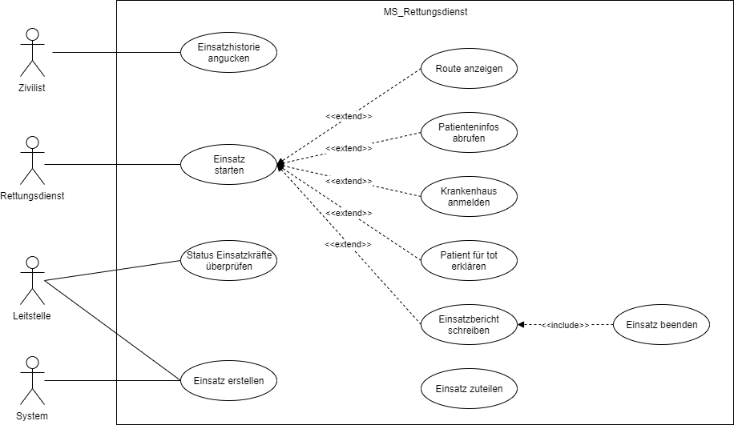
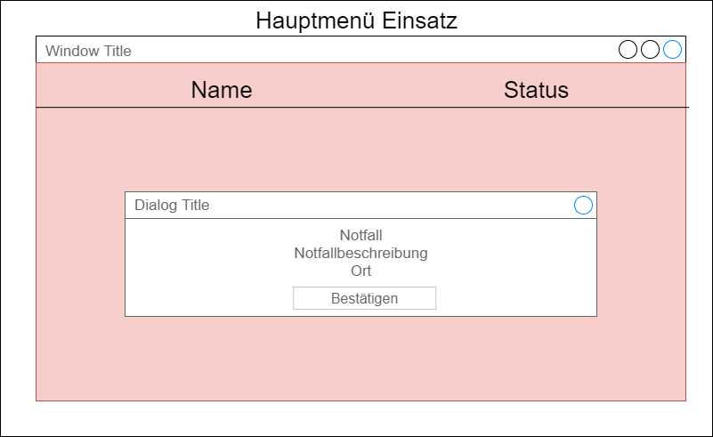

# Anforderungs- und Entwurfsspezifikation ("Pflichtenheft")

* __Titel:__ SmartCity-Rettungsdienst
* __Author:__ Patrick Poppe
* __Source Code:__  [Code Repository](https://github.com/SGSE-2020/MS_Rettungsdienst.git)

# 1 Einführung

## 1.1 Beschreibung

Der Rettungsdienst in der SmartCity stellt einen wesentlichen Faktor im Bereich der öffentlichen Dienste da. Ein zuverlässiges System kann die anstehenden Einsätze begleiten und Fehler verhindern. Somit kann eine Informationskette im Zusammenspiel mit Hausarzt und Krankenhaus über die komplette Behandlungsphase des Patienten erfolgen. Das System ist somit für die Bedürfnisse der Leitstelle wie auch der Sanitäter angepasst. Gleichzeitig dient es den Bürgern als Anlaufstelle für offizielle Informationen zu vergangenen Einsätzen. 


Da heutzutage das Handy immer am Mann ist, ist so auch eine lückenlose Alarmierung im Stadtgebiet möglich. Die Benutzung soll einfach und selbsterklärend sein, sodass eine fehlerfreie Benutzung auch bei einem Einsatz unter hohem Druck gewährleistet ist. Durch das Abfragen der Patienteninformationen können bereits bei der Erstversorgung zuverlässig Fehlbehandlungen ausgeschlossen werden. Das Anmelden der Patienten im Krankenhaus gewährleistet eine lückenlose Übergabe zwischen Krankenhaus und Rettungsdienst. Mit der Eingabe des Einsatzberichtes kann der Einsatz abgeschlossen werden und eine weitere Verpflegung des Patienten sichergestellt werden.


Eine digitale Alarmierung gibt es mittlerweile in vielen Städten und Gemeinden. Häufig basiert die Alarmierung jedoch noch auf Pagern. Dadurch ist immer ein zusätzliches Gerät am Mann zu tragen. Und die Möglichkeit einer fehlerfreien Alarmierung liegt im Interesse aller. Sowohl der Stadtverwaltung, die einen Rettungsdienst zur Verfügung stellen muss. Den Sanitätern, die helfen wollen, und den Bürgern der Stadt, die zum Notfall werden können.

## 1.2 Ziele

Die Alarmierung von Einsatzkräften spielt in vielen Gemeinden eine große Rolle. Eine lückenlose Alarmierungsmöglichkeit ohne die gesamte Bevölkerung zu unterrichten sind wichtige Eigenschaften eines modernen Systems. Das System soll die Mitarbeiter des Rettungsdienstes bei Einsätzen unterstützen. Hierzu zählt die Aufnahme eines Notfalls, die Benachrichtigung des Rettungswagen, sowie Maßnahmen vor Ort. Hierzu zählt das Abrufen der Patientenakte oder das Anmelden des Patienten in einem Krankenhaus. 


Die Benutzer des Systems sind vor allem die Mitarbeiter in der Leitstelle, die einen Notruf aufnehmen und die Sanitäter im Einsatz. Da bei Notrufen ein erhöhter Stresspegel vorliegt und die User nur eine Allgemeinbildung in IT-System haben, muss der Workflow hier einfach und intuitiv angelegt sein, um Fehler zu vermeiden. Die Seiten sollen deswegen nur wenige Elemente enthalten, damit die Hauptkonzentration dem Patienten gelten kann.

Zusätzlich können Krankentransporte in Auftrag gegeben werden. Diese werden automatisch von dem System bearbeitet und an den nächsten freien Sanitäter vergeben.


Das System soll jedoch keine Notrufe automatisch verteilen. Die Erfahrung und besonders wichtig die Einflussnahme des Leitstellenmitarbeiters auf Opfer, bzw. Ersthelfer, stellen einen wichtigen Teil in der Erstversorgung da. Auch soll das System keine Diagnose vor Ort erstellen, sondern nur bereits vorhandene Patientendaten abrufen. Hierzu können zum Beispiel Allergien gehören. So sollen Fehler bei der Behandlung vermieden werden.

# 2 Anforderungen

## 2.1 Stakeholder

| Funktion / Relevanz | Name | Kontakt / Verfügbarkeit | Wissen  | Interessen / Ziele  |
|---|---|---|---|---|
| Leiterin Leitstelle | Frau Emeg | Tel. 036356, E-Mail: emeg@leitstelle.de , Von 6-18 Uhr telefonisch  und per Mail erreichbar | Kennt das Altsystem, soll mit dem System arbeiten | Vereinfachung der Alarmierung und Einsatzplanung |
| Sanitäter | Rudolf Retter | Tel. 73683, Von 5-13 Uhr telefonisch erreichbar | Kennt das Altsystem | Unterstützung bei Einsätzen, Vereinfachung der Einsatzpflege |


## 2.2 Funktionale Anforderungen




## 2.3 Nicht-funktionale Anforderungen 

### 2.3.1 Rahmenbedingungen

- Kommunikation mit anderen Microservices:
  - Asynchron: RabbitMQ
  - Synchron: gRPC

### 2.3.2 Betriebsbedingungen

- Verfügbar per Webzugriff mit einem aktuellen Browser (z.B. Google Chrome 81.0.4044)
- optimierte Darstellung für Mobilgeräte

### 2.3.3 Qualitätsmerkmale

Qualitätsmerkmal | sehr gut | gut | normal | nicht relevant
---|---|---|---|---
**Zuverlässigkeit** | | | | 
Fehlertoleranz |X|-|-|-
Wiederherstellbarkeit |-|X|-|-
Ordnungsmäßigkeit |X|-|-|-
Richtigkeit |X|-|-|-
Konformität |-|X|-|-
**Benutzerfreundlichkeit** | | | | 
Installierbarkeit |-|-|X|-
Verständlichkeit |X|-|-|-
Erlernbarkeit |-|X|-|-
Bedienbarkeit |X|-|-|-
**Performance** | | | | 
Zeitverhalten |-|X|-|-
Effizienz|-|X|-|-
**Sicherheit** | | | | 
Analysierbarkeit |-|-|X|-
Modifizierbarkeit |-|-|X|-
Stabilität |X|-|-|-
Prüfbarkeit |X|-|-|-

## 2.4 Graphische Benutzerschnittstelle

#### Zivilisten

##### Historie ansehen


#### Sanitäter

##### Hauptmenü


##### Einsatz Annehmen



##### Hauptmenü Einsatz


##### Einsatz Weg Anzeigen


##### Patientendaten abrufen


##### Einsatzbericht schreiben


#### Leitstelle

##### Einsatz erstellen


## 2.5 Anforderungen im Detail

| **Als** | **möchte ich** | **so dass** | Akzeptanz | **P**riorität |
| :------ | :----- | :------ | :-------- | --------- |
| Zivilist | die Einsatzhistorie einsehen | ich mich über Einsätze informieren kann | Übersicht einsehbar | Must |
| Sanitäter | Einsätze annehmen können | ich Notfällen helfen kann | Einsätze annehmbar | Must |
| Sanitäter | die Route zum Einsatz angezeigt bekommen | ich mich nicht unnötig verfahre | Route anzeigbar | Must |
| Sanitäter | Patienteninfos abrufen können | ich den Patient bestmöglichst behandeln kann | Infos abrufbar | Must |
| Sanitäter | meinen Patienten im Krankenhaus anmelden | diese die Behandlung frühzeitig vorbereiten können | Patient kann angemeldet werden | Must |
| Sanitäter | einen Einsatzbericht schreiben | eine Protokollierung des Einsatzes für spätere Fragen möglich ist | Bericht schreibbar | Must |
| Sanitäter | einen Patienten für Tot erklären können | andere Dienste übernehmen können | Patient kann als tot erklärt werden | Must |
| Sanitäter | einen Einsatz beenden können | ich für neue Einsätze zur Verfügung stehe | Einsatz kann beendet werden | Must |
| Leistelle | den Status der Einsatzkräfte überprüfen | ich Einsätze planen kann | Status überprüfbar | Must |
| Leitstelle | Einsätze erstellen | diese übernommen werden können | Einsatz kann erstellt werden | Must |
| Leitstelle | Einsätze zuteilen | eine bestmögliche Abarbeitung erfolgen kann | Einsatzkräfte können Einsatz zugeteilt werden | Must |
| System | Einsätze erstellen | um Krankentransporte entgegennehmen zu können | Einsätze werden automatisch erstellt | Must |

### 


# 3 Technische Beschreibung

## 3.1 Systemübersicht


## 3.2 Softwarearchitektur


## 3.3 Schnittstellen

### Einsatzbericht abfragen
```json
"sgse.models.rettungsdienst.einsatzbericht":{

	"description": "Returns a  specific mission report", 

	"fields": [

		{"name": "missionID", "type": "string", "required": true}

	]

}
```

### Notruf auslösen

```json

"sgse.models.rettungsdienst.emergency":{

	"description" : "Create an emergency",

	"fields":[

		{"name": "location", "type": "string", "required": true},

		{"name": "patientID", "type": "string", "required": false}

	]

} 
```

### Krankentransport anmelden

```json
"sgse.models.rettungsdienst.transport":{

	"description" : "Create a transport for a patient",

	"fields":[

		{"name": "location", "type": "string", "required": true},

		{"name": "patientID", "type": "string", "required": true}

	]

}
```

## 3.3.1 Ereignisse

#### Senden

##### Patient verstorben

Name Event: Patient verstorben

Payload: PatientenID (BürgerID)

##### Einsatzbericht verfügbar

Name Event: EInsatzbericht Verfügbar

Payload: EinsatzNr

#### Empfangen

##### Bürger verstorben

Details siehe Bürgerbüro

## 3.4 Datenmodell 

### Einsatzbericht

```json
"sgse.rettungsdienst.einsatz": {
    "description": "An emergency report",
    "fields": [
        {"name": "einsatzID", "type": "string", "required": true},
        {"name": "patientenID", "type": "string", "required": false},
        {"name": "adresse", "type": "string", "required": true},
        {"name": "einsatzbegin", "type": "Date", "required": true},
        {"name": "einsatzende", "type": "Date", "required": false},
        {"name": "sanitaeter", "type": "string", "required": true},
        {"name": "patientenID", "type": "string", "required": false},
        {"name": "symptome", "type": "string", "required": false},
        {"name": "medikamente", "type": "string", "required": false}
    ]
}
```

#### Rollenzuweisung

```json
"sgse.rettungsdienst.user": {
    "description": "Role for every user",
    "fields": [
        {"name": "userID", "type": "string", "required": true},
        {"name": "role", "type": "int", "required": true}
    ]
}
```

##### ENUM-Rolle

1 = Sanitäter

2 = Leitstelle

## 3.5 Abläufe


## 3.7 Fehlerbehandlung 

Keine Verbindung zum Sanitäter --> Neuen Sanitäter zuweisen

Keine Verbindung zur Datenbank --> Daten zwischenspeichern

Keine Verbindung zum Krankenhaus --> keine Fehlerbehandlung, Fehlermeldung ausgeben

Keine Verbindung zum Hausarzt --> Fehlermeldung ausgeben

# 4 Projektorganisation

## 4.1 Annahmen

- Verwendete Technologien: HTML, JavaScript, Vue.js, sweetAlert2, Socket.io,node.js, MongoDB
- Aufteilung in Repositories gemäß Software- und Systemarchitektur und Softwarebbausteinen 

## 4.2 Verantwortlichkeiten

- Zuordnung von Personen zu Softwarebausteinen aus Kapitel 3.1 und 3.2
- Rollendefinition und Zuordnung

| Softwarebaustein | Person(en) |
|----------|-----------|
| Frontend | Patrick Poppe |
| Backend | Patrick Poppe |
| Datenbank | Patrick Poppe |

### Rollen

#### Softwarearchitekt
Entwirft den Aufbau von Softwaresystemen und trifft Entscheidungen über das Zusammenspiel der Softwarebausteine.

#### Frontend-Entwickler
Entwickelt graphische oder andere Benutzerschnittstellen, insbesondere das Layout einer Anwendung.

#### Backend-Entwickler
Implementiert die funktionale Logik der Anwendung. Hierbei werden zudem diverse Datenquellen und externe Dienste integriert und für die Anwendung bereitgestellt.

#### Datenbank-Entwickler

Implementiert und entwirft anhängende Datenbanken für den Dienst.

### Rollenzuordnung

| Name     | Rolle     |
|----------|-----------|
| Patrick Poppe | Softwarearchitekt |
| Patrick Poppe | Frontend-Entwickler |
| Patrick Poppe | Backend-Entwickler |
| Patrick Poppe | Datenbank-Entwickler |


## 4.3 Grober Projektplan

### Meilensteine
* 11.05.2020
  * Abgabe Pflichtenheft
* 08.06.2020
  * Abgabe Prototyp
* 03.07.2020
  * Softwareübergabe

# 5 Anhänge

## 5.1 Glossar 

- Definitionen, Abkürzungen, Begriffe

## 5.2 Referenzen

- Handbücher, Gesetze

## 5.3 Index


