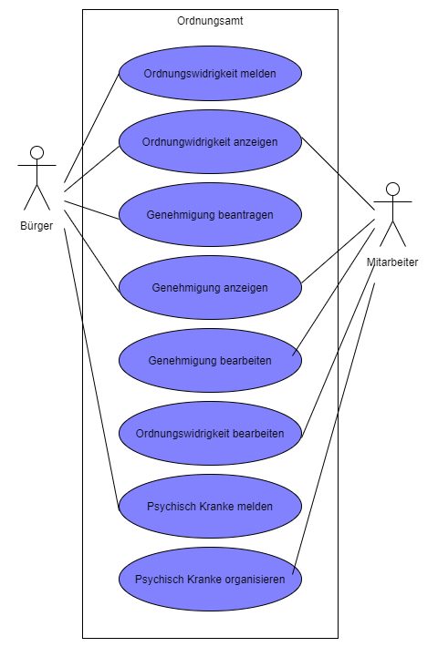

# Anforderungs- und Entwurfsspezifikation - SmartCity - Ordnungsamt

* Titel: SmartCity - Ordnungsamt
* Autor: Philipp Clausing
* SRC: [Repository](https://github.com/SGSE-2020/Spezifikation/tree/master/docs/philipp_clausing)

# 1 Einführung

## 1.1 Beschreibung

* Projektname
* Darstellung der Produktvision in Prosa (5-10 Sätze)
* Ziele
* Für wen ist das Produkt/der Service?
* Was ist das Bedürfnis? 
* Was ist das Produkt/der Service?
* Warum sollte der Kunde dieses Produkt/den Service „kaufen“ oder nutzen?
* Im Gegensatz zu welchen anderen Produkten/Services steht dies?
* Was macht dieses Produkt/der Service anders?
* Warum ist das Projekt sinnvoll?
* Welche Stakeholder sind betroffen und wie stehen Sie zu der Projektidee?
* Welche alternativen Lösungsideen existieren für den identifizierten Bedarf?
* Wie hoch sind Aufwand und erwarteter Nutzen und stehen sie in einem sinnvollen Verhältnis? (Lohnt sich das Projekt?)
* Verfügen wir über die notwendigen Kompetenzen? (Umsetzbarkeit)
* Welche Risiken und negativen Nebeneffekte sind zu erwarten?

## 1.2 Ziele

- Anwendungsbereiche, Motivation, Umfang, Alleinstellungsmerkmale, Marktanforderungen
- Informationen zu Zielbenutzergruppen und deren Merkmale (Bildung, Erfahrung, Sachkenntnis)
- Abgrenzung (Was ist das Softwaresystem _nicht_)
- ggfs. SWOT-Analyse

# 2 Anforderungen

## 2.1 Stakeholder

| Funktion / Relevanz | Name | Kontakt / Verfügbarkeit | Wissen  | Interessen / Ziele  |
|---|---|---|---|---|
|  |   |   |    |   |

## 2.2 Funktionale Anforderungen

## 2.3 Nicht-funktionale Anforderungen 

### 2.3.1 Rahmenbedingungen

### 2.3.2 Betriebsbedingungen

### 2.3.3 Qualitätsmerkmale

## 2.4 Graphische Benutzerschnittstelle

## 2.5 Anforderungen im Detail

#### Bürger

| **Als**  | **möchte ich**                     | **so dass**                                | **Akzeptanz**       | **Priorität**       |
| :------- | :--------------------------------- | :----------------------------------------- | :------------------ | ------------------- |
| Bürger   | Genehmigung beantragen             | Der Antrag vom Mitarbeiter gesehen wird    | Antrag liegt dem Ordnungsamt vor | Must |
| Bürger   | Genehmigungen einsehen             | Den Status der Genehmigungen einsehen kann | Status wird auf der Website angezeigt | Should |
| Bürger   | Ordnungswidrigkeit melden          | Das Ordnungsamt informiert ist             | Meldung liegt dem Ordnungsamt vor | Must |
| Bürger   | Ordnungswidrigkeiten einsehen      | Prüfen ob die Meldung dem OA vorliegt      | Meldung wird auf der Website angezeigt | Could |
| Bürger   | Psychisch Kranken melden           | Das Ordnungsamt sich um die Verwahrung kümmert | Meldung liegt dem Ordnungsamt vor | Must |

#### Ordnungsamt Mitarbeiter (OAMTM)

| **Als**  | **möchte ich**| **so dass** | **Akzeptanz**| **Priorität** |
| -------- | :--------------------------------- | :----------------------------------------- | :------------------ | ------------------- |
| OAMTM | Beantragte Genehmigungen einsehen | ich alle Genehmigungen auf einem Überblick sehe | Genehmigungen werden angezeigt | Must |
| OAMTM | Beantragte Genehmigungen bearbeiten | ich die Genehmigungen abarbeiten kann | Der Status der Genehmigung ändert sich | Must |
| OAMTM | Gemeldete Ordnungswidrigkeiten einsehen | ich alle Ordnungswidrigkeiten auf einen Blick sehe | Meldungen werden angezeigt | Must |
| OAMTM | Gemeldete Ordnungswidrigkeiten bearbeiten | ich den Meldungen nachgehen kann und diese aktualisieren kann| Der Status der Meldung ändert sich | Must |
| OAMTM | Meldung von psychisch Kranken einsehen | Ich alle Meldungen auf einen Blick sehe | Alle Meldungen werden angezeigt | Must |
| OAMTM | Meldung von psychisch Kranken bearbeiten | Ich den Meldungen nachgehen kann und diese aktualisieren kann | Status der Meldung ändert sich | Must |

### Use Case Diagramme

# 3 Technische Beschreibung

## 3.1 Systemübersicht

## 3.2 Softwarearchitektur

## 3.3 Schnittstellen

* Zugriff auf Ordnungswidrigkeiten mit BürgerID von betroffener Person
* Zugriff auf Anträge mit Genehmigt(Ja, Nein, In Bearbeitung), Bearbeiter, BürgerID, evtl. Gültigkeitsdauer und Anmerkungen von Antragsteller und. OA Mitarbeiter
* Zugriff auf Mitarbeiter (Ankunftszeit, Verweildauer, BearbeiterID)
* Psychisch Kranke Meldungen Zugriff für Krankenhaus/Medizinische Einrichtungen (Meldung, Meldungszeit, BürgerID)

## 3.3.1 Ereignisse

## 3.4 Datenmodell

## 3.5 Abläufe

## 3.6 Entwurf

## 3.7 Fehlerbehandlung 

## 3.8 Validierung

# 4 Projektorganisation

## 4.1 Annahmen

## 4.2 Verantwortlichkeiten

### Rollen

#### Softwarearchitekt

#### Frontend-Entwickler

#### Backend-Entwickler

### Rollenzuordnung

## 4.3 Grober Projektplan

### Meilensteine

* KW 18 (27.04)
    * Spezifikation schreiben

# 5 Anhänge

## 5.1 Glossar

- Definitionen, Abkürzungen, Begriffe

## 5.2 Referenzen

- Handbücher, Gesetze

## 5.3 Index
