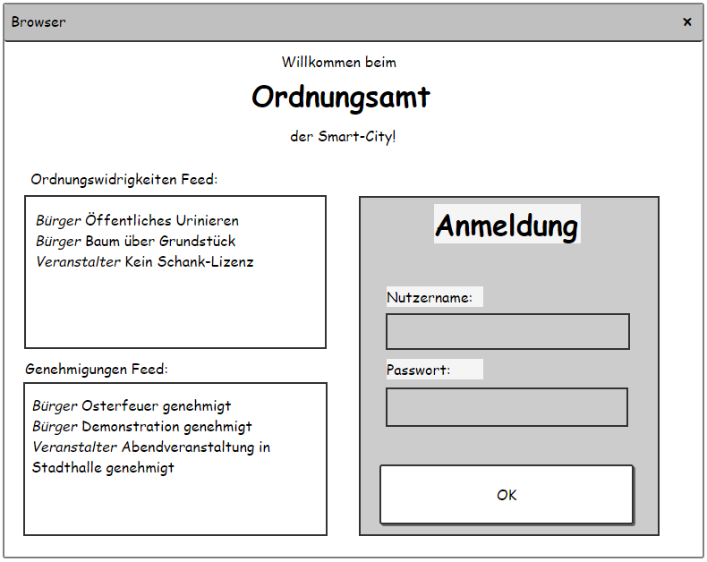
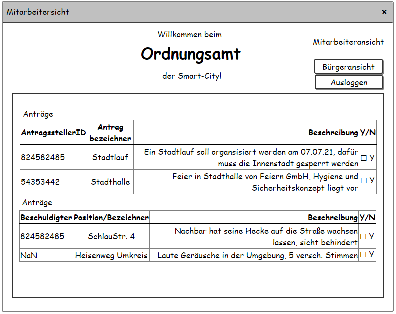
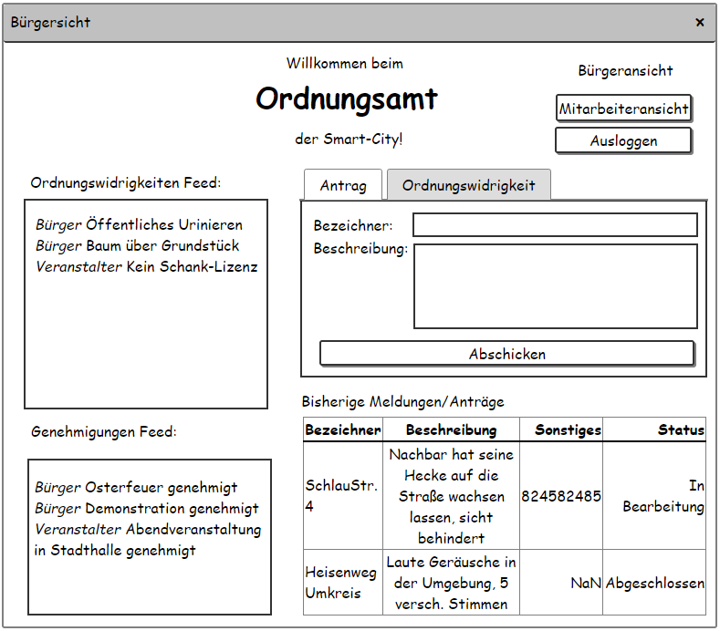
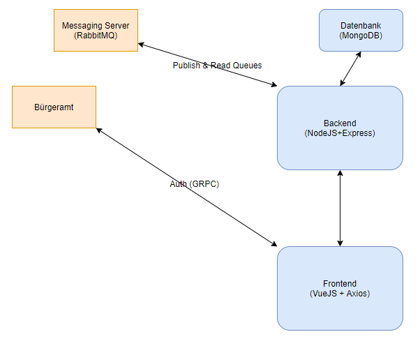
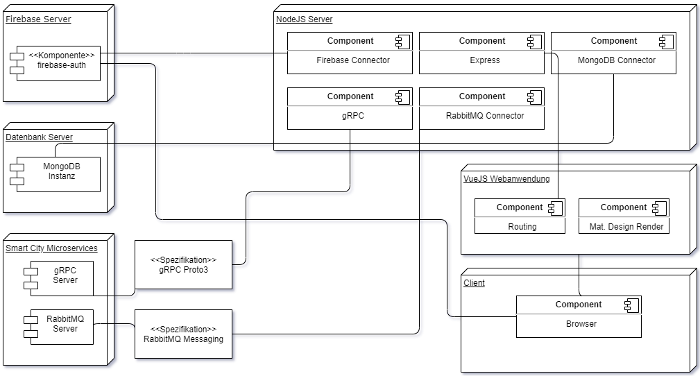

# Anforderungs- und Entwurfsspezifikation - SmartCity - Ordnungsamt

* Titel: SmartCity - Ordnungsamt
* Autor: Philipp Clausing
* SRC: [Repository](https://github.com/SGSE-2020/Spezifikation/tree/master/docs/philipp_clausing)

# 1 Einführung

## 1.1 Beschreibung

Das Ordnungsamt ist eine Kontrollbehörde der Smart City. Es bietet eine Plattform für die Bürger und auch die Mitarbeiter um Anträge und Meldungen effektiv zu stellen oder auch anzuarbeiten. Jeder Bürger ist dazu angehalten die Weboberfläche des Ordnungsamtes zu nutzen.

## 1.2 Ziele

Das Ordnungsamt mit Weboberfläche soll ein zentraler Punkt für Meldungen von ordnungswidrigem Verhalten und Anträge sein.

Alle Bewohner der Stadt (Benutzer und Mitarbeiter) sollen die Plattform ohne Probleme, intuitiv nutzen können.

# 2 Anforderungen

## 2.1 Stakeholder

| Funktion / Relevanz | Name | Kontakt / Verfügbarkeit | Wissen  | Interessen / Ziele  |
|---|---|---|---|---|
| Bürger | Heinz Müller | Tel. 42345634, von 10-19 Uhr telefonisch erreichbar,EMail 24/7 | Kennt die Funktionen welche ein Ordnungsamt bieten sollte | Will Ordnungswidrigkeiten sehen und melden dazu noch Genehmigungen beantragen und einsehen |
| Ordnungsamt Mitarbeiter | Sarah Steinmann | Tel. 6546724, von 8-25 Uhr telefonisch erreichbar, EMail 24/7 | Kennt das System und die Stadt | Möchte das Ordnungsamt steuern und Anträge bearbeiten außerdem Ordnungswidrigkeiten nachgehen |


## 2.2 Funktionale Anforderungen

### Use Case Diagramm


## 2.3 Nicht-funktionale Anforderungen 

### 2.3.1 Rahmenbedingungen

Die Kommunikation mit den anderen Mikroservices findet sowohl asynchron(Messaging) als auch synchron statt.

### Asynchron

Die asynchrone Kommunikation findet über Messaging statt. Dazu wird für alle Microservices ein RabbitMQ Server erstellt welcher die Nachrichten mittels Queues verarbeitet beziehungsweise durchleitet.

### Synchron

Die Kommunikation zwischen den Microservices direkt findet mittels GRPC statt. Die technischen Details werden in der Dateien mit dem Format ```proto3``` verfasst.

### 2.3.2 Betriebsbedingungen

Die Applikation wird als Webanwendung implementiert. Der Zugriff ist von jedem Gerät mit einem Webbrowser möglich.

### 2.3.3 Qualitätsmerkmale

| Qualitätsmerkmal       | sehr gut | gut  | normal | nicht relevant |
| ---------------------- | -------- | ---- | ------ | -------------- |
| Zuverlässigkeit        |          | X    |        |                |
| Fehlertoleranz         |          |      | X      |                |
| Wiederherstellbarkeit  | X        |      |        |                |
| Ordnungsmäßigkeit      | X        |      |        |                |
| Richtigkeit            | X        |      |        |                |
| Konformität            | X        |      |        |                |
| Benutzerfreundlichkeit |          |      | X      |                |
| Installierbarkeit      |          |      |        | X              |
| Verständlichkeit       | X        |      |        |                |
| Erlernbarkeit          |          | X    |        |                |
| Bedienbarkeit          |          | X    |        |                |
| Performance            | X        |      |        |                |
| Zeitverhalten          |          |      |        | X              |
| Effizienz              |          |      |        | X              |
| Sicherheit             | X        |      |        |                |
| Analysierbarkeit       |          |      | X      |                |
| Modifizierbarkeit      |          |      | X      |                |
| Stabilität             | X        |      |        |                |
| Prüfbarkeit            |          |      | X      |                |


## 2.4 Graphische Benutzerschnittstelle

### Startpunkt Ordnungsamt



**User Stories:** Genehmigungen anzeigen, Ordnungswidrigkeiten anzeigen

### Mitarbeiteransicht



**User Stories:** Genehmigung bearbeiten, Ordnungswidrigkeit bearbeiten, Psych. Kranke organisieren

### Benutzeransicht



**User Stories:** Ordnungswidrigkeit melden, Ordnungswidrigkeit ansehen, Anträge/Genehmigung ansehen, Anträge stellen

## 2.5 Anforderungen im Detail

#### Bürger

| **Als**  | **möchte ich**                     | **so dass**                                | **Akzeptanz**       | **Priorität**       |
| :------- | :--------------------------------- | :----------------------------------------- | :------------------ | ------------------- |
| Bürger   | Genehmigung beantragen             | Der Antrag vom Mitarbeiter gesehen wird    | Antrag liegt dem Ordnungsamt vor | Must |
| Bürger   | Genehmigungen einsehen             | Den Status der Genehmigungen einsehen kann | Status wird auf der Website angezeigt | Should |
| Bürger   | Ordnungswidrigkeit melden          | Das Ordnungsamt informiert ist             | Meldung liegt dem Ordnungsamt vor | Must |
| Bürger   | Ordnungswidrigkeiten einsehen      | Prüfen ob die Meldung dem OA vorliegt      | Meldung wird auf der Website angezeigt | Could |
| Bürger   | Psychisch Kranken melden           | Das Ordnungsamt sich um die Verwahrung kümmert | Meldung liegt dem Ordnungsamt vor | Must |


#### Ordnungsamt Mitarbeiter (OAMTM)


| **Als**  | **möchte ich**| **so dass** | **Akzeptanz**| **Priorität** |
| -------- | :--------------------------------- | :----------------------------------------- | :------------------ | ------------------- |
| OAMTM | Beantragte Genehmigungen einsehen | ich alle Genehmigungen auf einem Überblick sehe | Genehmigungen werden angezeigt | Must |
| OAMTM | Beantragte Genehmigungen bearbeiten | ich die Genehmigungen abarbeiten kann | Der Status der Genehmigung ändert sich | Must |
| OAMTM | Gemeldete Ordnungswidrigkeiten einsehen | ich alle Ordnungswidrigkeiten auf einen Blick sehe | Meldungen werden angezeigt | Must |
| OAMTM | Gemeldete Ordnungswidrigkeiten bearbeiten | ich den Meldungen nachgehen kann und diese aktualisieren kann| Der Status der Meldung ändert sich | Must |
| OAMTM | Meldung von psychisch Kranken einsehen | Ich alle Meldungen auf einen Blick sehe | Alle Meldungen werden angezeigt | Must |
| OAMTM | Meldung von psychisch Kranken bearbeiten | Ich den Meldungen nachgehen kann und diese aktualisieren kann | Status der Meldung ändert sich | Must |


# 3 Technische Beschreibung

## 3.1 Systemübersicht



## 3.2 Softwarearchitektur



## 3.3 Schnittstellen

* Zugriff auf Ordnungswidrigkeiten mit BürgerID von betroffener Person
* Zugriff auf Anträge mit Genehmigt(Ja, Nein, In Bearbeitung), Bearbeiter, BürgerID, evtl. Gültigkeitsdauer und Anmerkungen von Antragsteller und. OA Mitarbeiter
* Zugriff auf Mitarbeiter (Ankunftszeit, Verweildauer, BearbeiterID)
* Psychisch Kranke Meldungen Zugriff für Krankenhaus/Medizinische Einrichtungen (Meldung, Meldungszeit, BürgerID)

### Bestehende Genehmigungen anfragen

```json
"sgse.models.ordnungsamt.genehmigungen" : {
    "description": "Returns a complete list of the genehmigungen"  
}
```

Diese Schnittstelle dient zur Information anderer Microservices über aktuelle Genehmigungen welche bereits bearbeitet wurden.

### Bestehende Ordnungswidrigkeiten

```json
"sgse.models.ordnungsamt.ordnungswidrigkeiten" : {
    "description": "Returns a complete list of the ordnungswidrigkeiten"
}
```

Diese Schnittstelle stellt Informationen über alle aktuellen gemeldeten und auch bearbeiteten Ordnungswidrigkeiten bereit.

### Ordnungswidrigkeiten melden

```json
"sgse.models.ordnungsamt.ordnungswidrigkeiten" : {
    "description": "Sends a new report to the Ordnungsamt",
    "fields": [
        {"name": "uuid", "type": "string", "required": true},
        {"name": "tag", "type": "string", "required": false},
        {"name": "description", "type": "string", "required": true}
    ]
}
```

Mittels dieser Schnittstelle kann eine neue Ordnungswidrigkeit an das Ordnungsamt gesendet werden. Diese enthält die UUID des Beschuldigten. Mittels eines Tags eine ein bis zwei Wörter Kurzbeschreibung und eine umfangreiche Beschreibung in "Description". 

### Psychisch Kranke melden

```json
"sgse.models.ordnungsamt.psychkrank" : {
    "description": "Sends a new Message about a psych. patient to the Ordnungsamt",
    "fields": [
        {"name": "uuid", "type": "string", "required": true},
        {"name": "tag", "type": "string", "required": true},
        {"name": "description", "type": "string", "required": false}
    ]
}
```

Durch diese Schnittstelle ist es möglich psychisch Kranke zu melden. Diese werden dann vom Ordnungsamt zur Unterbringung gebracht. Das Datenmodell ist ähnlich dem "Ordnungswidrigkeiten melden" Modell

## 3.3.1 Ereignisse

### Empfangen

### Senden

### Messagequeues mit RabbitMQ

- Bewilligte Genehmigungen: Genehmigungen 
- Bearbeitete Ordnungswidrigkeiten: Ordnungswidrigkeiten

## 3.4 Datenmodell

## 3.5 Abläufe

- Aktivitätsdiagramme

## 3.6 Entwurf

- Softwarebestandteile darstellen

## 3.7 Fehlerbehandlung 

## 3.8 Validierung

# 4 Projektorganisation

## 4.1 Annahmen

### Verwendete Technologien

- HTML
- JavaScript
- CSS
- NoSQL
- JavaScript(Node)
- Docker
- GRPC

## 4.2 Grober Projektplan

### Meilensteine

* KW 18 (27.04)
    * Spezifikation schreiben
* KW 20 (11.05.2020)
    - Abgabe Software-Spezifikation
* KW 24 (8.06.2020)
    - Fertigstellung Prototyp
* KW 27 (30.06.2020)
    - Microservice abgeschlossen
* KW 27 (03.07.2020)
    - Abgabe und Projektende

# 5 Anhänge

## 5.1 Glossar

- OAMTM - Ordnungsamt Microservice

## 5.2 Referenzen

- Handbücher, Gesetze

## 5.3 Index
