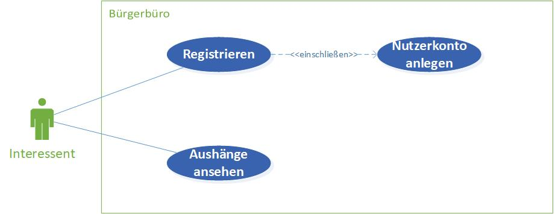
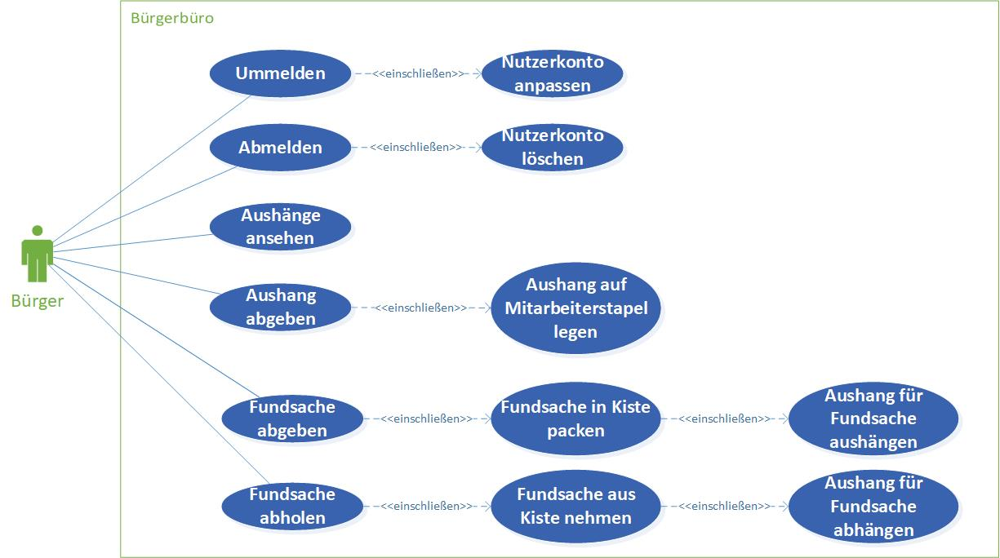
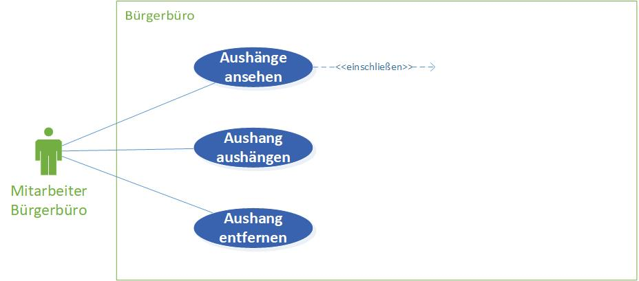

# Bürgerbüro - Anforderungs- und Entwurfsspezifikation

* **Titel:** SmartCity - Bürgerbüro
* **Author:** Pia Schreiner
* **Source Code:** [Link zum Code Repository](https://github.com/SGSE-2020/MS_Buergerbuero)

# 1 Einführung

## 1.1 Beschreibung

Das Bürgerbüro ist ein Service innerhalb der Smart City. Er dient als Anlaufstelle für alle Bürgerinnen und Bürger die
neu in die Stadt einziehen wollen oder schon in der Stadt wohnen. 
Bürgerinnen und Bürger können sich mittels des Bürgerbüros in der Stadt anmelden, sich ummelden oder auch wieder abmelden.
Außerdem bietet das Bürgerbüro Zugang zu allen wichtigen Informationen rund um die Smart City.

## 1.2 Ziele

Die zentrale Anlaufstelle für alle Bürger, spielt in jeder Gemeinde eine große Rolle. Es dient dazu, eine zentrale Organisation für alle Bürgerdaten zur Verfügung zu stellen, sowie die neusten Informationen aus anderen Services zu sammeln und auf einem schwarzen Brett auszuhängen. Ziel ist es, dass alle Bürger hier her kommen um Organisatorische Themen zu klären oder sich über neue Aushänge zu informieren.

# 2 Anforderungen

## 2.1 Stakeholder

| Funktion / Relevanz | Name | Kontakt / Verfügbarkeit | Wissen  | Interessen / Ziele  |
|---|---|---|---|---|
| Interessent (Möchte in die Smart City einziehen)  |  Martin Meyer   |  Tel. 2837462, von 16-20 Uhr telefonisch erreichbar | Kennt das System in anderen Städten, ist interessiert am System der Smart City | Übersichtliche Darstellung aller angebotenen Inhalte, um sich zurechtzufinden |
| Bürger                                            |  Ulla Friedrich |  Tel. 1027363, ulla-f@web.de, von 12-18 Uhr telefonisch erreichbar, per E-Mail immer erreichbar | Kennt das bisherige System der Smart City | Einfache Handhabung um Daten zu ändern und Informationen zu erhalten |
| Angestellter des Bürgerbüros                      |  Lukas Schmidt  |  Tel. 5847236, l.schmidt@web.de, von 8-16 Uhr telefonisch erreichbar, per E-Mail immer erreichbar | Kennt das bisherige System der Smart City | Vereinfachung der organisatorischen Tätigkeiten  |

## 2.2 Funktionale Anforderungen

### Interessent

### Bürger

### Mitarbeiter Bürgerbüro

## 2.3 Nicht-funktionale Anforderungen 

### 2.3.1 Rahmenbedingungen

- Normen, Standards, Protokolle, Hardware, externe Vorgaben

### 2.3.2 Betriebsbedingungen

- Vorgaben des Kunden (z.B. Web Browser / Betriebssystem Versionen, Programmiersprache)

### 2.3.3 Qualitätsmerkmale

- Externe Qualitätsanforderungen (z.B. Performance, Sicherheit, Zuverlässigkeit, Benutzerfreundlichkeit)

Qualitätsmerkmal | sehr gut | gut | normal | nicht relevant
---|---|---|---|---
**Zuverlässigkeit** | | | | |
Fehlertoleranz |X|-|-|-|
Wiederherstellbarkeit |X|-|-|-|
Ordnungsmäßigkeit |X|-|-|-|
Richtigkeit |X|-|-|-|
Konformität |-|X|-|-|
**Benutzerfreundlichkeit** | | | | |
Installierbarkeit |-|-|X|-|
Verständlichkeit |X|-|-|-|
Erlernbarkeit |-|X|-|-|
Bedienbarkeit |-|X|-|-|
**Performance** | | | | |
Zeitverhalten |-|-|X|-|
Effizienz|-|-|-|X|
**Sicherheit** | | | | |
Analysierbarkeit |X|-|-|-|
Modifizierbarkeit |-|-|-|X|
Stabilität |X|-|-|-|
Prüfbarkeit |X|-|-|-|

## 2.4 Graphische Benutzerschnittstelle

- GUI-Mockups passend zu User Stories
- Screens mit Überschrift kennzeichnen, die im Inhaltsverzeichnis zu sehen ist
- Unter den Screens darstellen (bzw. verlinken), welche User Stories mit dem Screen abgehandelt werden
- Modellierung der Navigation zwischen den Screens der GUI-Mockups als Zustandsdiagramm

## 2.5 Anforderungen im Detail

### Interessent

| Funktion | Rolle | In meiner Rolle möchte ich | so dass | Akzeptanz | Priorität |
| --| --| -- | -- | -- | -- |
| Registrierung/Anmeldung | Interessent | mich beim Bürgerbüro registrieren| für mich ein Konto erstellt wird | Registrierung möglich | Hoch |
| Schwarzes Brett lesen| Interessent | Zugriff auf das schwarze Brett haben | ich interessante Aushänge zur Smart City ansehen kann und mich besser zurechtfinde | Schwarzes Brett ist zugänglich | Mittel |

### Bürger

| Funktion | Rolle | In meiner Rolle möchte ich | so dass | Akzeptanz | Priorität |
| --| --| -- | -- | -- | -- |
| Ummeldung| Bürger | mich beim Bürgerbüro anmelden | ich auf meine Daten zugreifen kann, um diese zu ändern | Änderung meiner Daten möglich | Hoch |
| Abmeldung | Bürger | mich beim Bürgerbüro abmelden | mein Nutzerkonto gelöscht wird | Nutzerkonto wird gelöscht | Hoch |
| Schwarzes Brett lesen| Bürger | Zugriff auf das schwarze Brett haben | ich das Fundbüro nutzen kann und wichtige Aushänge sehen kann | Schwarzes Brett ist zugänglich | Mittel |
| Aushang abgeben | Bürger | einen Aushang für das schwarze Brett im Bürgerbüro abgeben | ich meine Anliegen für alle Bürger teilen kann| Aushang muss angenommen werden | Mittel |
| Fundbüro Annahme | Bürger | Dinge im Fundbüro des Bürgerbüros abgeben können | Bürger, die etwas verloren haben, dies abholen können | Bürger hat gefundenen Gegenstand abgegeben und Aushang am schwarzen Brett ist erstellt wordenm | Niedrig |
| Fundbüro Rückgabe | Bürger | Dinge im Fundbüro des Bürgerbüros abholen | Dinge wieder zum rechtmäßigen Besitzer zurückgelangen können | Bürger hat gefundenen Gegenstand abgeholt und Aushang ist vom schwarzen Brett entfernt | Niedrig |

### Bürgerbüro Mitarbeiter

| Funktion | Rolle | In meiner Rolle möchte ich | so dass | Akzeptanz | Priorität |
| --| --| -- | -- | -- | -- |
| Schwarzes Brett lesen| Bürgerbüro Mitarbeiter | Zugriff auf das schwarze Brett haben | ich das Fundbüro nutzen kann und wichtige Aushänge sehen kann | Schwarzes Brett ist zugänglich | Mittel |
| Aushang aushängen | Bürgerbüro Mitarbeiter | abgegebene oder gesendete Aushänge am schwarzen Brett anbringen | alle Bürger diese sehen können| Aushang ist am schwarzen Brett zu sehen | Mittel|
| Aushang entfernen | Bürgerbüro Mitarbeiter | Aushänge vom schwarzen Brett wieder entfernen | Bürger diese nicht mehr einsehen können | Aushang ist vom schwarzen Brett entfernt | Mittel |

# 3 Technische Beschreibung

## 3.1 Systemübersicht

- Systemarchitekturdiagramm ("Box-And-Arrow" Diagramm)
- Kommunikationsprotokolle, Datenformate

## 3.2 Softwarearchitektur

- Darstellung von Softwarebausteinen (Module, Schichten, Komponenten)

## 3.3 Schnittstellen

- Schnittstellenbeschreibung (API)
- Auflistung der nach außen sichtbaren Schnittstelle der Softwarebausteine

## 3.3.1 Ereignisse

- In Event-gesteuerten Systemen: Definition der Ereignisse und deren Attribute

## 3.4 Datenmodell 

- Konzeptionelles Analyseklassendiagramm (logische Darstellung der Konzepte der Anwendungsdomäne)
- Modellierung des physikalischen Datenmodells 
  - RDBMS: ER-Diagramm bzw. Dokumentenorientiert: JSON-Schema

## 3.5 Abläufe

- Aktivitätsdiagramme für relevante Use Cases
- Aktivitätsdiagramm für den Ablauf sämtlicher Use Cases

## 3.6 Entwurf

- Detaillierte UML-Diagramme für relevante Softwarebausteine

## 3.7 Fehlerbehandlung 

* Mögliche Fehler / Exceptions auflisten

## 3.8 Validierung

* Relevante (Integrations)-Testfälle, die aus den Use Cases abgeleitet werden können

# 4 Projektorganisation

## 4.1 Annahmen

- Nicht durch den Kunden definierte spezifische Annahmen, Anforderungen und Abhängigkeiten
- Verwendete Technologien (Programmiersprache, Frameworks, etc.)
- Aufteilung in Repositories gemäß Software- und Systemarchitektur und Softwarebbausteinen 
- Einschränkungen, Betriebsbedingungen und Faktoren, die die Entwicklung beeinflussen (Betriebssysteme, Entwicklungsumgebung)
- Interne Qualitätsanforderungen (z.B. Softwarequalitätsmerkmale wie z.B. Erweiterbarkeit)

## 4.2 Grober Projektplan

- Meilensteine

### Meilensteine
* KW 43 (21.10)
  * Abgabe Pflichtenheft
* KW 44 (28.10) / Projekt aufsetzen
  * Repository Struktur
* KW 45 (4.11) / Implementierung
  * Implementierung #3 (Final)
* KW 48 (18.12) / Abnahmetests
  * manuelle Abnahmetestss
  * Präsentation / Software-Demo

# 5 Anhänge

## 5.1 Glossar 

- Definitionen, Abkürzungen, Begriffe

## 5.2 Referenzen

- Handbücher, Gesetze

## 5.3 Index

