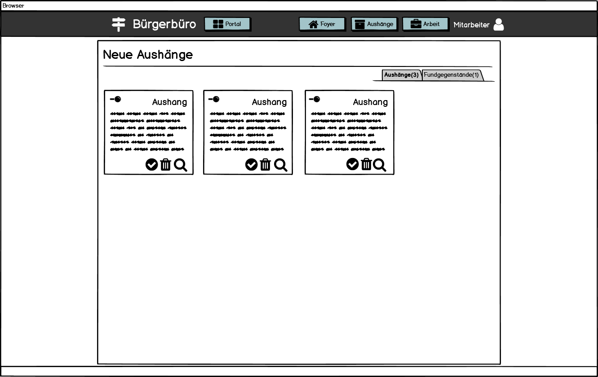

# Bürgerbüro - Anforderungs- und Entwurfsspezifikation

* **Titel:** Smart City - Bürgerbüro
* **Autor:** Pia Schreiner
* **Source Code:** [Link zum Code Repository](https://github.com/SGSE-2020/MS_Buergerbuero)


# 1 Einführung

## 1.1 Beschreibung

Das Bürgerbüro ist ein Service innerhalb der Smart City. Er dient als Anlaufstelle für alle Bürgerinnen und Bürger, die neu in die Stadt einziehen wollen oder schon in der Stadt wohnen. Jeder Interessent, der in die Smart City einziehen möchte, kann im Bürgerbüro ein zentrales Nutzerkonto eröffnen, welches für alle Dienstleister innerhalb der Smart City genutzt wird. Außerdem steht jedem die Einsicht auf das schwarze Brett offen, an welchem Aushänge über die neusten Informationen sowie abgegebene Fundgestände zu finden sind. 

Bürgerinnen und Bürger, welche bereits in der Smart City wohnen und ein Nutzerkonto besitzen, können ihre Daten anpassen sowie eigene Aushänge für das schwarze Brett erstellen. Zudem können sie Fundgegenstände abgeben oder auch abholen.

## 1.2 Ziele

Die zentrale Anlaufstelle für alle Bürger spielt in jeder Gemeinde eine große Rolle. Das Ziel des Bürgerbüros ist es, eine zentrale Organisation zu bieten und die Informationen über alle Bürgerinnen und Bürger, sowie alle Informationen zentral zu sammeln und zur Verfügung zu stellen. 

Weiterhin sollen alle Bürgerinnen und Bürger einfach und ohne viel Zeitaufwand ihre eigenen Daten aktualisieren oder das schwarze Brett nutzen können, um immer auf dem neusten Stand zu sein.

Ziel ist es, dass alle Bürger hier her kommen, um organisatorische Themen zu klären oder sich über neue Aushänge zu informieren.

# 2 Anforderungen

## 2.1 Stakeholder

| Funktion / Relevanz | Name | Kontakt / Verfügbarkeit | Wissen  | Interessen / Ziele  |
|---|---|---|---|---|
| Interessent (Möchte in die Smart City einziehen)  |  Martin Meyer   |  Tel. 2837462, von 16-20 Uhr telefonisch erreichbar | Kennt das System in anderen Städten, ist interessiert am System der Smart City | Übersichtliche Darstellung aller angebotenen Inhalte, um sich zurecht zu finden |
| Bürger                                            |  Ulla Friedrich |  Tel. 1027363, ulla-f@web.de, von 12-18 Uhr telefonisch erreichbar, per E-Mail immer erreichbar | Kennt das bisherige System der Smart City | Einfache Handhabung um Daten zu ändern und Informationen zu erhalten |
| Angestellter des Bürgerbüros                      |  Lukas Schmidt  |  Tel. 5847236, l.schmidt@web.de, von 8-16 Uhr telefonisch erreichbar, per E-Mail immer erreichbar | Kennt das bisherige System der Smart City | Vereinfachung der organisatorischen Tätigkeiten  |

## 2.2 Funktionale Anforderungen

### Interessent


### Bürger


### Mitarbeiter Bürgerbüro


### Dienstleister


## 2.3 Nicht-funktionale Anforderungen 

### 2.3.1 Rahmenbedingungen

Kommunikation mit anderen Dienstleistern findet sowohl synchron als auch asynchron statt.

#### Synchrone Kommunikation

Synchrone Kommunikation zwischen den anderen Dienstleistern findet mittels gRPC statt. Dabei werden alle Protokoll Buffer Dateien zur Kommunikation in der Syntax `proto3` formuliert. Die Kommunikation zwischen der Webanwendung und dem Backendserver findet über REST statt.

#### Asynchrone Kommunikation

Zwischen Dienstleistern werden Messagequeues mit Hilfe von RabbitMQ für asynchrone Kommunikation genutzt. Es wird ein eigener Exchange für die Nachrichten vom Bürgerbüro genutzt. Je nach Thema der Message wird diese in verschiedene Queues gelagert.

### 2.3.2 Betriebsbedingungen

Die Anwendung ist per Webzugriff mit einem aktuellen Browser (optimiert für Google Chrome) nutzbar. Für die Ansicht auf mobilen Endgeräten ist die Darstellung optimiert. 

### 2.3.3 Qualitätsmerkmale

Qualitätsmerkmal | sehr gut | gut | normal | nicht relevant
---|---|---|---|---
**Zuverlässigkeit** | | | | 
Fehlertoleranz |X|-|-|-
Wiederherstellbarkeit |X|-|-|-
Ordnungsmäßigkeit |X|-|-|-
Richtigkeit |X|-|-|-
Konformität |-|X|-|-
**Benutzerfreundlichkeit** | | | | 
Installierbarkeit |-|-|-|X
Verständlichkeit |X|-|-|-
Erlernbarkeit |X|-|-|-
Bedienbarkeit |X|-|-|-
**Performance** | | | | 
Zeitverhalten |-|X|-|-
Effizienz|-|-|X|-
**Sicherheit** | | | | 
Analysierbarkeit |-|-|-|X
Modifizierbarkeit |-|-|X|-
Stabilität |-|X|-|-
Prüfbarkeit |X|-|-|-

## 2.4 Graphische Benutzerschnittstelle

### Interessent

#### Ansicht des Foyers


#### Übersicht der Aushänge


#### Detailansicht von Aushang


#### Registrierung


#### Einloggen in ein bestehendes Nutzerkonto


### Bürger

#### Ansicht des Foyers


#### Übersicht der Anhänge für angemeldete Bürger


#### Übersicht des Nutzerkontos


#### Nutzerkonto - Daten ändern


#### Nutzerkonto - Neuen Aushang erstellen


#### Nutzerkonto - Fundgegenstand abgeben


#### Aushänge- Fundgegenstand abholen


### Mitarbeiter

#### Übersicht der Anhänge für Mitarbeiter


#### Mitarbeiter - Work Stack




### Zustandsdiagramm


## 2.5 Anforderungen im Detail

### Interessent

Funktion | Rolle | In meiner Rolle möchte ich | so dass | Akzeptanz | Priorität
-- | -- | -- | -- | -- | --
[Registrierung](#registrierung) | Interessent | mich beim Bürgerbüro registrieren | für mich ein Konto erstellt wird | Registrierung möglich | Hoch
[Schwarzes Brett lesen](#Übersicht-der-aushänge) | Interessent | Zugriff auf das schwarze Brett haben | ich interessante Aushänge zur Smart City ansehen kann und mich besser zurechtfinde | Schwarzes Brett ist zugänglich | Mittel

### Bürger

| Funktion | Rolle | In meiner Rolle möchte ich | so dass | Akzeptanz | Priorität |
| --| --| -- | -- | -- | -- |
| [Ummeldung](#nutzerkonto-daten-ändern) | Bürger | mich beim Bürgerbüro anmelden | ich auf meine Daten zugreifen kann, um diese zu ändern | Änderung meiner Daten möglich | Hoch |
| [Wegziehen](#Übersicht-des-nutzerkontos) | Bürger | aus der Stadt ausziehen | mein Nutzerkonto deaktiviert wird | Nutzerkonto wird deaktiviert | Hoch |
| [Schwarzes Brett lesen](#Übersicht-der-anhänge-für-angemeldete-bürger) | Bürger | Zugriff auf das schwarze Brett haben | ich das Fundbüro nutzen kann und wichtige Aushänge sehen kann | Schwarzes Brett ist zugänglich | Mittel |
| [Aushang abgeben](#nutzerkonto-neuen-aushang-erstellen) | Bürger | einen Aushang für das schwarze Brett im Bürgerbüro abgeben | ich meine Anliegen für alle Bürger teilen kann| Aushang muss angenommen werden | Mittel |
| [Aushang löschen](#Übersicht-der-anhänge-für-angemeldete-bürger) | Bürger | einen selber erstellen Aushang wieder löschen | dieser nicht mehr am schwarzen Brett für alle sichtbar ist | Aushang muss gelöscht werden | Mittel |
| [Fundbüro Annahme](#nutzerkonto-fundgegenstand-abgeben) | Bürger | Dinge im Fundbüro des Bürgerbüros abgeben können | Bürger, die etwas verloren haben, dies abholen können | Bürger hat gefundenen Gegenstand abgegeben und Aushang am schwarzen Brett ist erstellt worden | Niedrig |
| [Fundbüro Rückgabe](#aushänge-fundgegenstand-abholen) | Bürger | Dinge im Fundbüro des Bürgerbüros abholen | Dinge wieder zum rechtmäßigen Besitzer zurück gelangen können | Bürger hat gefundenen Gegenstand abgeholt und Aushang ist vom schwarzen Brett entfernt | Niedrig |


### Bürgerbüro Mitarbeiter

| Funktion | Rolle | In meiner Rolle möchte ich | so dass | Akzeptanz | Priorität |
| --| --| -- | -- | -- | -- |
| [Schwarzes Brett lesen](#Übersicht-der-anhänge-für-mitarbeiter) | Bürgerbüro Mitarbeiter | Zugriff auf das schwarze Brett haben | ich das Fundbüro nutzen kann und wichtige Aushänge sehen kann | Schwarzes Brett ist zugänglich | Mittel |
| [Aushang aushängen](#mitarbeiter-work-stack) | Bürgerbüro Mitarbeiter | abgegebene oder gesendete Aushänge am schwarzen Brett anbringen | alle Bürger diese sehen können| Aushang ist am schwarzen Brett zu sehen | Mittel|
| [Aushang entfernen](#Übersicht-der-anhänge-für-mitarbeiter) | Bürgerbüro Mitarbeiter | Aushänge vom schwarzen Brett wieder entfernen | Bürger diese nicht mehr einsehen können | Aushang ist vom schwarzen Brett entfernt | Mittel |

### Andere Dienstleister

| Funktion                    | Rolle         | In meiner Rolle möchte ich                                   | so dass                                                      | Akzeptanz                                     | Priorität |
| --------------------------- | ------------- | ------------------------------------------------------------ | ------------------------------------------------------------ | --------------------------------------------- | --------- |
| Deaktivierung Nutzer        | Dienstleister | einen Bürger für tot erklären lassen können                  | das Nutzerkonto deaktiviert wird                             | Deaktivierung von Nutzer möglich              | Hoch      |
| Bürgerdaten anfragen        | Dienstleister | zu einer Nutzer ID Nutzerdaten anfragen                      | ich diese für meine Services verwenden kann                  | Nutzerdaten zu einer UID werden zurückgegeben | Hoch      |
| Verifizierung des Nutzers   | Dienstleister | nachvollziehen können ob ein Bürger auch in der Smart City wohnt | sichergestellt ist, dass nur Bürger der Stadt meine Dienstleistungen nutzen können | Verifizierung von Nutzer ist möglich          | Hoch      |
| Aushang abgeben             | Dienstleister | einen Aushang an das Bürgerbüro senden                       | neue Informationen meiner Services allen Bürgern zur Verfügung stehen | Aushang abgeben ist möglich                   | Mittel    |
| Abgegebenen Aushang löschen | Dienstleister | einen an das Bürgerbüro gesendeten Aushang wieder löschen    | die Information nicht mehr auf dem schwarzen Brett zu sehen sind | Aushang wird vom schwarzen Brett gelöscht     | Mittel    |


# 3 Technische Beschreibung

## 3.1 Systemübersicht


## 3.2 Softwarearchitektur


## 3.3 Schnittstellen

### Bürgerdaten abfragen

Diese Schnittstelle dient dazu, allen anderen Dienstleistern jegliche Daten von einem Bürger zukommen zu lassen. Sie erwartet die UID des Bürgers und gibt den kompletten Datensatz des Bürgers zurück.

```json
"sgse.models.buergerbuero.getUser": {
	"description": "Returns a complete data set for the requested user", 
	"fields": [
		{"name": "uid", "type": "string", "required": true}
	]
}
```

### Bürger verifizieren

Diese Schnittstelle dient dazu, einen Bürger zu verifizieren, um sicherzustellen, dass dieser auch in der Smart City wohnt und Services von anderen Dienstleistern nutzen darf. Sie erwartet ein Nutzertoken und gibt, wenn die Verifizierung erfolgreich ist, die UID des Bürgers zurück. Bei Misserfolg wird null übergeben.

```json
"sgse.models.buergerbuero.verifyUser": {
	"description": "Verifies a usertoken", 
	"fields": [
		{"name": "token", "type": "string", "required": true}
	]
}
```

### Aushang für das schwarze Brett entgegennehmen

Diese Schnittstelle dient dazu, Aushänge von anderen Dienstleistern entgegenzunehmen.  Beim Senden eines Aushangs für das schwarze Brett muss der Name des Microservices im Parameter `service` übergeben werden. Nach erfolgreichem Erstellen des Aushangs wird die ID des Aushangs zurückgegeben, um diesen anschließend wieder vom schwarzen Brett entfernen zu können.

```json
"sgse.models.buergerbuero.sendAnnouncement": {
	"description": "Sends a new anouncement to be shown at the blackboard", 
	"fields": [
		{"name": "title", "type": "string", "required": true},
		{"name": "text",  "type": "string", "required": true},
        {"name": "image",  "type": "string", "required": false},
        {"name": "service",  "type": "string", "required": false},
	]
}
```

### Aushang vom schwarzen Brett entfernen

Diese Schnittstelle dient dazu, Aushänge von anderen Dienstleistern wieder zu entfernen. Die Validierung findet dabei mittels der ID des Aushangs, sowie dem Namen des Services statt. 

```json
"sgse.models.buergerbuero.deleteAnnouncement": {
	"description": "Removes an existing anouncement from the blackboard", 
	"fields": [
		{"name": "id", "type": "string", "required": true},
		{"name": "service",  "type": "string", "required": true}
	]
}
```


## 3.3.1 Ereignisse

### Veröffentlichung von Ereignissen mittels RabbitMQ

#### Bürgerdaten aktualisiert

```json
"sgse.messages.buergerbuero.updateUser":{
    "description": "The following user was updated", 
        "fields": [
            {"name": "uid", "type": "string", "required": true}
        ]
}
```

#### Nutzerkonto deaktiviert (Bürger für tot erklärt oder weggezogen)

```json
"sgse.messages.buergerbuero.deactivateUser":{
    "description": "The following user was deactivated", 
        "fields": [
            {"name": "uid", "type": "string", "required": true}
        ]
}
```

#### Neuer Bürger zugezogen

```json
"sgse.messages.buergerbuero.newUser":{
    "description": "The following user was created", 
        "fields": [
            {"name": "uid", "type": "string", "required": true}
        ]
}
```


### Konsumieren von Ereignissen mittels RabbitMQ

#### Bürger für tot erklären

Abonnieren der Messagequeue vom Rettungsdienst, welcher meldet wenn ein Bürger gestorben ist. Anschließend soll das Nutzerkonto des verstorbenen Bürgers deaktiviert werden. Definition der Message ist in der Spezifikation des Rettungsdienstes zu finden.

## 3.4 Datenmodell 

### Nutzer

```json
"sgse.models.buergerbuero.user": {
	"description": "Represents a dataset for one user", 
	"fields": [
		{"name": "uid", "type": "string", "required": true},
		{"name": "gender", "type": "int", "required": true},
		{"name": "firstName", "type": "string", "required": true},
		{"name": "lastName", "type": "string", "required": true},
        {"name": "nickName", "type": "string", "required": false},
        {"name": "email", "type": "string", "required": true},
        {"name": "birthDate", "type": "date", "required": true},
        {"name": "streetAddress", "type": "string", "required": true},
        {"name": "zipCode", "type": "string", "required": true},
        {"name": "city", "type": "string", "required": true},
        {"name": "phone", "type": "string", "required": false},
        {"name": "image", "type": "string", "required": false},
        {"name": "isActive", "type": "boolean", "required": true}
	]
}
```

### Aushang

```json
"sgse.models.buergerbuero.announcement": {
	"description": "Represents an anouncement on the blackboard", 
	"fields": [
		{"name": "id", "type": "string", "required": true},
        {"name": "title", "type": "string", "required": true},
        {"name": "text", "type": "string", "required": true},
        {"name": "type", "type": "string", "required": true},
        {"name": "image", "type": "string", "required": false},
        {"name": "source", "type": "string", "required": true},
        {"name": "service", "type": "string", "required": false},
        {"name": "isActive", "type": "boolean", "required": true}
	]
}
```


## 3.5 Abläufe

### Interessent

#### Registrieren


### Bürger

#### Daten anpassen


#### Aus der Stadt wegziehen


#### Aushang erstellen


#### Aushang löschen


#### Fundsache abgeben


#### Fundsache abholen


### Mitarbeiter Bürgerbüro

#### Aushang aushängen


### Dienstleister

#### Verifizierung des Bürgers


#### Nutzerdaten abfragen


#### Bürger für tot erklären


#### Aushang abgeben


#### Abgegebenen Aushang löschen


## 3.6 Entwurf

### Datenbankübersicht

Das Modell wird mit Hilfe von ORM und einer PostgreSQL Datenbank umgesetzt.


## 3.7 Fehlerbehandlung 

Fehlermeldungen des Programms sind grundsätzlich aussagekräftig und ermöglichen dem Nutzer eine Diagnose.

### Mögliche Fehler:

- Zugriff auf Firebase nicht möglich 
    - Firebase ist nicht erreichbar -> Anfrage verwerfen -> Fehlermeldung weitergeben an Dienstleister
- Privater Key ist abgelaufen -> Es muss dafür gesorgt werden, dass in diesem Fall ein neuer Schlüssel beantragt und zwischengespeichert wird
- Zugriff auf RabbitMQ nicht möglich -> Veröffentlichung von Messages wird nicht durchgeführt -> Alle zu veröffentlichen Messages zwischenspeichern bis RabbitMQ wieder verfügbar ist und anschließend die Queue füllen
- Zugriff zwischen Front- und Backend nicht möglich -> Frontend zeigt die Fehlermeldung  "Service nicht verfügbar. Bitte versuchen Sie es später noch einmal."
- Zugriff auf PostgreSQL nicht möglich -> Antwort mit Fehlermeldung "Service nicht verfügbar. Bitte versuchen Sie es später noch einmal."
   - Gegebenenfalls Möglichkeit für DB-Redundanz um Fehler auszugleichen
- Fehlender Parameter bei externer Anfrage -> Hinweisende Antwort


# 4 Projektorganisation

## 4.1 Annahmen

### Verwendete Technologien

- HTML
- JavaScript
- TypeScript
- SQL
- Docker
- Protokoll Buffer
- ORM

### Aufteilung

- Unterordner im Repository gemäß Software- und Systemarchitektur und Softwarebausteinen 
  - NodeJS Server
  - Angular Webanwendung
  - PostgreSQL Database


## 4.2 Grober Projektplan

### Meilensteine
* __KW 20__ _(11.05.2020)_
  * Abgabe Software-Spezifikation
* __KW 24__ _(08.06.2020)_
  * Fertigstellung und Präsentation vom Prototyp
* **KW 27**  (30.06.2020)
  * Fertigstellung vom Mikro-Service
* **KW 27** (02.07.2020)
  * Einbindung ist vollständig
* __KW 27__ _(03.07.2020)_
  * Finale Abgabe und Präsentation


# 5 Anhänge

## 5.1 Glossar 

| Begriff          | Definition                                                   |
| ---------------- | ------------------------------------------------------------ |
| Schwarzes Brett  | Digitale Pinnwand, welche Bürger zu aktuellen wechselnden Sachverhalten der Smart City informiert. |
| Microservice     | Architekturmuster für unabhängige Prozesse                   |
| RabbitMQ         | Open Source Message Broker Software zur Implementierung von AMQP |
| AMQP             | Advanced Message Queuing Protocol. Stellt ein Netzwerkprotokoll auf Anwendungsebene für eine Message-orientierte Middleware dar. |
| gRPC             | Protokoll zum Aufruf von Funktionen in verteilten Systemen. Basiert auf HTTP/2 und Protokoll Buffern. |
| Protokoll Buffer | Datenformat zur Serialisierung mit einer Schnittstellen Beschreibungssprache |
| proto3           | Dritte Version der Sprachdefinition für ein Protokoll Buffer |
| REST             | Programmierparadigma für verteilte Systeme, insbesondere Webservices |
| UID              | Unique ID (einzigartig, darf nur einmal existieren)          |
| Firebase         | Cloud Service von Google                                     |
| ORM              | Steht für `Object Relation Mapping` und ist eine Technik um Objekte aus einer Anwendung in einer relationalen Datenbank ablegen und auslesen kann. |
| TypeORM          | ORM Framework für JavaScript und TypeScript.                 |


## 5.2 Referenzen

- [Wikipedia: Einwohnermeldeamt](https://de.wikipedia.org/wiki/Einwohnermeldeamt)
- [Mali Framework für gRPC und NodeJS](https://mali.js.org/)

- [Tutorial für RabbitMQ mit NodeJS](https://www.cloudamqp.com/blog/2015-05-19-part2-2-rabbitmq-for-beginners_example-and-sample-code-node-js.html)
- [ORM Framework für NodeJS](https://typeorm.io/#/)

