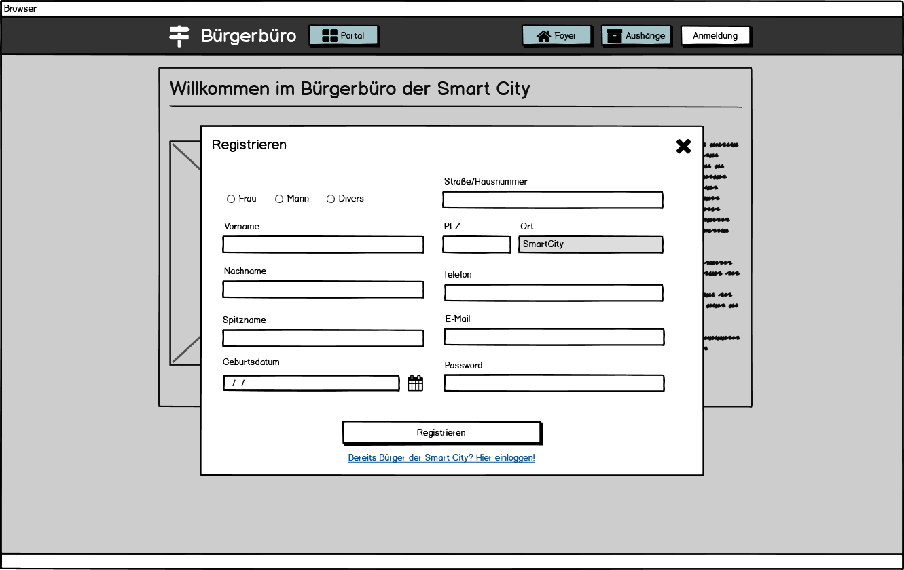
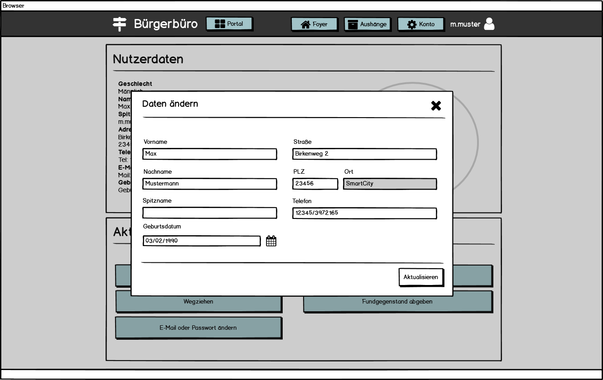

# Bürgerbüro - Anforderungs- und Entwurfsspezifikation

* **Titel:** SmartCity - Bürgerbüro
* **Author:** Pia Schreiner
* **Source Code:** [Link zum Code Repository](https://github.com/SGSE-2020/MS_Buergerbuero)


# 1 Einführung

## 1.1 Beschreibung

Das Bürgerbüro ist ein Service innerhalb der Smart City. Er dient als Anlaufstelle für alle Bürgerinnen und Bürger, die neu in die Stadt einziehen wollen oder schon in der Stadt wohnen. Jeder Interessent, der in die Smart City einziehen möchte, kann im Bürgerbüro ein zentrales Nutzerkonto eröffnen, welches für alle Dienstleister innerhalb der Smart City genutzt wird. Außerdem steht jedem die Einsicht auf das schwarze Brett offen, an welchem Aushänge über die neusten Informationen sowie abgegebene Fundgestände zu finden sind. 

Bürgerinnen und Bürger, welche bereits in der Smart City wohnen und ein Nutzerkonto besitzen, können ihre Daten anpassen sowie eigene Aushänge für das schwarze Brett erstellen. Zudem können sie Fundgegenstände abgeben oder auch abholen.

## 1.2 Ziele

Die zentrale Anlaufstelle für alle Bürger spielt in jeder Gemeinde eine große Rolle. Das Ziel des Bürgerbüros ist es, eine zentrale Organisation zu bieten und die Informationen über alle Bürgerinnen und Bürger, sowie alle Informationen zentral zu sammeln und zur Verfügung zu stellen. 

Weiterhin sollen alle Bürgerinnen und Bürger einfach und ohne viel Zeitaufwand ihre eigenen Daten aktualisieren oder das schwarze Brett nutzen können, um immer auf dem neusten Stand zu sein.

Ziel ist es, dass alle Bürger hier her kommen, um organisatorische Themen zu klären oder sich über neue Aushänge zu informieren.

# 2 Anforderungen

## 2.1 Stakeholder

| Funktion / Relevanz | Name | Kontakt / Verfügbarkeit | Wissen  | Interessen / Ziele  |
|---|---|---|---|---|
| Interessent (Möchte in die Smart City einziehen)  |  Martin Meyer   |  Tel. 2837462, von 16-20 Uhr telefonisch erreichbar | Kennt das System in anderen Städten, ist interessiert am System der Smart City | Übersichtliche Darstellung aller angebotenen Inhalte, um sich zurecht zu finden |
| Bürger                                            |  Ulla Friedrich |  Tel. 1027363, ulla-f@web.de, von 12-18 Uhr telefonisch erreichbar, per E-Mail immer erreichbar | Kennt das bisherige System der Smart City | Einfache Handhabung um Daten zu ändern und Informationen zu erhalten |
| Angestellter des Bürgerbüros                      |  Lukas Schmidt  |  Tel. 5847236, l.schmidt@web.de, von 8-16 Uhr telefonisch erreichbar, per E-Mail immer erreichbar | Kennt das bisherige System der Smart City | Vereinfachung der organisatorischen Tätigkeiten  |

## 2.2 Funktionale Anforderungen

### Interessent


### Bürger


//TODO Aushänge ansehen entfernen

//TODO Abgegebenen Aushang löschen

//TODO Nutzerkonto löschen (Firebase) -> Nutzerkonto als deaktiv markieren (PostgreSQL


### Mitarbeiter Bürgerbüro


//TODO Aushänge ansehen entfernen

### Dienstleister


//TODO get User

//TODO Aushang abgeben

//TODO Abgegebenen Aushang entfernen

## 2.3 Nicht-funktionale Anforderungen 

### 2.3.1 Rahmenbedingungen

Kommunikation mit anderen Dienstleistern findet sowohl synchron als auch asynchron statt.

#### Synchrone Kommunikation

Synchrone Kommunikation zwischen den anderen Dienstleistern findet mittels gRPC statt. Dabei werden alle Protokoll Buffer Dateien zur Kommunikation in der Syntax `proto3` formuliert. Die Kommunikation zwischen der Webanwendung und dem Backendserver findet über REST statt.

#### Asynchrone Kommunikation

Zwischen Dienstleistern werden Messagequeues mit Hilfe von RabbitMQ für asynchrone Kommunikation genutzt. Es wird ein eigener Exchange für die Nachrichten vom Bürgerbüro genutzt. Je nach Thema der Message wird diese in vers. Queues gelagert.

### 2.3.2 Betriebsbedingungen

Die Anwendung ist per Webzugriff mit einem aktuellen Browser (optimiert für Google Chrome) nutzbar. Für die Ansicht auf mobilen Endgeräten ist die Darstellung optimiert. 

### 2.3.3 Qualitätsmerkmale

Qualitätsmerkmal | sehr gut | gut | normal | nicht relevant
---|---|---|---|---
**Zuverlässigkeit** | | | | 
Fehlertoleranz |X|-|-|-
Wiederherstellbarkeit |X|-|-|-
Ordnungsmäßigkeit |X|-|-|-
Richtigkeit |X|-|-|-
Konformität |-|X|-|-
**Benutzerfreundlichkeit** | | | | 
Installierbarkeit |-|-|-|X
Verständlichkeit |X|-|-|-
Erlernbarkeit |X|-|-|-
Bedienbarkeit |X|-|-|-
**Performance** | | | | 
Zeitverhalten |-|X|-|-
Effizienz|-|-|X|-
**Sicherheit** | | | | 
Analysierbarkeit |-|-|-|X
Modifizierbarkeit |-|-|X|-
Stabilität |-|X|-|-
Prüfbarkeit |X|-|-|-

## 2.4 Graphische Benutzerschnittstelle

### Interessent

#### Foyer Ansicht


#### Aushänge Übersicht


#### Detailansicht von Aushang


#### Registrierung



#### Anmeldung


### Bürger

#### Nutzerkonto - Übersicht


#### Nutzerkonto - Daten anpassen



#### Nutzerkonto - Neuen Aushang erstellen


### Mitarbeiter

#### Mitarbeiter - Aushänge Übersicht


#### Mitarbeiter - Work Stack


### Zustandsdiagramm


## 2.5 Anforderungen im Detail

//TODO überarbeiten

### Interessent

Funktion | Rolle | In meiner Rolle möchte ich | so dass | Akzeptanz | Priorität
-- | -- | -- | -- | -- | --
Registrierung/Anmeldung | Interessent | mich beim Bürgerbüro registrieren | für mich ein Konto erstellt wird | Registrierung möglich | Hoch
Schwarzes Brett lesen | Interessent | Zugriff auf das schwarze Brett haben | ich interessante Aushänge zur Smart City ansehen kann und mich besser zurechtfinde | Schwarzes Brett ist zugänglich | Mittel

### Bürger

| Funktion | Rolle | In meiner Rolle möchte ich | so dass | Akzeptanz | Priorität |
| --| --| -- | -- | -- | -- |
| Ummeldung| Bürger | mich beim Bürgerbüro anmelden | ich auf meine Daten zugreifen kann, um diese zu ändern | Änderung meiner Daten möglich | Hoch |
| Abmeldung | Bürger | mich beim Bürgerbüro abmelden | mein Nutzerkonto gelöscht wird | Nutzerkonto wird gelöscht | Hoch |
| Schwarzes Brett lesen| Bürger | Zugriff auf das schwarze Brett haben | ich das Fundbüro nutzen kann und wichtige Aushänge sehen kann | Schwarzes Brett ist zugänglich | Mittel |
| Aushang abgeben | Bürger | einen Aushang für das schwarze Brett im Bürgerbüro abgeben | ich meine Anliegen für alle Bürger teilen kann| Aushang muss angenommen werden | Mittel |
| Fundbüro Annahme | Bürger | Dinge im Fundbüro des Bürgerbüros abgeben können | Bürger, die etwas verloren haben, dies abholen können | Bürger hat gefundenen Gegenstand abgegeben und Aushang am schwarzen Brett ist erstellt worden | Niedrig |
| Fundbüro Rückgabe | Bürger | Dinge im Fundbüro des Bürgerbüros abholen | Dinge wieder zum rechtmäßigen Besitzer zurück gelangen können | Bürger hat gefundenen Gegenstand abgeholt und Aushang ist vom schwarzen Brett entfernt | Niedrig |


### Bürgerbüro Mitarbeiter

| Funktion | Rolle | In meiner Rolle möchte ich | so dass | Akzeptanz | Priorität |
| --| --| -- | -- | -- | -- |
| Schwarzes Brett lesen| Bürgerbüro Mitarbeiter | Zugriff auf das schwarze Brett haben | ich das Fundbüro nutzen kann und wichtige Aushänge sehen kann | Schwarzes Brett ist zugänglich | Mittel |
| Aushang aushängen | Bürgerbüro Mitarbeiter | abgegebene oder gesendete Aushänge am schwarzen Brett anbringen | alle Bürger diese sehen können| Aushang ist am schwarzen Brett zu sehen | Mittel|
| Aushang entfernen | Bürgerbüro Mitarbeiter | Aushänge vom schwarzen Brett wieder entfernen | Bürger diese nicht mehr einsehen können | Aushang ist vom schwarzen Brett entfernt | Mittel |

### Andere Dienstleister

| Funktion                  | Rolle         | In meiner Rolle möchte ich                                   | so dass                                                      | Akzeptanz                            | Priorität |
| ------------------------- | ------------- | ------------------------------------------------------------ | ------------------------------------------------------------ | ------------------------------------ | --------- |
| Deaktivierung Nutzer      | Dienstleister | einen Bürger für tot erklären lassen können                  | das Nutzerkonto deaktiviert wird                             | Deaktivierung von Nutzer möglich     | Hoch      |
| Verifizierung des Nutzers | Dienstleister | nachvollziehen können ob ein Bürger auch in der Smart City wohnt | sichergestellt ist, dass nur Bürger der Stadt meine Dienstleistungen nutzen können | Verifizierung von Nutzer ist möglich | Hoch      |


# 3 Technische Beschreibung

## 3.1 Systemübersicht


## 3.2 Softwarearchitektur


## 3.3 Schnittstellen

### Bürgerdaten abfragen

Diese Schnittstelle dient dazu, allen anderen Dienstleistern jegliche Daten von einem Bürger zukommen zu lassen. Sie erwartet die UID des Bürgers und gibt den kompletten Datensatz des Bürgers zurück.

```json
"sgse.models.buergerbuero.userdata": {
	"description": "Returns a complete data set for the requested user", 
	"fields": [
		{"name": "uid", "type": "string", "required": true}
	]
}
```

### Bürger verifizieren

Diese Schnittstelle dient dazu, einen Bürger zu verifizieren, um sicherzustellen, dass dieser auch in der Smart City wohnt und Services von anderen Dienstleistern nutzen darf. Sie erwartet ein Nutzertoken und gibt, wenn die Verifizierung erfolgreich ist, die UID des Bürgers zurück. Bei Misserfolg wird null übergeben.

```json
"sgse.models.buergerbuero.tokenverification": {
	"description": "Verifies a usertoken", 
	"fields": [
		{"name": "token", "type": "string", "required": true}
	]
}
```

### Bürger für tot erklären

Diese Schnittstelle dient dazu, einen Bürger, der gestorben ist, für tot zu erklären. Dieser Vorgang deaktiviert das Konto des Bürgers. Sie erwartet eine UID des Bürgers, welcher gestorben ist.

```json
"sgse.models.buergerbuero.deactivation": {
	"description": "Returns a complete data set for the requested user", 
	"fields": [
		{"name": "uid", "type": "string", "required": true}
	]
}
```

### Aushang für das schwarze Brett entgegennehmen

Diese Schnittstelle dient dazu, Aushänge von anderen Dienstleistern entgegenzunehmen.  Beim Senden eines Aushangs für das schwarze Brett muss der Name des Microservices im Parameter ´service´ übergeben werden. Nach erfolgreichem Erstellen des Aushangs wird die ID des Aushangs zurückgegeben, um diesen anschließend wieder vom schwarzen Brett entfernen zu können.

```json
"sgse.models.buergerbuero.anouncementcreation": {
	"description": "Sends a new anouncement to be shown at the blackboard", 
	"fields": [
		{"name": "title", "type": "string", "required": true},
		{"name": "text",  "type": "string", "required": true},
        {"name": "image",  "type": "string", "required": false},
        {"name": "service",  "type": "string", "required": false},
	]
}
```

### Aushang vom schwarzen Brett entfernen

Diese Schnittstelle dient dazu, Aushänge von anderen Dienstleistern wieder zu entfernen. Die Validierung findet dabei mittels der ID des Aushangs, sowie dem Namen des Services statt. 

```json
"sgse.models.buergerbuero.anouncementdeletion": {
	"description": "Removes an existing anouncement from the blackboard", 
	"fields": [
		{"name": "id", "type": "string", "required": true},
		{"name": "service",  "type": "string", "required": true}
	]
}
```


## 3.3.1 Ereignisse

### Empfangen

- Bürger gestorben
- Aushang für das schwarze Brett entgegennehmen
- Aushang vom schwarzen Brett löschen

### Senden

- Nutzer verifizieren
- Nutzerdaten ausgeben
- Aushang ID zurückgeben an Dienstleister

### Messagequeues mit RabbitMQ

- Bürgerdaten haben sich aktualisiert (Adressänderung, Namensänderung)
- Nutzerkonto wurde deaktiviert (z.B durch Nutzer wurde für tot erklärt)

## 3.4 Datenmodell 

### Nutzer

```json
"sgse.models.buergerbuero.user": {
	"description": "Represents a dataset for one user", 
	"fields": [
		{"name": "uid", "type": "string", "required": true},
		{"name": "gender", "type": "int", "required": true},
		{"name": "firstname", "type": "string", "required": true},
		{"name": "lastname", "type": "string", "required": true},
        {"name": "nickname", "type": "string", "required": false},
        {"name": "email", "type": "string", "required": true},
        {"name": "birthdate", "type": "date", "required": false},
        {"name": "street_address", "type": "string", "required": true},
        {"name": "zipcode", "type": "string", "required": true},
        {"name": "city", "type": "string", "required": true},
        {"name": "phone", "type": "string", "required": false},
        {"name": "image", "type": "string", "required": false}
	]
}
```

### Aushang

```json
"sgse.models.buergerbuero.announcement": {
	"description": "Represents an anouncement on the blackboard", 
	"fields": [
		{"name": "id", "type": "string", "required": true},
        {"name": "title", "type": "string", "required": true},
        {"name": "text", "type": "string", "required": true},
        {"name": "type", "type": "string", "required": true},
        {"name": "image", "type": "string", "required": false},
        {"name": "source", "type": "string", "required": true},
        {"name": "service", "type": "string", "required": false},
	]
}
```


## 3.5 Abläufe

//TODO

- Aktivitätsdiagramme für relevante Use Cases
- Aktivitätsdiagramm für den Ablauf sämtlicher Use Cases

## 3.6 Entwurf

//TODO

- Klassendiagramm
- ERD

## 3.7 Fehlerbehandlung 

Fehlermeldungen des Programms sind grundsätzlich aussagekräftig und ermöglichen dem Nutzer eine Diagnose.

### Mögliche Fehler:

- Zugriff auf Firebase nicht möglich 
    - Firebase ist nicht erreichbar -> Anfrage verwerfen -> Fehlermeldung weitergeben an Dienstleister
- Privater Key ist abgelaufen -> Es muss dafür gesorgt werden, dass in diesem Fall ein neuer Schlüssel beantragt und zwischengespeichert wird
- Zugriff auf RabbitMQ nicht möglich -> Produce wird nicht durchgeführt -> Alle Produce Anfragen zwischenspeichern bis RabbitMQ wieder verfügbar ist und anschließend die Queue füllen
- Zugriff zwischen Front- und Backend nicht möglich -> Frontend zeigt die Fehlermeldung  "Service nicht verfügbar. Bitte versuchen Sie es später noch einmal."
- Zugriff auf PostgreSQL nicht möglich -> Antwort mit Fehlermeldung "Service nicht verfügbar. Bitte versuchen Sie es später noch einmal."
   - Gegebenenfalls Möglichkeit für DB-Redundanz um Fehler auszugleichen
- Fehlender Parameter bei externer Anfrage -> Hinweisende Antwort

# 4 Projektorganisation

## 4.1 Annahmen

### Verwendete Technologien

- HTML
- JavaScript
- TypeScript
- SQL

### Aufteilung

- Unterordner im Repository gemäß Software- und Systemarchitektur und Softwarebausteinen 
  - NodeJS Server
  - Angular Webanwendung
  - PostgreSQL Database


## 4.2 Grober Projektplan

### Meilensteine
* __KW 20__ _(11.05.2020)_
  * Abgabe Software-Spezifikation
* __KW 24__ _(08.06.2020)_
  * Fertigstellung und Präsentation vom Prototyp
* **KW 27**  (30.06.2020)
  * Fertigstellung vom Mikro-Service
* **KW 27** (02.07.2020)
  * Einbindung ist vollständig
* __KW 27__ _(03.07.2020)_
  * Finale Abgabe und Präsentation

# 5 Anhänge

## 5.1 Glossar 

//TODO

- Mikro-Service
- RabbitMQ
- Exchange
- Channel
- catchALL
- Protokoll Buffer
- gRPC
- REST 
- proto3
- (a)snychonität
- uid (unique id, also generierende seite weiß, dass es sie schon gibt, bedingung: nur 1 darf generieren)
- Firebase -> cloud service von google


## 5.2 Referenzen

//TODO

- +Quellenangabe

## 5.3 Index

//TODO

- Bilderverzeichnis

- Tabellenverzeichnis

