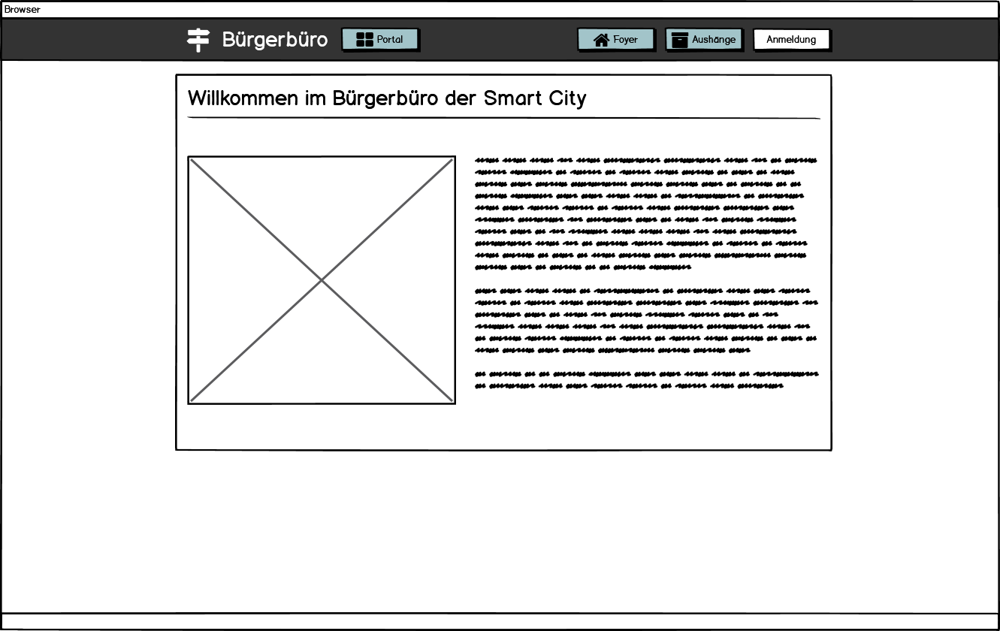
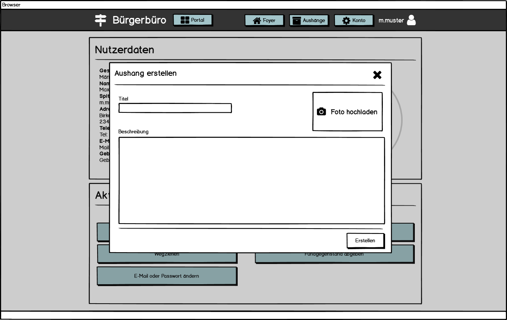

# Bürgerbüro - Anforderungs- und Entwurfsspezifikation

* **Titel:** SmartCity - Bürgerbüro
* **Author:** Pia Schreiner
* **Source Code:** [Link zum Code Repository](https://github.com/SGSE-2020/MS_Buergerbuero)


# 1 Einführung

## 1.1 Beschreibung

Das Bürgerbüro ist ein Service innerhalb der Smart City. Er dient als Anlaufstelle für alle Bürgerinnen und Bürger die neu in die Stadt einziehen wollen oder schon in der Stadt wohnen. Jeder Interessent der in die Smart City einziehen möchte kann im Bürgerbüro ein zentrales Nutzerkonto eröffnen, welches für alles Dienstleister innerhalb der Smart City genutzt wird. Außerdem steht jedem die Einsicht auf das schwarze Brett offen, an welchem Infos über die neusten Informationen, sowie abgegebene Fundgestände zu finden sind. 

Bürgerinnen und Bürger, welche bereits in der Smart City wohnen und ein Nutzerkonto besitzen können Ihre Daten anpassen, sowie eigene Aushänge für das schwarze Brett erstellen. Zudem können sie Fundgegenstände abgeben oder auch abholen.

## 1.2 Ziele

Die zentrale Anlaufstelle für alle Bürger, spielt in jeder Gemeinde eine große Rolle. Das Ziel des Bürgerbüros ist es eine zentrale Organisation zu bieten und die Informationen über alle Bürgerinnen und Bürger, sowie alle Informationen zentral zu sammeln und zur Verfügung zu stellen. 

Weiterhin sollen alle Bürgerinnen und Bürger einfach und ohne viel Zeitaufwand Ihre eigenen Daten zu aktualisieren oder das schwarze Brett nutzen können um immer auf dem neusten Stand zu sein.

Ziel ist es, dass alle Bürger hier her kommen um Organisatorische Themen zu klären oder sich über neue Aushänge zu informieren.

# 2 Anforderungen

## 2.1 Stakeholder

| Funktion / Relevanz | Name | Kontakt / Verfügbarkeit | Wissen  | Interessen / Ziele  |
|---|---|---|---|---|
| Interessent (Möchte in die Smart City einziehen)  |  Martin Meyer   |  Tel. 2837462, von 16-20 Uhr telefonisch erreichbar | Kennt das System in anderen Städten, ist interessiert am System der Smart City | Übersichtliche Darstellung aller angebotenen Inhalte, um sich zurechtzufinden |
| Bürger                                            |  Ulla Friedrich |  Tel. 1027363, ulla-f@web.de, von 12-18 Uhr telefonisch erreichbar, per E-Mail immer erreichbar | Kennt das bisherige System der Smart City | Einfache Handhabung um Daten zu ändern und Informationen zu erhalten |
| Angestellter des Bürgerbüros                      |  Lukas Schmidt  |  Tel. 5847236, l.schmidt@web.de, von 8-16 Uhr telefonisch erreichbar, per E-Mail immer erreichbar | Kennt das bisherige System der Smart City | Vereinfachung der organisatorischen Tätigkeiten  |

## 2.2 Funktionale Anforderungen

### Interessent


### Bürger


### Mitarbeiter Bürgerbüro


### Dienstleister


## 2.3 Nicht-funktionale Anforderungen 

### 2.3.1 Rahmenbedingungen

Kommunikation mit anderen Dienstleistern findet sowohl synchron als auch asynchron statt.

#### Synchrone Kommunikation

Synchrone Kommunikation zwischen den anderen Dienstleistern findet mittels gRPC statt. Dabei werden alle Protokoll Buffer Dateien zur Kommunikation in der Syntax `proto3` formuliert. Die Kommunikation zwischen der Webanwendung und dem Backendserver finden über REST statt.

#### Asynchrone Kommunikation

Zwischen Dienstleitern werden Messagequeues mit Hilfe von RabbitMQ für asynchrone Kommunikation genutzt. 

### 2.3.2 Betriebsbedingungen

Die Anwendung ist per Webzugriff mit einem aktuellen Browser (optimiert für Google Chrome) nutzbar. Für die Ansicht auf mobilen Endgeräten ist die Darstellung optimiert. 

### 2.3.3 Qualitätsmerkmale

Qualitätsmerkmal | sehr gut | gut | normal | nicht relevant
---|---|---|---|---
**Zuverlässigkeit** | | | | 
Fehlertoleranz |X|-|-|-
Wiederherstellbarkeit |X|-|-|-
Ordnungsmäßigkeit |X|-|-|-
Richtigkeit |X|-|-|-
Konformität |-|X|-|-
**Benutzerfreundlichkeit** | | | | 
Installierbarkeit |-|-|-|X
Verständlichkeit |X|-|-|-
Erlernbarkeit |X|-|-|-
Bedienbarkeit |X|-|-|-
**Performance** | | | | 
Zeitverhalten |-|X|-|-
Effizienz|-|-|X|-
**Sicherheit** | | | | 
Analysierbarkeit |-|-|-|X
Modifizierbarkeit |-|-|X|-
Stabilität |-|X|-|-
Prüfbarkeit |X|-|-|-

## 2.4 Graphische Benutzerschnittstelle

### Interessent

#### Foyer Ansicht



#### Aushänge Übersicht


#### Detailansicht von Aushang


#### Registrierung


#### Anmeldung


### Bürger

#### Nutzerkonto - Übersicht


#### Nutzerkonto - Daten anpassen


#### Nutzerkonto - Neuen Aushang erstellen




### Mitarbeiter

#### Mitarbeiter - Aushänge Übersicht


#### Mitarbeiter - Work Stack


### Zustandsdiagramm


## 2.5 Anforderungen im Detail

### Interessent

| Funktion | Rolle | In meiner Rolle möchte ich | so dass | Akzeptanz | Priorität |
| --| --| -- | -- | -- | -- |
| Registrierung/Anmeldung | Interessent | mich beim Bürgerbüro registrieren| für mich ein Konto erstellt wird | Registrierung möglich | Hoch |
| Schwarzes Brett lesen| Interessent | Zugriff auf das schwarze Brett haben | ich interessante Aushänge zur Smart City ansehen kann und mich besser zurechtfinde | Schwarzes Brett ist zugänglich | Mittel |

### Bürger

| Funktion | Rolle | In meiner Rolle möchte ich | so dass | Akzeptanz | Priorität |
| --| --| -- | -- | -- | -- |
| Ummeldung| Bürger | mich beim Bürgerbüro anmelden | ich auf meine Daten zugreifen kann, um diese zu ändern | Änderung meiner Daten möglich | Hoch |
| Abmeldung | Bürger | mich beim Bürgerbüro abmelden | mein Nutzerkonto gelöscht wird | Nutzerkonto wird gelöscht | Hoch |
| Schwarzes Brett lesen| Bürger | Zugriff auf das schwarze Brett haben | ich das Fundbüro nutzen kann und wichtige Aushänge sehen kann | Schwarzes Brett ist zugänglich | Mittel |
| Aushang abgeben | Bürger | einen Aushang für das schwarze Brett im Bürgerbüro abgeben | ich meine Anliegen für alle Bürger teilen kann| Aushang muss angenommen werden | Mittel |
| Fundbüro Annahme | Bürger | Dinge im Fundbüro des Bürgerbüros abgeben können | Bürger, die etwas verloren haben, dies abholen können | Bürger hat gefundenen Gegenstand abgegeben und Aushang am schwarzen Brett ist erstellt worden | Niedrig |
| Fundbüro Rückgabe | Bürger | Dinge im Fundbüro des Bürgerbüros abholen | Dinge wieder zum rechtmäßigen Besitzer zurück gelangen können | Bürger hat gefundenen Gegenstand abgeholt und Aushang ist vom schwarzen Brett entfernt | Niedrig |


### Bürgerbüro Mitarbeiter

| Funktion | Rolle | In meiner Rolle möchte ich | so dass | Akzeptanz | Priorität |
| --| --| -- | -- | -- | -- |
| Schwarzes Brett lesen| Bürgerbüro Mitarbeiter | Zugriff auf das schwarze Brett haben | ich das Fundbüro nutzen kann und wichtige Aushänge sehen kann | Schwarzes Brett ist zugänglich | Mittel |
| Aushang aushängen | Bürgerbüro Mitarbeiter | abgegebene oder gesendete Aushänge am schwarzen Brett anbringen | alle Bürger diese sehen können| Aushang ist am schwarzen Brett zu sehen | Mittel|
| Aushang entfernen | Bürgerbüro Mitarbeiter | Aushänge vom schwarzen Brett wieder entfernen | Bürger diese nicht mehr einsehen können | Aushang ist vom schwarzen Brett entfernt | Mittel |

### Andere Dienstleister

| Funktion                  | Rolle         | In meiner Rolle möchte ich                                   | so dass                                                      | Akzeptanz                            | Priorität |
| ------------------------- | ------------- | ------------------------------------------------------------ | ------------------------------------------------------------ | ------------------------------------ | --------- |
| Deaktivierung Nutzer      | Dienstleister | einen Bürger für tot erklären lassen können                  | das Nutzerkonto deaktiviert wird                             | Deaktivierung von Nutzer möglich     | Hoch      |
| Verifizierung des Nutzers | Dienstleister | nachvollziehen können ob ein Bürger auch in der Smart City wohnt | sichergestellt ist, dass nur Bürger der Stadt meine Dienstleistungen nutzen können | Verifizierung von Nutzer ist möglich | Hoch      |


# 3 Technische Beschreibung

## 3.1 Systemübersicht


## 3.2 Softwarearchitektur


## 3.3 Schnittstellen

### Bürgerdaten abfragen

Diese Schnittstelle dient dazu, allen anderen Dienstleistungen alle Daten von einem Bürger zukommen zu lassen. Sie erwartet die ID des Bürgers und gibt den kompletten Datensatz des Bürgers zurück.

```json
"sgse.models.buergerbuero.userdata":{
	"description": "Returns a complete data set for the requested user", 
	"fields": [
		{"name": "uid", "type": "string", "required": true}
	]
}
```

### Bürger verifizieren

Diese Schnittstelle dient dazu, einen Bürger zu verifizieren, um sicherzustellen, dass dieser auch in der Smart City wohnt und Services von anderen Dienstleistungen nutzen darf. Sie erwartet ein Nutzertoken und gibt wenn die Verifizierung erfolgreich die ID des Bürgers zurück.

```json
"sgse.models.buergerbuero.tokenverification":{
	"description": "Verifies a usertoken", 
	"fields": [
		{"name": "token", "type": "string", "required": true}
	]
}
```

### Bürger für tot erklären

Diese Schnittstelle dient dazu, einen Bürger der gestorben ist für tot zu erklären. Dieser Vorgang deaktiviert das Konto des Bürgers. Sie erwartet eine ID des Bürgers, welcher gestorben ist.

```json
"sgse.models.buergerbuero.deactivation":{
	"description": "Returns a complete data set for the requested user", 
	"fields": [
		{"name": "uid", "type": "string", "required": true}
	]
}
```

### Aushang für das schwarze Brett entgegennehmen

Diese Schnittstelle dient dazu, Aushänge von anderen Dienstleistern entgegenzunehmen. 

```json
"sgse.models.buergerbuero.anouncementcreation":{
	"description": "Sends a new anouncement to be shown at the blackboard", 
	"fields": [
		{"name": "title", "type": "string", "required": true},
        {"name": "text", "type": "string", "required": true}
	]
}
```


## 3.3.1 Ereignisse

### Empfangen

- Bürger gestorben

- Aushang für das schwarze Brett entgegennehmen

### Senden

- Nutzer verifizieren
- Nutzerdaten rausgeben

### Messagequeues mit RabbitMQ

- Bürgerdaten haben sich aktualisiert (Adressänderung, Namensänderung)
- Nutzer wurde für tot erklärt (Nutzerkonto wurde deaktiviert)

## 3.4 Datenmodell 

### Nutzer

```json
"sgse.models.buergerbuero.user":{
	"description": "Represents a dataset for one user", 
	"fields": [
		{"name": "uid", "type": "string", "required": true},
        {"name": "prename", "type": "string", "required": true},
        {"name": "lastname", "type": "string", "required": true},
        {"name": "email", "type": "string", "required": true},
        {"name": "birthdate", "type": "date", "required": false},
        {"name": "street", "type": "string", "required": true},
        {"name": "streetnr", "type": "int", "required": true},
        {"name": "zipcode", "type": "int", "required": true},
        {"name": "location", "type": "string", "required": true},
        {"name": "phonenr", "type": "string", "required": false}
	]
}
```

### Aushang

```json
"sgse.models.buergerbuero.announcement":{
	"description": "Represents an anouncement on the blackboard", 
	"fields": [
		{"name": "id", "type": "string", "required": true},
        {"name": "title", "type": "string", "required": true},
        {"name": "text", "type": "string", "required": true},
        {"name": "type", "type": "string", "required": true}
	]
}
```


## 3.5 Abläufe

- Aktivitätsdiagramme für relevante Use Cases
- Aktivitätsdiagramm für den Ablauf sämtlicher Use Cases

## 3.6 Entwurf

- Detaillierte UML-Diagramme für relevante Softwarebausteine

## 3.7 Fehlerbehandlung 

### 

# 4 Projektorganisation

## 4.1 Annahmen

### Verwendete Technologien

- HTML
- JavaScript
- TypeScript
- SQL

### Aufteilung

- Unterordner im Repository gemäß Software- und Systemarchitektur und Softwarebausteinen 
  - NodeJS Server
  - Angular Webanwendung
  - PostgreSQL Database


## 4.2 Grober Projektplan

### Meilensteine
* __KW 20__ _(11.05.2020)_
  * Abgabe Software-Spezifikation
* __KW 24__ _(08.06.2020)_
  * Fertigstellung und Präsentation vom Prototyp
* **KW 27**  (30.06.2020)
  * Fertigstellung vom Mikro-Service
* **KW 27** (02.07.2020)
  * Einbindung ist vollständig
* __KW 27__ _(03.07.2020)_
  * Finale Abgabe und Präsentation

# 5 Anhänge

## 5.1 Glossar 

- Definitionen, Abkürzungen, Begriffe

## 5.2 Referenzen

- Handbücher, Gesetze

## 5.3 Index


