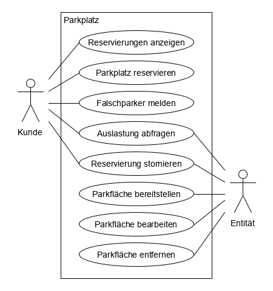

# Anforderungs- und Entwurfsspezifikation ("Pflichtenheft")

**Title:** SmartCity - Parkplatz

**Autor:** Sven Simikin

**Repositories:** 
[Source code](https://github.com/SGSE-2020/MS_Parkplatz), 
[Spezifikation](https://sgse-2020.github.io/Spezifikation/#/./sven_simikin/Spezifikation_Parkplatz), 
[Praktikumstagebuch](https://github.com/SGSE-2020/Praktikumstagebuch/blob/master/sven_simikin/ProjektTagebuch.md)

# 1 Einführung

## 1.1 Beschreibung

Das Projekt __Parkplatz__ erlaubt Kunden und Entitäten der MS-Architektur Parkplätze innerhalb definiter Zeiträume zu 
reservieren. Die Reservierung von Parkflächen macht die aufwendige manuelle Suche nach Parkplätzen überflüssig und 
ersetzt herkömmliche Park-Leitsysteme welche auf Statistischen- oder Vorhersagemodellen basieren. Die genaue 
Spezifizierung von Parkmöglichkeiten erlaubt es Kunden Termine fristgerecht wahrzunehmen und garantiert die abstellplatz 
findung. 

## 1.2 Ziele
Das Softwaresystem "Parkplatz" soll Kunden und Entitäten (andere Services) das Reservieren von Parkplätzen ermöglichen.
Parkplätze können für bestimmte Zeiträume reserviert werden und ermöglichen damit, Kunden spezifische Parkplätze 
innerhalb festgelegter Zeiträume zu nutzen. Dieser Prozess garantiert Kunden einen Parkplatz für ihr Kraftfahrzeug (PKW) 
zu finden und somit Termine oder andere zeitkritische Aktivitäten sicher wahrnehmen zu können. Das Abfragen von 
Auslastungen und verfügbaren Parkflächen soll Kunden bei der Terminfindungen unterstützen und ermöglicht dem 
Parkplatzservice das intelligente verwalten von Preisen in abhängigkeit der aktuellen Auslastung. Im Unterschied zu 
gängigen Park-Leitsystemen garantiert das Softwaresystem "Parkplatz" die Findung eines spezifischen Parkplatzes und 
zeigt nicht wage Statistiken über etwaig verfügbare freie Parkflächen und Preise an. Das Signalisieren mit 
Hinweisschildern und Anzeigetafeln für Parkplätze und Parkflächen entfällt, da einem Kunden stets spezifische Parkplätze 
zugewiesen werden können. 

Die Hauptmotivationen der Parkplatzreservierung sind:
* Termingerechte Reservierung für zeitkritische Aktivitäten
* Chancengleiches zuweisen von Parkplätzen ohne Priorisierung und Präferenz
* Schaffung neuer Parkplätze, welche bisher durch "Dauerparker" blockiert sind
* Schaffung eines auslastungsbedingten automatischen Preismodells

Anforderungen an den Markt und insbesondere an die Kunden sind die ausnahmslose Einhaltung der festgelegten Parkzeiten 
sowie das Melden von verstoßen gegen einzuhaltende Parkzeiten und das Abstellen von Fahrzeugen an verbindlichen 
Abstellorten.

### Zielbenutzergruppen
Zielgruppen sind im Besonderen Entitäten (andere Services) die Ihren Kunden die Möglichkeit einer Parkplatzreservierung 
bieten möchten, sowie Kunden welche über das Parkplatz-Portal direkt Parkplätze reservieren. Bei der Zielgruppe Kunden 
handelt es sich um Personen, welche im Besitz einer gültigen Fahrerlaubnis sind und die Berechtigung besitzen, ein 
Kraftfahrzeug zu führen. Kunden sind im Regelfall volljährig, bzw. führen ein Fahrzeug unter Aufsicht einer 
Begleitperson.   

### Abgrenzung
Das Softwaresystem erlaubt es Kunden nicht Parkplätze dauerhaft zu reservieren, zu blockieren, hinzuzufügen, zu 
entfernen, Verlängerungen zu beantragen, Verbesserungen einzureichen sowie Schäden und Vorfälle zu melden. Ebenfalls ist 
das freie Wählen oder wechseln von Parkplätzen nicht vorgesehen, sodass lediglich das einfache Zuordnen von Parkplätzen 
ermöglicht wird. Entitäten (andere Services) stellen vorhandene Parkflächen zentral über eine Schnittstelle dem 
__Parkplatz__ Service bereit. Das Benachrichtigen von Kunden über freie, verfügbare, belegte, stornierte, unverfügbare 
oder geänderte Parkplätze ist kein Bestandteil des Services. Eine Validierung von Führerscheinen und Fahrberechtigungen 
ist nicht vorgesehen.

# 2 Anforderungen

## 2.1 Stakeholder

| Funktion / Relevanz                              | Name       |  Wissen                                                       | Interessen / Ziele                                                                         |
| ------------------------------------------------ | ---------- | ------------------------------------------------------------- | ------------------------------------------------------------------------------------------ |
| Entität in der MS-Architektur (weiterer Service) | Entität    | Ist mit der API und dem Prozess der reservierung vertraut     | Möchte einen Parkplatz für einen Kunden reservieren, stellt dem Service Parkflächen bereit |
| Neukunde welcher Parkplatz reservieren möchte    | Neukunde   | Ist mit dem Reservierungsprozess gegeben falls nicht vertraut | Möchte Parkplatz für sich selbst reservieren                                               |
| Stammkunde welcher Parkplatz reservieren möchte  | Stammkunde | Ist mit dem Reservierungsprozess aus Erfahrung vertraut       | Möchte Parkplatz für sich selbst reservieren                                               |

## 2.2 Funktionale Anforderungen



## 2.3 Nicht-funktionale Anforderungen 

### 2.3.1 Rahmenbedingungen

- Normen, Standards, Protokolle, Hardware, externe Vorgaben

### 2.3.2 Betriebsbedingungen

Der Kunde soll die Anwendung als Website im Browser verwenden können. In diesem Sinne kann der Kunde die Anwendung mobil 
auf seinem Smartphone verwenden aber auch einen Laptop oder Personal Computer für den Aufruf der Website benutzen. Es 
ist notwendig, einen Webbrowser in einer aktuellen Version zu verwenden, um die korrekte Darstellung der Website zu 
gewährleisten. Es gibt hinsichtlich des Betriebssystems und der zu verwendenden Programmiersprache keine besonderen 
Anforderungen.

### 2.3.3 Qualitätsmerkmale

- Externe Qualitätsanforderungen (z.B. Performance, Sicherheit, Zuverlässigkeit, Benutzerfreundlichkeit)

| Qualitätsmerkmal           | sehr gut | gut | normal | nicht relevant |
| -------------------------- | -------- | --- | ------ | -------------- |
| **Zuverlässigkeit**        |          |     |        |                |
| Fehlertoleranz             |X         |-    |-       |-               |
| Wiederherstellbarkeit      |X         |-    |-       |-               |
| Ordnungsmäßigkeit          |X         |-    |-       |-               |
| Richtigkeit                |X         |-    |-       |-               |
| Konformität                |-         |X    |-       |-               |
| **Benutzerfreundlichkeit** |          |     |        |                |
| Installierbarkeit          |-         |-    |-       |X               |
| Verständlichkeit           |X         |-    |-       |-               |
| Erlernbarkeit              |X         |-    |-       |-               |
| Bedienbarkeit              |X         |-    |-       |-               |
| **Performance**            |          |     |        |                |
| Zeitverhalten              |X         |-    |-       |-               |
| Effizienz                  |-         |-    |-       |X               |
| **Sicherheit**             |          |     |        |                |
| Analysierbarkeit           |-         |-    |-       |X               |
| Modifizierbarkeit          |-         |-    |-       |X               |
| Stabilität                 |-         |-    |-       |X               |
| Prüfbarkeit                |-         |-    |-       |X               |

## 2.4 Graphische Benutzerschnittstelle

- GUI-Mockups passend zu User Stories
- Screens mit Überschrift kennzeichnen, die im Inhaltsverzeichnis zu sehen ist
- Unter den Screens darstellen (bzw. verlinken), welche User Stories mit dem Screen abgehandelt werden
- Modellierung der Navigation zwischen den Screens der GUI-Mockups als Zustandsdiagramm

## 2.5 Anforderungen im Detail

### Entität (Microservice)
| Funktion                 | Als     | möchte ich                                      | so dass                                                      | Akzeptanz                                         | Priorität |
| ------------------------ | ------- | ----------------------------------------------- | ------------------------------------------------------------ | ------------------------------------------------- | --------- |
| Auslastung abfragen      | Entität | die Auslastung einer Parkfläche abfragen        | ich mir einen überblick über freie Plätze verschaffen kann   | Übersicht über Parkplatzauslastung erhalten       | Hoch      |
| Parkplatz reservieren    | Entität | einen Parkplatz für meinen Kunden reservieren   | ein Parkplatz für meinen Kunden reserviert wird              | Parkplatz wird für Zeitraum reserviert            | Hoch      |
| Reservierung stornieren  | Entität | eine existierende Reservierung Stornieren       | eine Reservierung wird für meinen Kunden storniert wird      | Reservierung wird storniert                       | Mittel    |
| Parkfläche bereitstellen | Entität | Parkflächen dem Parkplatz-Service bereitstellen | eine Parkflächen dem Parkplatz-Service bereitgestellt wird   | Parkflächen sind im System verfügbar              | Hoch      |
| Parkfläche bearbeiten    | Entität | Parkflächen des Parkplatz-Service bearbeiten    | eine Bereitgestellte Parkfläche aktualisiert wird            | Parkflächen wurden aktualisiert                   | Gering    |
| Parkfläche entfernen     | Entität | Parkflächen des Parkplatz-Service entfernen     | eine Bereitgestellte Parkfläche aus dem System entfernt wird | Parkflächen sind nicht länger im System verfügbar | Gering    |

### Kunde
| Funktion                | Als     | möchte ich                                | so dass                                | Akzeptanz                              | Priorität |
| ----------------------- | ------- | ----------------------------------------- | -------------------------------------- | -------------------------------------- | --------- |
| Auslastung abfragen     | Kunde   | die Auslastung einer Parkfläche abfragen  | ich sehe, ob es freie Parkplätze gibt  | Übersicht der freien plätze erhalten   | Hoch      |
| Falschparker melden     | Kunde   | Falschparker melden                       | Falschparker belangt werden            | Falschparkermeldung wird akzeptiert    | Hoch      |
| Parkplatz reservieren   | Kunde   | einen Parkplatz für mich reservieren      | ein Parkplatz für mich reserviert wird | Parkplatz wird für Zeitraum reserviert | Hoch      |
| Reservierungen anzeigen | Kunde   | meine reservierungen anzeigen lassen      | ich eine Übersicht erhalte             | Reservierungen werden angezeigt        | Mittel    |
| Reservierung stornieren | Kunde   | eine existierende Reservierung Stornieren | meine Reservierung storniert wird      | Reservierung wird storniert            | Mittel    |

# 3 Technische Beschreibung

## 3.1 Systemübersicht


## 3.2 Softwarearchitektur


## 3.3 Schnittstellen

### Auslastung abfragen

Diese Schnittstelle dient dazu, die Auslastung aller im System bekannten Parkflächen abzufragen. Es ist vorgesehen, 
Informationen bezüglich der aktuellen Auslastung der Parkfläche als auch Informationen bezüglich des Bereistellers der 
Parkfläche zur Verfügung zu stellen. Sie steht Kunden als auch weiteren Entitäten der Microservice-Architektur zur 
Verfügung. Für die Abfrage werden außer der obligatorischen __MS__ Authentifizierung keine weiteren Parameter benötigt.

Die resultierende Payload dieser Schnittstelle ist wie folgt definiert:

```json
"sgse.models.parkplatz.utilization":{
	"description": "Represents the utilization of a Parkfläche object", 
	"fields": [
        {"name": "provider", "type": "string"},
        {"name": "location", "type": "string"},
        {"name": "provided_spots", "type": "number"},
        {"name": "occupied_spots", "type": "number"},
		{"name": "utilization", "type": "number"}
	]
}
```

### Reservierungen anzeigen

Diese Schnittstelle dient dazu, Kunden einen Überblick über Ihre Reservierungen zu verschaffen. Sie ist ausschließlich 
für den internen Gebrauch, sowie für die Verwendung durch den aktuell im System authentifizierten Kunden vorgesehen, 
sodass das Abfragen von Reservierungen beliebiger Kunden durch weitere __MS__ der Microservice-Architektur verhindert 
wird. Es werden aktuelle Reservierungen als auch Reservierungen der Vergangenheit durch diese Schnittstelle vermittelt 
und ermöglichen damit eine historische Übersicht für Kunden. Zusätzlich wird zwischen ausstehenden, stornierten und 
stattgefundenen Reservierungen unterschieden.

Die resultierende Payload dieser Schnittstelle ist wie folgt definiert:

```json
"sgse.models.parkplatz.history":{
	"description": "Represents a historic reservation record.", 
	"fields": [
        {"name": "datetime", "type": "string"},
        {"name": "location", "type": "string"},
        {"name": "state", "type": "string"},
        {"name": "cost", "type": "number"}
	]
}
```

## 3.3.1 Ereignisse

- In Event-gesteuerten Systemen: Definition der Ereignisse und deren Attribute

## 3.4 Datenmodell 

- Konzeptionelles Analyseklassendiagramm (logische Darstellung der Konzepte der Anwendungsdomäne)
- Modellierung des physikalischen Datenmodells 
  - RDBMS: ER-Diagramm bzw. Dokumentenorientiert: JSON-Schema

## 3.5 Abläufe

- Aktivitätsdiagramme für relevante Use Cases
- Aktivitätsdiagramm für den Ablauf sämtlicher Use Cases

## 3.6 Entwurf

- Detaillierte UML-Diagramme für relevante Softwarebausteine

## 3.7 Fehlerbehandlung 

* Mögliche Fehler / Exceptions auflisten

## 3.8 Validierung

* Relevante (Integrations)-Testfälle, die aus den Use Cases abgeleitet werden können

# 4 Projektorganisation

## 4.1 Annahmen

- Nicht durch den Kunden definierte spezifische Annahmen, Anforderungen und Abhängigkeiten
- Verwendete Technologien (Programmiersprache, Frameworks, etc.)
- Aufteilung in Repositories gemäß Software- und Systemarchitektur und Softwarebbausteinen 
- Einschränkungen, Betriebsbedingungen und Faktoren, die die Entwicklung beeinflussen (Betriebssysteme, Entwicklungsumgebung)
- Interne Qualitätsanforderungen (z.B. Softwarequalitätsmerkmale wie z.B. Erweiterbarkeit)

## 4.2 Verantwortlichkeiten

- Zuordnung von Personen zu Softwarebausteinen aus Kapitel 3.1 und 3.2
- Rollendefinition und Zuordnung

| Softwarebaustein  | Person(en)        |
| ----------------- | ----------------- |
| Komponente A      | Thomas Mustermann |

### Rollen

#### Softwarearchitekt
Entwirft den Aufbau von Softwaresystemen und trifft Entscheidungen über das Zusammenspiel der Softwarebausteine.

#### Frontend-Entwickler
Entwickelt graphische oder andere Benutzerschnittstellen, insbesondere das Layout einer Anwendung.

#### Backend-Entwickler
Implementiert die funktionale Logik der Anwendung. Hierbei werden zudem diverse Datenquellen und externe Dienste integriert und für die Anwendung bereitgestellt.

### Rollenzuordnung

| Name         | Rolle               |
| ------------ | ------------------- |
| Sven Simikin | Softwarearchitekt   |
| Sven Simikin | Frontend-Entwickler |
| Sven Simikin | Backend-Entwickler  |

## 4.3 Grober Projektplan

### Meilensteine
* __KW 19__ _(08.05.2020)_
  * Fertigstellung Api-Schnittstellen-Spezifikation
* __KW 20__ _(11.05.2020)_
  * Abgabe Software-Spezifikation
* __KW 24__ _(08.06.2020)_
  * Abgabe Softwareprodukt (Version 0)
* __KW 27__ _(03.07.2020)_
  * Abgabe Softwareprodukt

# 5 Anhänge

## 5.1 Glossar 

- __MS__ - Microservice
- __Entität__ - Microservice in der Architektur
- __Parkfläche__ - Menge von Parkplätzen
- __Parkplatz__ - Abstellplatz für einen PKW

## 5.2 Referenzen

- Handbücher, Gesetze

## 5.3 Index


