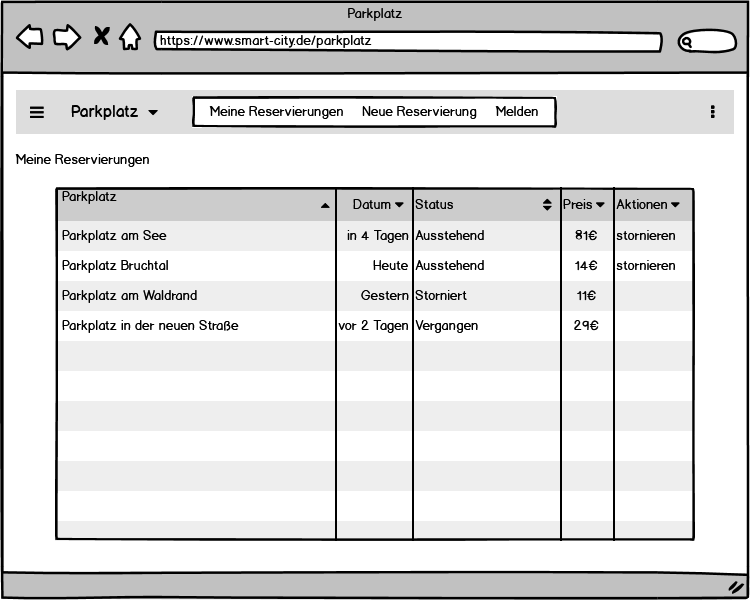
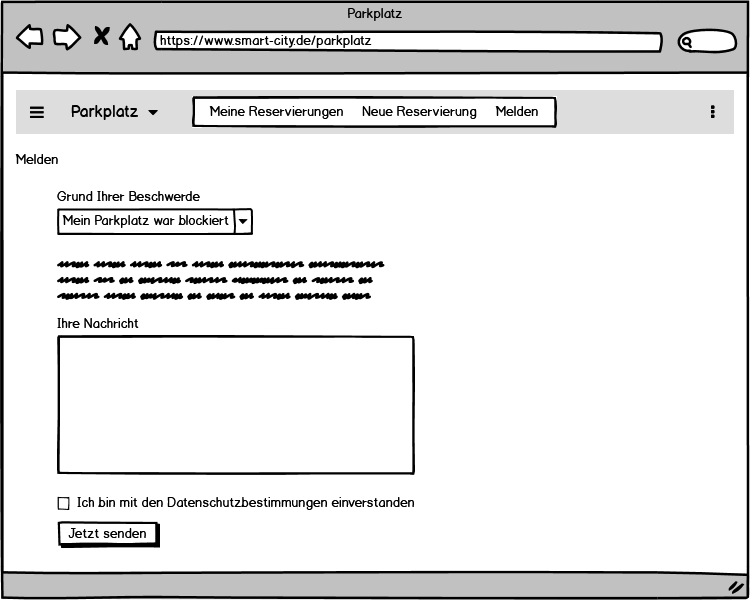

# Anforderungs- und Entwurfsspezifikation ("Pflichtenheft")

* **Title:** SmartCity - Parkplatz
* **Autor:** Sven Simikin
* **Repositories:** 
[Source code](https://github.com/SGSE-2020/MS_Parkplatz), 
[Spezifikation](https://sgse-2020.github.io/Spezifikation/#/./sven_simikin/Spezifikation_Parkplatz), 
[Praktikumstagebuch](https://github.com/SGSE-2020/Praktikumstagebuch/blob/master/sven_simikin/ProjektTagebuch.md)

# 1 Einführung

## 1.1 Beschreibung

Das Projekt __Parkplatz__ erlaubt Kunden und Entitäten der MS-Architektur Parkplätze innerhalb definiter Zeiträume zu 
reservieren. Die Reservierung von Parkflächen macht die aufwendige manuelle Suche nach Parkplätzen überflüssig und 
ersetzt herkömmliche Park-Leitsysteme welche auf Statistischen- oder Vorhersagemodellen basieren. Die genaue 
Spezifizierung von Parkmöglichkeiten erlaubt es Kunden Termine fristgerecht wahrzunehmen und garantiert die abstellplatz 
findung. 

## 1.2 Ziele
Das Softwaresystem "Parkplatz" soll Kunden und Entitäten (andere Services) das Reservieren von Parkplätzen ermöglichen.
Parkplätze können für bestimmte Zeiträume reserviert werden und ermöglichen damit, Kunden spezifische Parkplätze 
innerhalb festgelegter Zeiträume zu nutzen. Dieser Prozess garantiert Kunden einen Parkplatz für ihr Kraftfahrzeug (PKW) 
zu finden und somit Termine oder andere zeitkritische Aktivitäten sicher wahrnehmen zu können. Das Abfragen von 
Auslastungen und verfügbaren Parkflächen soll Kunden bei der Terminfindungen unterstützen und ermöglicht dem 
Parkplatzservice das intelligente Verwalten von Preisen in Abhängigkeit der aktuellen Auslastung. Im Unterschied zu 
gängigen Park-Leitsystemen garantiert das Softwaresystem "Parkplatz" die Findung eines spezifischen Parkplatzes und 
zeigt nicht wage Statistiken über etwaig verfügbare freie Parkflächen und Preise an. Das Signalisieren mit 
Hinweisschildern und Anzeigetafeln für Parkplätze und Parkflächen entfällt, da einem Kunden stets spezifische Parkplätze 
zugewiesen werden können. 

Die Hauptmotivationen der Parkplatzreservierung sind:
* Termingerechte Reservierung für zeitkritische Aktivitäten
* Chancengleiches zuweisen von Parkplätzen ohne Priorisierung und Präferenz
* Schaffung neuer Parkplätze, welche bisher durch "Dauerparker" blockiert sind
* Schaffung eines auslastungsbedingten, automatischen Preismodells

Anforderungen an den Markt und insbesondere an die Kunden sind die ausnahmslose Einhaltung der festgelegten Parkzeiten 
sowie das Melden von verstoßen gegen einzuhaltende Parkzeiten und das Abstellen von Fahrzeugen an verbindlichen 
Abstellorten.

### Zielbenutzergruppen
Zielgruppen sind im Besonderen Entitäten (andere Services) die Ihren Kunden die Möglichkeit einer Parkplatzreservierung 
bieten möchten, sowie Kunden welche über das Parkplatz-Portal direkt Parkplätze reservieren. Bei der Zielgruppe Kunden 
handelt es sich um Personen, welche im Besitz einer gültigen Fahrerlaubnis sind und die Berechtigung besitzen, ein 
Kraftfahrzeug zu führen. Kunden sind im Regelfall volljährig, bzw. führen ein Fahrzeug unter Aufsicht einer 
Begleitperson.   

### Abgrenzung
Das Softwaresystem erlaubt es Kunden nicht Parkplätze dauerhaft zu reservieren, zu blockieren, hinzuzufügen, zu 
entfernen, Verlängerungen zu beantragen, Verbesserungen einzureichen sowie Schäden und Vorfälle zu melden. Ebenfalls ist 
das freie Wählen oder wechseln von Parkplätzen nicht vorgesehen, sodass lediglich das einfache Zuordnen von Parkplätzen 
ermöglicht wird. Entitäten (andere Services) stellen vorhandene Parkflächen zentral über eine Schnittstelle dem 
__Parkplatz__ Service bereit. Das Benachrichtigen von Kunden über freie, verfügbare, belegte, stornierte, unverfügbare 
oder geänderte Parkplätze ist kein Bestandteil des Services. Eine Validierung von Führerscheinen und Fahrberechtigungen 
ist nicht vorgesehen.

# 2 Anforderungen

## 2.1 Stakeholder

| Funktion / Relevanz                              | Name       |  Wissen                                                       | Interessen / Ziele                                                                         |
| ------------------------------------------------ | ---------- | ------------------------------------------------------------- | ------------------------------------------------------------------------------------------ |
| Entität in der MS-Architektur (weiterer Service) | Entität    | Ist mit der API und dem Prozess der reservierung vertraut     | Möchte einen Parkplatz für einen Kunden reservieren, stellt dem Service Parkflächen bereit |
| Neukunde welcher Parkplatz reservieren möchte    | Neukunde   | Ist mit dem Reservierungsprozess gegeben falls nicht vertraut | Möchte Parkplatz für sich selbst reservieren                                               |
| Stammkunde welcher Parkplatz reservieren möchte  | Stammkunde | Ist mit dem Reservierungsprozess aus Erfahrung vertraut       | Möchte Parkplatz für sich selbst reservieren                                               |

## 2.2 Funktionale Anforderungen
### Kunde


### Entität


## 2.3 Nicht-funktionale Anforderungen 

### 2.3.1 Rahmenbedingungen

- Kommunikation innerhalb des eigenen services
    - Synchron: RESTful zwischen Front- und Backend
- Kommunikation mit anderen Microservices
    - Asynchron: Massaging mit RabbitMQ
    - Synchron: Unary/Streaming mit gRPC
- Kommunikation mit Dritten
    - Synchron: Firebase RESTful Authentifizierung

### 2.3.2 Betriebsbedingungen

Der Kunde soll die Anwendung als Website im Browser verwenden können. In diesem Sinne kann der Kunde die Anwendung mobil 
auf seinem Smartphone verwenden aber auch einen Laptop oder Personal Computer für den Aufruf der Website benutzen. Es 
ist notwendig, einen Webbrowser in einer aktuellen Version zu verwenden, um die korrekte Darstellung der Website zu 
gewährleisten. Es gibt hinsichtlich des Betriebssystems oder weiterer Betriebsbedingungen keine besonderen 
Anforderungen.

### 2.3.3 Qualitätsmerkmale

| Qualitätsmerkmal           | sehr gut | gut | normal | nicht relevant |
| -------------------------- | -------- | --- | ------ | -------------- |
| **Zuverlässigkeit**        |          |     |        |                |
| Fehlertoleranz             |X         |-    |-       |-               |
| Wiederherstellbarkeit      |X         |-    |-       |-               |
| Ordnungsmäßigkeit          |X         |-    |-       |-               |
| Richtigkeit                |X         |-    |-       |-               |
| Konformität                |-         |X    |-       |-               |
| **Benutzerfreundlichkeit** |          |     |        |                |
| Installierbarkeit          |-         |-    |-       |X               |
| Verständlichkeit           |X         |-    |-       |-               |
| Erlernbarkeit              |X         |-    |-       |-               |
| Bedienbarkeit              |X         |-    |-       |-               |
| **Performance**            |          |     |        |                |
| Zeitverhalten              |X         |-    |-       |-               |
| Effizienz                  |-         |-    |-       |X               |
| **Sicherheit**             |          |     |        |                |
| Analysierbarkeit           |-         |-    |X       |-               |
| Modifizierbarkeit          |-         |-    |X       |-               |
| Stabilität                 |-         |-    |X       |-               |
| Prüfbarkeit                |-         |-    |X       |-               |

## 2.4 Graphische Benutzerschnittstelle

## Meine Reservierungen


Behandelt User Stories: Reservierungen anzeigen, Reservierung stornieren 

## Neue Reservierung


Behandelt User Stories: Parkplatz reservieren, Auslastung abfragen

## Reservierung stornieren (Meine Reservierungen Detail)


Behandelt User Stories: Reservierungen anzeigen, Reservierung stornieren 

## Melden


Behandelt User Stories: Falschparker melden

### Zustandsdiagramm


## 2.5 Anforderungen im Detail

### Entität
| Funktion                 | Als     | möchte ich                                      | so dass                                                      | Akzeptanz                                         | Priorität |
| ------------------------ | ------- | ----------------------------------------------- | ------------------------------------------------------------ | ------------------------------------------------- | --------- |
| Auslastung abfragen      | Entität | die Auslastung einer Parkfläche abfragen        | ich mir einen überblick über freie Plätze verschaffen kann   | Übersicht über Parkplatzauslastung erhalten       | Hoch      |
| Parkplatz reservieren    | Entität | einen Parkplatz für meinen Kunden reservieren   | ein Parkplatz für meinen Kunden reserviert wird              | Parkplatz wird für Zeitraum reserviert            | Hoch      |
| Reservierung stornieren  | Entität | eine existierende Reservierung Stornieren       | eine Reservierung wird für meinen Kunden storniert wird      | Reservierung wird storniert                       | Mittel    |
| Parkfläche bereitstellen | Entität | Parkflächen dem Parkplatz-Service bereitstellen | eine Parkflächen dem Parkplatz-Service bereitgestellt wird   | Parkflächen sind im System verfügbar              | Hoch      |
| Parkfläche bearbeiten    | Entität | Parkflächen des Parkplatz-Service bearbeiten    | eine Bereitgestellte Parkfläche aktualisiert wird            | Parkflächen wurden aktualisiert                   | Gering    |
| Parkfläche entfernen     | Entität | Parkflächen des Parkplatz-Service entfernen     | eine Bereitgestellte Parkfläche aus dem System entfernt wird | Parkflächen sind nicht länger im System verfügbar | Gering    |

### Kunde
| Funktion                | Als     | möchte ich                                | so dass                                | Akzeptanz                              | Priorität |
| ----------------------- | ------- | ----------------------------------------- | -------------------------------------- | -------------------------------------- | --------- |
| Auslastung abfragen     | Kunde   | die Auslastung einer Parkfläche abfragen  | ich sehe, ob es freie Parkplätze gibt  | Übersicht der freien plätze erhalten   | Hoch      |
| Falschparker melden     | Kunde   | Falschparker melden                       | Falschparker belangt werden            | Falschparkermeldung wird akzeptiert    | Hoch      |
| Parkplatz reservieren   | Kunde   | einen Parkplatz für mich reservieren      | ein Parkplatz für mich reserviert wird | Parkplatz wird für Zeitraum reserviert | Hoch      |
| Reservierungen anzeigen | Kunde   | meine reservierungen anzeigen lassen      | ich eine Übersicht erhalte             | Reservierungen werden angezeigt        | Mittel    |
| Reservierung stornieren | Kunde   | eine existierende Reservierung Stornieren | meine Reservierung storniert wird      | Reservierung wird storniert            | Mittel    |

# 3 Technische Beschreibung

## 3.1 Systemübersicht


## 3.2 Softwarearchitektur


## 3.3 Schnittstellen

### Auslastung abfragen

Diese Schnittstelle dient dazu, die Auslastung aller im System bekannten Parkflächen abzufragen. Es ist vorgesehen, 
Informationen bezüglich der aktuellen Auslastung der Parkfläche als auch Informationen bezüglich des Bereistellers der 
Parkfläche zur Verfügung zu stellen. Sie steht Kunden als auch weiteren Entitäten der Microservice-Architektur zur 
Verfügung. Für die Abfrage werden außer der obligatorischen __MS__ Authentifizierung keine weiteren Parameter benötigt.

Die resultierende Payload dieser Schnittstelle ist wie folgt definiert:

```json
"sgse.models.parkplatz.utilization":{
	"description": "Represents the utilization of a Parkfläche object", 
	"fields": [
        {"name": "provider", "type": "string"},
        {"name": "location", "type": "string"},
        {"name": "provided_spots", "type": "number"},
        {"name": "occupied_spots", "type": "number"},
        {"name": "utilization", "type": "number"}
    ]
}
```

### Reservierungshistorie

Diese Schnittstelle dient dazu, Kunden einen Überblick über ihre Reservierungen zu verschaffen. Sie ist ausschließlich 
für den internen Gebrauch, sowie für die Verwendung durch den aktuell im System authentifizierten Kunden vorgesehen, 
sodass das Abfragen von Reservierungen beliebiger Kunden durch weitere __MS__ der Microservice-Architektur verhindert 
wird. Es werden aktuelle Reservierungen als auch Reservierungen der Vergangenheit durch diese Schnittstelle vermittelt 
und ermöglichen damit eine historische Übersicht für Kunden. Zusätzlich wird zwischen ausstehenden, stornierten und 
stattgefundenen Reservierungen unterschieden.

Die resultierende Payload dieser Schnittstelle ist wie folgt definiert:

```json
"sgse.models.parkplatz.history":{
	"description": "Represents a historic reservation record.", 
	"fields": [
        {"name": "datetime", "type": "string"},
        {"name": "location", "type": "string"},
        {"name": "state", "type": "string"},
        {"name": "cost", "type": "number"}
    ]
}
```

### Reservierung

Diese Schnittstelle erlaubt Kunden und Entitäten das Reservieren von Parkplätzen. Es ist erforderlich, dass Kunden und 
Entitäten sich der Schnittstelle Authentifizieren, sodass sichergestellt werden, kann das alle Reservierungen 
authentisch sind. Die als benötigt definierten Parameter sind zwingend erforderlich. Für den Fall, dass Parameter, 
welche nicht als benötigt markiert sind, keine Werte übergeben werden, werden an deren Stelle Standardwerte verwendet.

Die folgenden Parameter erlauben die Kommunikation mit der Schnittstelle:

```json
"sgse.models.parkplatz.reservation":{
	"description": "Represents a reservation record.", 
	"fields": [
        {"name": "userUUID", "type": "string", "required": true},
        {"name": "location", "type": "string", "required": true},
        {"name": "datetime", "type": "string", "default": "now"},
        {"name": "duration", "type": "number", "default": "60"}
    ]
}
```

### Parkfläche bereitstellen

Diese Schnittstelle erlaubt Entitäten das Bereitstellen von Parkflächen für das Parkplatzsystem.

Die folgenden Parameter erlauben die Kommunikation mit der Schnittstelle:

```json
"sgse.models.parkplatz.area.provision":{
	"description": "Represents a record for the provison of a parking area by a entity.", 
	"fields": [
        {"name": "location", "type": "string", "required": true},
        {"name": "name", "type": "string", "required": true},
        {"name": "address", "type": "string"},
        {"name": "capacity", "type": "number"}
    ]
}
```

### Parkfläche bearbeiten

Diese Schnittstelle erlaubt Entitäten das Bearbeiten von bereitgestellten Parkflächen für das Parkplatzsystem.

Die folgenden Parameter erlauben die Kommunikation mit der Schnittstelle:

```json
"sgse.models.parkplatz.area.revision":{
	"description": "Represents a record for the provison of a parking area by a entity.", 
	"fields": [
        {"name": "location", "type": "string", "required": true},
        {"name": "name", "type": "string"},
        {"name": "address", "type": "string"},
        {"name": "capacity", "type": "number"}
    ]
}
```

### Falschparker Meldung

Diese Schnittstelle erlaubt Kunden, Falschparker dem System zu melden. Sie ist ausschließlich für den internen Gebrauch, 
sowie für die Verwendung durch den aktuell im System authentifizierten Kunden vorgesehen, sodass das Melden von 
Falschparkern nicht missbraucht wird. Alle Parameter dieser Schnittstelle sind zwingend erforderlich.

Die folgenden Parameter erlauben die Kommunikation mit der Schnittstelle:

```json
"sgse.models.parkplatz.abuse":{
	"description": "Represents a absue report record.", 
	"fields": [
        {"name": "userUUID", "type": "string", "required": true},
        {"name": "location", "type": "string", "required": true},
        {"name": "message", "type": "string", "required": true}
    ]
}
```

### Stornierung

Diese Schnittstelle erlaubt Kunden und Entitäten, bestehende Reservierungen zu stornieren. 

Die folgenden Parameter erlauben die Kommunikation mit der Schnittstelle:

```json
"sgse.models.parkplatz.cancellation":{
	"description": "Represents a cancellation record.", 
	"fields": [
        {"name": "reservationUUID", "type": "string", "required": true}
    ]
}
```

### Parkfläche entfernen

Diese Schnittstelle erlaubt Entitäten, bestehende Parkflächen aus dem System zu entfernen. 

Die folgenden Parameter erlauben die Kommunikation mit der Schnittstelle:

```json
"sgse.models.parkplatz.area.removal":{
	"description": "Represents a record for the removel of a parking area provided by a entity.", 
	"fields": [
        {"name": "parkingAreaUUID", "type": "string", "required": true}
    ]
}
```

## 3.3.1 Ereignisse

### Veröffentlichung neuer Ereignisse

Die zu veröffentlichenden Ereignisse enthalten sehr allgemeine Informationen, für die es in der Microservice-Architektur
zu diesem Zeitpunkt keinen bestimmten Konsumenten gibt. Die Implementierung dieser Funktion erfolgt daher auf einer 
freien Basis, um die verwendeten Technologien kennenzulernen. Zu einem späteren Zeitpunkt könnten diese Informationen 
beispielsweise für statistische Zwecke von Konsumenten verarbeitet werden, um Bewegungsbilder zu erzeugen und das 
Konsumverhalten der Einwohner zu beobachten.

#### Reservierung aufgenommen
Wurde eine neue Parkplatzreservierung aufgenommen, wird dieses Ereignis als Event veröffentlicht. 

Die resultierende Payload dieses Ereignisses ist wie folgt definiert:
```json
"sgse.messages.parkplatz.reservation":{
	"description": "Represents a newly created reservation.", 
	"fields": [
        {"name": "userUUID", "type": "string"},
        {"name": "location", "type": "string"},
        {"name": "datetime", "type": "string"}
    ]
}
```
#### Reservierung storniert
Wurde eine bestehende Parkplatzreservierung storniert, wird dieses Ereignis als Event veröffentlicht. 

Die resultierende Payload dieses Ereignisses ist wie folgt definiert:
```json
"sgse.messages.parkplatz.cancellation":{
	"description": "Represents a cancelled reservation.", 
	"fields": [
        {"name": "userUUID", "type": "string"},
        {"name": "location", "type": "string"},
        {"name": "datetime", "type": "string"}
    ]
}
```

## 3.4 Datenmodell 


## 3.5 Abläufe
Im Folgenden werden die drei wichtigsten Abläufe dargestellt (Auslastung abfragen, Reservierung aufgeben, 
Reservierung stornieren). Die Kernelemente und Hauptschritte der Vorgänge sind jeweils hervorgehoben worden. Triviale 
Abläufe, wie das Melden von Vorfällen werden aufgrund ihrer einfachheit nicht abgebildet.

### Auslastung abfragen


### Reservierung aufgeben


### Reservierung stornieren


## 3.6 Entwurf

## 3.7 Fehlerbehandlung 

* Der Service(Backend) ist nicht verfügbar → Fehlermeldung im Frontend anzeigen
* Der Service(Frontend) ist nicht verfügbar → Fehler nicht behandeln
* Der Benutzer kann sich nicht einloggen → Fehlermeldung im Frontend anzeigen
* Der Benutzer kann sich nicht ausloggen → Fehlermeldung im Frontend anzeigen
* Benutzerdaten konnten nicht abgerufen werden → Fehlermeldung im Frontend anzeigen
* Falschparker konnten nicht gemeldet werden → Fehlermeldung im Frontend anzeigen
* Die Reservierungshistorie kann nicht angezeigt werden → Fehlermeldung im Frontend anzeigen
* Es konnte kein Parkplatz reserviert werden → Fehlermeldung im Frontend anzeigen / Fehlermeldung per gRPC zurückgeben
* Eine Reservierung konnte nicht storniert werden → Fehlermeldung im Frontend anzeigen / Fehlermeldung per gRPC zurückgeben
* Parkfläche konnte nicht bereitgestellt werden → Fehlermeldung per gRPC zurückgeben
* Parkfläche konnte nicht bearbeitet werden → Fehlermeldung per gRPC zurückgeben
* Parkfläche konnte nicht entfernt werden → Fehlermeldung per gRPC zurückgeben

# 4 Projektorganisation

## 4.1 Annahmen

### Verwendete Technologien
#### Frontend
- Angular - Front-End-Webapplikationsframework 
- NGINX - Webserver
- AngularFire - Angular Firebase client library
#### Backend
- Node - JavaScript Laufzeitumgebung
- amqplib - RabbitMQ AMQP Client
- nodemon/node - Webserver
- Node gRPC Library - gRPC Framework for Node 
- Node Redis - Redis client for Node
- TypeORM - Object Relation Mapper
#### Database
- Redis - In-Memory Database 
- MySQL - ER-Datenbank

## 4.3 Grober Projektplan

### Meilensteine
* __KW 19__ _(08.05.2020)_
  * Fertigstellung Api-Schnittstellen-Spezifikation
* __KW 20__ _(11.05.2020)_
  * Abgabe Software-Spezifikation
* __KW 24__ _(08.06.2020)_
  * Abgabe Softwareprodukt (Version 0)
* __KW 27__ _(03.07.2020)_
  * Abgabe Softwareprodukt

# 5 Anhänge

## 5.1 Glossar 

- __AMQP__ - Advanced Message Queuing Protocol
- __Entität__ - Microservice in der Architektur
- __Firebase__ - Google Cloud Entwicklungsplattform
- __gRPC__ - Remote Procedure Call Framework
- __MS__ - Microservice
- __Parkfläche__ - Menge von Parkplätzen
- __Parkplatz__ - Abstellplatz für einen PKW
- __RabbitMQ__ - Message Broker
- __Redis__ - In-Memory-Datenbank
- __UUID__ - Universally Unique Identifier

## 5.2 Referenzen

### Offizielle Dokumentationen
- [Angular](https://angular.io/docs)
- [Firebase](https://firebase.google.com/docs/auth)
- [gRPC](https://grpc.io/docs/)
- [MySQL](https://dev.mysql.com/doc/)
- [NGINX](https://nginx.org/en/docs/)
- [Node](https://nodejs.org/en/docs/)
- [Nodemon](https://github.com/remy/nodemon#nodemon)
- [RabbitMQ](https://www.rabbitmq.com/documentation.html)
- [Redis](https://redis.io/documentation)
- [TypeORM](https://typeorm.io/#/)

### Softwarepakete und Bibliotheken
- [AMQP 0-9-1](https://www.npmjs.com/package/amqplib)
- [AngularFire](https://www.npmjs.com/package/@angular/fire)
- [gRPC Client](https://www.npmjs.com/package/@grpc/grpc-js)
- [nodemon](https://www.npmjs.com/package/nodemon)
- [redis](https://www.npmjs.com/package/redis)
- [typeorm](https://www.npmjs.com/package/typeorm)

## 5.3 Index

### Bilderverzeichnis
1. [Kunde Use Case Diagramm](#kunde)
2. [Entity Use Case Diagramm](#entität)
3. [Meine Reservierungen Mockup](#meine-reservierungen)
4. [Neue Reservierung Mockup](#neue-reservierung)
5. [Reservierung stornieren Mockup](#reservierung-stornieren-meine-reservierungen-detail)
6. [Melden Mockup](#melden)
7. [Zustandsdiagramm](#zustandsdiagramm)
8. [Systemübersicht](#_31-systemübersicht)
9. [Softwarearchitektur](#_32-softwarearchitektur)
10. [Datenmodell](#_34-datenmodell)
11. [Ablauf Auslastung abfragen](#auslastung-abfragen-1)
12. [Ablauf Reservierung aufgeben](#reservierung-aufgeben)
13. [Ablauf Reservierung stornieren](#reservierung-stornieren)

### Tabellenverzeichnis
1. [Stackeholder](#_21-stakeholder)
2. [Qualitätsmerkmale](#_233-qualitätsmerkmale)
3. [Entität User Stories](#entität-1)
4. [Kunde User Stories](#kunde-1)
5. [Verantwortlichkeiten](#_42-verantwortlichkeiten)
6. [Rollenzuordnung](#rollenzuordnung)
