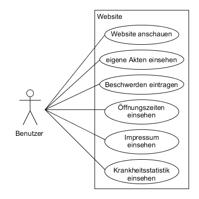
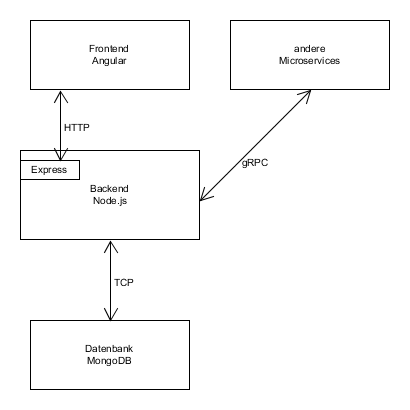

# Anforderungs- und Entwurfsspezifikation ("Pflichtenheft")

* Microservice Hausarzt, Tim Steven Meier, Inhaltsverzeichnis
* https://github.com/SGSE-2020/MS_Hausarzt

# 1 Einführung

## 1.1 Beschreibung

* Projektname
  * Microservice Hausarzt
* Darstellung der Produktvision in Prosa (5-10 Sätze)
* Ziele
  * Online Arzttermine
* Für wen ist das Produkt/der Service?
  * für die Bürger der Stadt
* Was ist das Bedürfnis?
  * Einfach über den Browser mit dem Hausarzt kommunizieren
* Was ist das Produkt/der Service?
  * Web Applikation für den Hausarzt
* Warum sollte der Kunde dieses Produkt/den Service „kaufen“ oder nutzen?
  * gehört zu Smart City
* Im Gegensatz zu welchen anderen Produkten/Services steht dies?
* Was macht dieses Produkt/der Service anders?
* Warum ist das Projekt sinnvoll?
* Welche Stakeholder sind betroffen und wie stehen Sie zu der Projektidee?
* Welche alternativen Lösungsideen existieren für den identifizierten Bedarf?
* Wie hoch sind Aufwand und erwarteter Nutzen und stehen sie in einem sinnvollen Verhältnis? (Lohnt sich das Projekt?)
* Verfügen wir über die notwendigen Kompetenzen? (Umsetzbarkeit)
* Welche Risiken und negativen Nebeneffekte sind zu erwarten?

## 1.2 Ziele

- Anwendungsbereiche, Motivation, Umfang, Alleinstellungsmerkmale, Marktanforderungen
- Informationen zu Zielbenutzergruppen und deren Merkmale (Bildung, Erfahrung, Sachkenntnis)
- Abgrenzung (Was ist das Softwaresystem _nicht_)
- ggfs. SWOT-Analyse

# 2 Anforderungen

## 2.1 Stakeholder


| Funktion / Relevanz | Name | Wissen  | Interessen / Ziele  |
|---|---|---|---|
| Arzt | Alexander Arzt | Kennt sich mit Medizin aus | Vereinfachung der Terminverwaltung und  Patientenakten |
| Mitarbeiter | Manfred Mitarbeiter |  Erfahren im Umgang mit Patienten  | Einfache Einsicht in Patientenbegehren                      |
| Stammkunde | Gerd Grippe | Häufiger Patient | Einfacher Termine bekommen, Einsicht in seine Patientenakte |

## 2.2 Funktionale Anforderungen


#### Benutzer



#### Admin


## 2.3 Nicht-funktionale Anforderungen 

### 2.3.1 Rahmenbedingungen

- Kommunikation mit anderen Microservices
  - Asynchron: RabbitMQ
  - Synchron: gRPC

### 2.3.2 Betriebsbedingungen

- Website mit Microservice Hausarzt
- Datenbank um wichtige Daten zu speichern

### 2.3.3 Qualitätsmerkmale

Qualitätsmerkmal | sehr gut | gut | normal | nicht relevant
---|---|---|---|---
**Zuverlässigkeit** | | | | 
Fehlertoleranz |X|-|-|-
Wiederherstellbarkeit |X|-|-|-
Ordnungsmäßigkeit |X|-|-|-
Richtigkeit |X|-|-|-
Konformität |-|X|-|-
**Benutzerfreundlichkeit** | | | | 
Installierbarkeit |-|-|-|X
Verständlichkeit |X|-|-|-
Erlernbarkeit |-|X|-|-
Bedienbarkeit |-|X|-|-
**Performance** | | | | 
Zeitverhalten |-|X|-|-
Effizienz|-|X|-|-
**Sicherheit** | | | | 
Analysierbarkeit ||X|-|-
Modifizierbarkeit |-|X|-|-
Stabilität |X|-|-|-
Prüfbarkeit |-|-|X|-

## 2.4 Graphische Benutzerschnittstelle

#### Login


#### Home


#### Profil


#### Krankheitsstatistik


#### Impressum


#### Admin/Mitarbeiter Patientenübersicht


#### Admin/Mitarbeiter Mitarbeiterübersicht


#### Admin/Mitarbeiter Termine


## 2.5 Anforderungen im Detail


#### Benutzer

| **Als**  | **möchte ich**| **so dass** | **Akzeptanz**| **Priorität** |
| ---- | :----| :----- | :---- | ---- |
| Benutzer | einen Termin machen     | ich auf Krankheiten überprüft werden kann | Termin machen, auf der Online Website | hoch  |
| Benutzer | den Besuch bezahlen | ich eine Behandlung bekomme | Bezahlmöglichkeit in der Online Website | hoch  |
| Benutzer | einen Parkplatz bekommen | ich nicht so weit laufen muss | automatische Reservierung durch Termin machen | mittel |
| Benutzer | Öffnungszeiten einsehen | ich planen kann | Ansicht der Öffnungszeiten | mittel |
| Benutzer | Impressum einsehen | ich weitere Kontaktinformationen habe | Ansicht des Impressums | mittel |
| Benutzer | Krankheitsstatistik einsehen | ich weiß, welche Krankheiten im Moment verbreitet sind | Ansicht der Krankheitsstatistik | mittel |


#### Administrator/Arzt


| **Als**  | **möchte ich**| **so dass** | **Akzeptanz**| **Priorität** |
| ---- | :----| :----- | :---- | ---- |
| Administrator | nur der Admin Zugriff auf Admin Funktionen hat | kein unbefugter Änderungen machen kann | Adminkonto | hoch |
| Administrator | einen Überblick über die Patienten haben | ich einen Überblick über die Patienten habe | Übersicht bei Admin Zugriff | hoch |
| Administrator | einen Blick in die Krankenakte der Patienten werfen | die Patienten die beste mögliche Behandlung bekommen | genauere Übersicht im Admin Zugriff | mittel |
| Administrator | Rezepte für Medikamente an Kunden geben | der Kunde Medikamente kaufen kann | Herausgabe von Rezepten | mittel |
| Administrator | Patienten an das Krankenhaus weiterleiten | die Patienten die beste mögliche Behandlung bekommen | Weiterleitungsfunktion | mittel |
| Administrator | eine Mitarbeiterübersicht haben| ich einen Überblick über die Mitarbeiter habe | Übersicht bei Admin Zugriff | mittel |
| Administrator | meine Mitarbeiter bezahlen | die Mitarbeiter arbeiten | Mitarbeiter Bezahlmöglichkeit | mittel |

# 3 Technische Beschreibung

## 3.1 Systemübersicht



## 3.2 Softwarearchitektur


## 3.3 Schnittstellen


#### Überweisung eines Patienten an den Hausarzt

Mithilfe der "user_id" kann ein Patient an den Hausarzt übergeben werden. Dabei muss ein Grund angegeben werden, warum der Patient überwiesen werden soll.

```json
"sgse.model.hausarzt.ueberweisung": {
    "description": "Object um einen Patienten an den Hausarzt zu ueberweisen",
    "fields": [
      {"name": "user_id", "type": "string", "required": true},
      {"name": "reason", "type": "string", "required": true}  
    ]
}
```


#### Krankenakte eines Patienten anfordern

Mithilfe der "user_id" kann die Krankenakte eines Patienten angefordert werden.

```json
// Anforderung
"sgse.model.hausarzt.anforderung_krankenakte": {
    "description": "Object um die Krankeakte eines Patienten anzufordern",
    "fields": [
      {"name": "user_id", "type": "string", "required": true}
    ]
}

// Antwort des Hausarztes
"sgse.model.hausarzt.krankenakte": {
    "description": "Object um die Krankeakte eines Patienten anzufordern",
    "fields": [
      {"name": "user_id", "type": "string", "required": true},
      {"name": "patientenakten", "type": "list[patientenakte]", "required": true}
    ]
}
```


#### Krankenakte eines Patienten aktualisieren/einreichen

Beim Aktualisieren muss die gesamte Krankenakte des Patienten geschickt werden, welche danach gespeichert wird.

```json
"sgse.model.hausarzt.aktualisierung_krankenakte": {
    "description": "objekt einer patientenakte, welches zum aktualisieren ist",
    "fields": [
      {"name": "user_id", "type": "string", "required": true},
      {"name": "datum", "type": "string", "required": true},
      {"name": "anamnese", "type": "string", "required": false},
      {"name": "symptome", "type": "string", "required": false},
      {"name": "diagnose", "type": "string", "required": false},
      {"name": "medikation", "type": "string", "required": false},
      {"name": "psychisch_krank", "type": "string", "required": false},
      {"name": "sonstiges", "type": "string", "required": false}
    ]
}
```


## 3.3.1 Ereignisse

- In Event-gesteuerten Systemen: Definition der Ereignisse und deren Attribute

## 3.4 Datenmodell 


## 3.5 Abläufe

#### Aktivität Benutzer


#### Aktivität Admin


## 3.6 Entwurf

- Detaillierte UML-Diagramme für relevante Softwarebausteine

## 3.7 Fehlerbehandlung 

* Mögliche Fehler / Exceptions auflisten

## 3.8 Validierung

* Relevante (Integrations)-Testfälle, die aus den Use Cases abgeleitet werden können

# 4 Projektorganisation

## 4.1 Annahmen

- Das Frontend wird mit JavaScript entwickelt
- Für den API-Server wird Node.js verwendet
- Die Bausteine Datenbank, Frontend und Backend müssen als Docker Container vorliegen
- Für die Kommunikation mit anderen Prozessen wir gRPC verwendet

## 4.2 Verantwortlichkeiten

- Zuordnung von Personen zu Softwarebausteinen aus Kapitel 3.1 und 3.2
- Rollendefinition und Zuordnung

| Softwarebaustein | Person(en) |
|----------|-----------|
| Komponente A | Thomas Mustermann |

### Rollen

#### Softwarearchitekt
Entwirft den Aufbau von Softwaresystemen und trifft Entscheidungen über das Zusammenspiel der Softwarebausteine.

#### Frontend-Entwickler
Entwickelt graphische oder andere Benutzerschnittstellen, insbesondere das Layout einer Anwendung.

#### Backend-Entwickler
Implementiert die funktionale Logik der Anwendung. Hierbei werden zudem diverse Datenquellen und externe Dienste integriert und für die Anwendung bereitgestellt.

### Rollenzuordnung

| Name     | Rolle     |
|----------|-----------|
| Thomas Mustermann | Softwarearchitekt |


## 4.3 Grober Projektplan

- Meilensteine

### Meilensteine
* KW 43 (21.10)
  * Abgabe Pflichtenheft
* KW 44 (28.10) / Projekt aufsetzen
  * Repository Struktur
* KW 45 (4.11) / Implementierung
  * Implementierung #3 (Final)
* KW 48 (18.12) / Abnahmetests
  * manuelle Abnahmetestss
  * Präsentation / Software-Demo

# 5 Anhänge

## 5.1 Glossar 

- Definitionen, Abkürzungen, Begriffe

## 5.2 Referenzen

- Handbücher, Gesetze

## 5.3 Index


