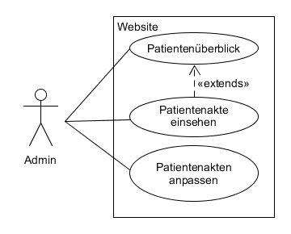

# Anforderungs- und Entwurfsspezifikation ("Pflichtenheft")

* Microservice Hausarzt, Tim Steven Meier, Inhaltsverzeichnis
* https://github.com/SGSE-2020/MS_Hausarzt

# 1 Einführung

## 1.1 Beschreibung

Der Hausarzt ist ein wichtiger Bestandteil für die Gesundheit der Bürger aus der Smart City. Er ist die erste Anlaufstelle bei körperlichen Beschwerden und Krankheiten. Als Bürger der Smart City kann man sich mit seiner Email anmelden und online seine Beschwerden eintragen. Außerdem ist es jedem Bürger möglich sich seine eigenen Krankenakten anzusehen, welche für gewöhnlich nur mit viel Aufwand einsehbar sind. Es gibt weiterführend auch eine Statistik zu den aktuell verbreiteten Krankheiten und Tipps und Tricks, wie man einer Ansteckung vorbeugen kann.


## 1.2 Ziele

Die Website des Hausarztes dient als Schnittstelle zwischen den Bürgern der Stadt und dem Hausarzt. Dabei vereinfacht es die Kommunikation für Bürger und Mitarbeiter. Außerdem bietet es einen einfachen Einblick in die Krankenakte.

Das System richtet sich an alle Bürger der Smart City, welche Beschwerden und Krankheiten haben. Es ist eine einfache Anlaufstelle um diese bei dem Hausarzt zu untersuchen.

Die Website bietet lediglich eine Möglichkeit seine Beschwerden einzutragen, damit sich der Arzt besser vorbereiten kann. Es ist weiterhin erforderlich, dass der Betroffene zu dem Termin erscheint um sich behandeln zu lassen.

# 2 Anforderungen

## 2.1 Stakeholder


| Funktion / Relevanz | Name | Wissen  | Interessen / Ziele  |
|---|---|---|---|
| Arzt | Hans Heiler | Kennt sich mit Medizin aus | Vereinfachung der Patientenakten |
| Mitarbeiter | Manfred Mitarbeiter |  Erfahren im Umgang mit Patienten  | Einfache Einsicht in Patientenbegehren                      |
| Stammkunde | Gerd Grippe | Häufiger Patient | Einsicht in seine Patientenakte |

## 2.2 Funktionale Anforderungen


#### Benutzer


#### Admin




## 2.3 Nicht-funktionale Anforderungen 

### 2.3.1 Rahmenbedingungen

- Kommunikation mit anderen Microservices
  - Asynchron: RabbitMQ
  - Synchron: gRPC

### 2.3.2 Betriebsbedingungen

- Website mit Microservice Hausarzt
- Datenbank um wichtige Daten zu speichern

### 2.3.3 Qualitätsmerkmale

Qualitätsmerkmal | sehr gut | gut | normal | nicht relevant
---|---|---|---|---
**Zuverlässigkeit** | | | | 
Fehlertoleranz |X|-|-|-
Wiederherstellbarkeit |X|-|-|-
Ordnungsmäßigkeit |X|-|-|-
Richtigkeit |X|-|-|-
Konformität |-|X|-|-
**Benutzerfreundlichkeit** | | | | 
Installierbarkeit |-|-|-|X
Verständlichkeit |X|-|-|-
Erlernbarkeit |-|X|-|-
Bedienbarkeit |-|X|-|-
**Performance** | | | | 
Zeitverhalten |-|X|-|-
Effizienz|-|X|-|-
**Sicherheit** | | | | 
Analysierbarkeit ||X|-|-
Modifizierbarkeit |-|X|-|-
Stabilität |X|-|-|-
Prüfbarkeit |-|-|X|-

## 2.4 Graphische Benutzerschnittstelle

#### Login


#### Home


#### Krankheitsstatistik


#### Impressum


#### Termin


#### Admin/Mitarbeiter Patientenübersicht


## 2.5 Anforderungen im Detail


#### Benutzer

| **Als**  | **möchte ich**| **so dass** | **Akzeptanz**| **Priorität** |
| ---- | :----| :----- | :---- | ---- |
| Benutzer | meine Beschwerden eintragen     | ich auf Krankheiten überprüft werden kann | Beschwerden eintragen, auf der Online Website | hoch  |
| Benutzer | Öffnungszeiten einsehen | ich planen kann | Ansicht der Öffnungszeiten | mittel |
| Benutzer | Impressum einsehen | ich weitere Kontaktinformationen habe | Ansicht des Impressums | mittel |
| Benutzer | Krankheitsstatistik einsehen | ich weiß, welche Krankheiten im Moment verbreitet sind | Ansicht der Krankheitsstatistik | mittel |


#### Administrator/Arzt


| **Als**  | **möchte ich**| **so dass** | **Akzeptanz**| **Priorität** |
| ---- | :----| :----- | :---- | ---- |
| Administrator | nur der Admin Zugriff auf Admin Funktionen hat | kein unbefugter Änderungen machen kann | Adminkonto | hoch |
| Administrator | einen Überblick über die Patienten haben | ich einen Überblick über die Patienten habe | Übersicht bei Admin Zugriff | hoch |
| Administrator | einen Blick in die Krankenakte der Patienten werfen | die Patienten die beste mögliche Behandlung bekommen | genauere Übersicht im Admin Zugriff | mittel |
| Administrator | die Krankenakte der Patienten bearbeiten | die Patienten die beste mögliche Behandlung bekommen | akten bearbeiten | mittel |

# 3 Technische Beschreibung

## 3.1 Systemübersicht


## 3.2 Softwarearchitektur


## 3.3 Schnittstellen


#### Überweisung eines Patienten an den Hausarzt

Mithilfe der "user_id" kann ein Patient an den Hausarzt übergeben werden. Dabei muss ein Grund angegeben werden, warum der Patient überwiesen werden soll.

```json
"sgse.model.hausarzt.sendUeberweisung": {
    "description": "Object um einen Patienten an den Hausarzt zu ueberweisen",
    "fields": [
      {"name": "user_id", "type": "string", "required": true},
      {"name": "reason", "type": "string", "required": true}  
    ]
}
```


#### Krankenakte eines Patienten anfordern

Mithilfe der "user_id" kann die Krankenakte eines Patienten angefordert werden.

```json
// Anforderung
"sgse.model.hausarzt.getKrankenakte": {
    "description": "Object um die Krankeakte eines Patienten anzufordern",
    "fields": [
      {"name": "user_id", "type": "string", "required": true}
    ]
}
```


#### Krankenakte eines Patienten aktualisieren/einreichen

Beim Aktualisieren muss die gesamte Krankenakte des Patienten geschickt werden, welche danach gespeichert wird.

```json
"sgse.model.hausarzt.updatePatientenakte": {
    "description": "objekt einer patientenakte, welches zum aktualisieren ist",
    "fields": [
      {"name": "patientenakte_id", "type": "string", "required": true},
      {"name": "user_id", "type": "string", "required": true},
      {"name": "datum", "type": "string", "required": true},
      {"name": "anamnese", "type": "string", "required": false},
      {"name": "symptome", "type": "string", "required": false},
      {"name": "diagnose", "type": "string", "required": false},
      {"name": "medikation", "type": "string", "required": false},
      {"name": "psychisch_krank", "type": "string", "required": false},
      {"name": "sonstiges", "type": "string", "required": false}
    ]
}
```


## 3.3.1 Ereignisse

#### Terminbestätigung

Der von ihnen angeforderte Termin wurde bestätigt.

```json
"sgse.model.hausarzt.termin_bestaetigung": {
    "description": "objekt einer patientenakte, welches zum aktualisieren ist",
    "fields": [
      {"name": "user_id", "type": "string", "required": true},
      {"name": "datum", "type": "string", "required": true},
      {"name": "uhrzeit", "type": "string", "required": false},
      {"name": "anamnese", "type": "string", "required": false}
    ]
}
```

## 3.4 Datenmodell 


## 3.5 Abläufe

#### Aktivität Benutzer


#### Aktivität Admin


# 4 Projektorganisation

## 4.1 Annahmen

- Das Frontend wird mit JavaScript entwickelt
- Für den API-Server wird Node.js verwendet
- Die Bausteine Datenbank, Frontend und Backend müssen als Docker Container vorliegen
- Für die Kommunikation mit anderen Prozessen wir gRPC verwendet


## 4.3 Grober Projektplan

### Meilensteine
- KW 20(11.05.2020)
  - Abgabe Software-Spezifikation
- KW 24(08.06.2020)
  - Fertigstellung und Präsentation vom Prototyp
- KW 27(30.06.2020)
  - Fertigstellung vom Mikro-Service
- KW 27(02.07.2020)
  - Einbindung ist vollständig
- KW 27(03.07.2020)
  - Finale Abgabe und Präsentation

# 5 Anhänge

## 5.1 Glossar 

- Definitionen, Abkürzungen, Begriffe

## 5.2 Referenzen

- Handbücher, Gesetze

## 5.3 Index


